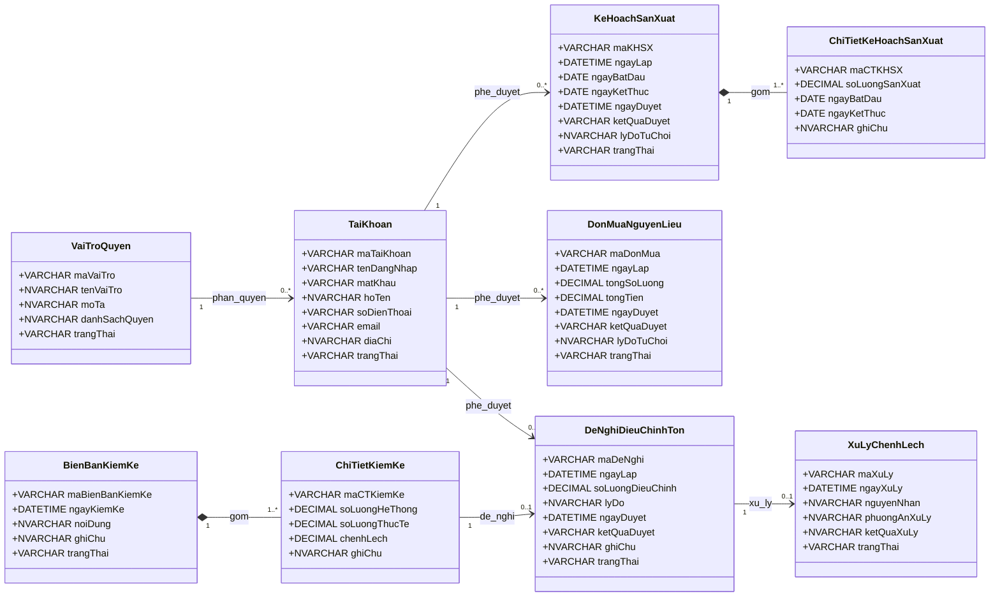

```mermaid
classDiagram
direction LR

class TaiKhoan {
    +VARCHAR maTaiKhoan
    +VARCHAR tenDangNhap
    +VARCHAR matKhau
    +NVARCHAR hoTen
    +VARCHAR soDienThoai
    +VARCHAR email
    +NVARCHAR diaChi
    +VARCHAR trangThai
}

class VaiTroQuyen {
    +VARCHAR maVaiTro
    +NVARCHAR tenVaiTro
    +NVARCHAR moTa
    +NVARCHAR danhSachQuyen
    +VARCHAR trangThai
}

class KeHoachSanXuat {
    +VARCHAR maKHSX
    +DATETIME ngayLap
    +DATE ngayBatDau
    +DATE ngayKetThuc
    +DATETIME ngayDuyet
    +VARCHAR ketQuaDuyet
    +NVARCHAR lyDoTuChoi
    +VARCHAR trangThai
}

class ChiTietKeHoachSanXuat {
    +VARCHAR maCTKHSX
    +DECIMAL soLuongSanXuat
    +DATE ngayBatDau
    +DATE ngayKetThuc
    +NVARCHAR ghiChu
}

class DonMuaNguyenLieu {
    +VARCHAR maDonMua
    +DATETIME ngayLap
    +DECIMAL tongSoLuong
    +DECIMAL tongTien
    +DATETIME ngayDuyet
    +VARCHAR ketQuaDuyet
    +NVARCHAR lyDoTuChoi
    +VARCHAR trangThai
}

class BienBanKiemKe {
    +VARCHAR maBienBanKiemKe
    +DATETIME ngayKiemKe
    +NVARCHAR noiDung
    +NVARCHAR ghiChu
    +VARCHAR trangThai
}

class ChiTietKiemKe {
    +VARCHAR maCTKiemKe
    +DECIMAL soLuongHeThong
    +DECIMAL soLuongThucTe
    +DECIMAL chenhLech
    +NVARCHAR ghiChu
}

class DeNghiDieuChinhTon {
    +VARCHAR maDeNghi
    +DATETIME ngayLap
    +DECIMAL soLuongDieuChinh
    +NVARCHAR lyDo
    +DATETIME ngayDuyet
    +VARCHAR ketQuaDuyet
    +NVARCHAR ghiChu
    +VARCHAR trangThai
}

class XuLyChenhLech {
    +VARCHAR maXuLy
    +DATETIME ngayXuLy
    +NVARCHAR nguyenNhan
    +NVARCHAR phuongAnXuLy
    +NVARCHAR ketQuaXuLy
    +VARCHAR trangThai
}

VaiTroQuyen "1" --> "0..*" TaiKhoan : phan_quyen
TaiKhoan "1" --> "0..*" KeHoachSanXuat : phe_duyet
TaiKhoan "1" --> "0..*" DonMuaNguyenLieu : phe_duyet
TaiKhoan "1" --> "0..*" DeNghiDieuChinhTon : phe_duyet
KeHoachSanXuat "1" *-- "1..*" ChiTietKeHoachSanXuat : gom
BienBanKiemKe "1" *-- "1..*" ChiTietKiemKe : gom
ChiTietKiemKe "1" --> "0..1" DeNghiDieuChinhTon : de_nghi
DeNghiDieuChinhTon "1" --> "0..1" XuLyChenhLech : xu_ly
```
