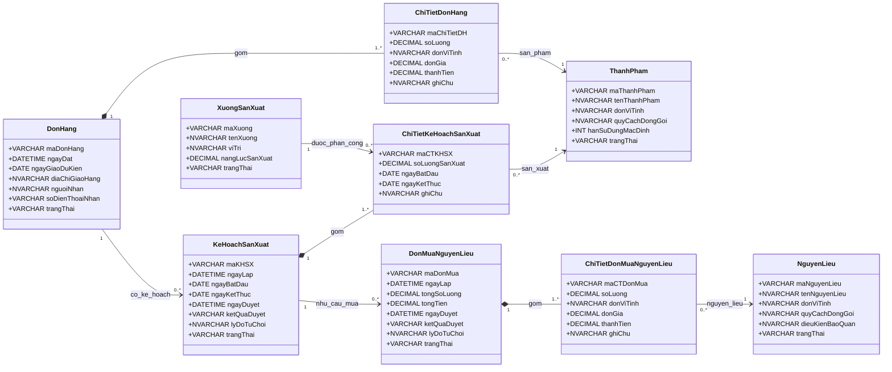

```mermaid
classDiagram
direction LR

class DonHang {
    +VARCHAR maDonHang
    +DATETIME ngayDat
    +DATE ngayGiaoDuKien
    +NVARCHAR diaChiGiaoHang
    +NVARCHAR nguoiNhan
    +VARCHAR soDienThoaiNhan
    +VARCHAR trangThai
}

class ChiTietDonHang {
    +VARCHAR maChiTietDH
    +DECIMAL soLuong
    +NVARCHAR donViTinh
    +DECIMAL donGia
    +DECIMAL thanhTien
    +NVARCHAR ghiChu
}

class KeHoachSanXuat {
    +VARCHAR maKHSX
    +DATETIME ngayLap
    +DATE ngayBatDau
    +DATE ngayKetThuc
    +DATETIME ngayDuyet
    +VARCHAR ketQuaDuyet
    +NVARCHAR lyDoTuChoi
    +VARCHAR trangThai
}

class ChiTietKeHoachSanXuat {
    +VARCHAR maCTKHSX
    +DECIMAL soLuongSanXuat
    +DATE ngayBatDau
    +DATE ngayKetThuc
    +NVARCHAR ghiChu
}

class XuongSanXuat {
    +VARCHAR maXuong
    +NVARCHAR tenXuong
    +NVARCHAR viTri
    +DECIMAL nangLucSanXuat
    +VARCHAR trangThai
}

class ThanhPham {
    +VARCHAR maThanhPham
    +NVARCHAR tenThanhPham
    +NVARCHAR donViTinh
    +NVARCHAR quyCachDongGoi
    +INT hanSuDungMacDinh
    +VARCHAR trangThai
}

class DonMuaNguyenLieu {
    +VARCHAR maDonMua
    +DATETIME ngayLap
    +DECIMAL tongSoLuong
    +DECIMAL tongTien
    +DATETIME ngayDuyet
    +VARCHAR ketQuaDuyet
    +NVARCHAR lyDoTuChoi
    +VARCHAR trangThai
}

class ChiTietDonMuaNguyenLieu {
    +VARCHAR maCTDonMua
    +DECIMAL soLuong
    +NVARCHAR donViTinh
    +DECIMAL donGia
    +DECIMAL thanhTien
    +NVARCHAR ghiChu
}

class NguyenLieu {
    +VARCHAR maNguyenLieu
    +NVARCHAR tenNguyenLieu
    +NVARCHAR donViTinh
    +NVARCHAR quyCachDongGoi
    +NVARCHAR dieuKienBaoQuan
    +VARCHAR trangThai
}

DonHang "1" *-- "1..*" ChiTietDonHang : gom
DonHang "1" --> "0..*" KeHoachSanXuat : co_ke_hoach
KeHoachSanXuat "1" *-- "1..*" ChiTietKeHoachSanXuat : gom
XuongSanXuat "1" --> "0..*" ChiTietKeHoachSanXuat : duoc_phan_cong
ChiTietDonHang "0..*" --> "1" ThanhPham : san_pham
ChiTietKeHoachSanXuat "0..*" --> "1" ThanhPham : san_xuat
KeHoachSanXuat "1" --> "0..*" DonMuaNguyenLieu : nhu_cau_mua
DonMuaNguyenLieu "1" *-- "1..*" ChiTietDonMuaNguyenLieu : gom
ChiTietDonMuaNguyenLieu "0..*" --> "1" NguyenLieu : nguyen_lieu
```
