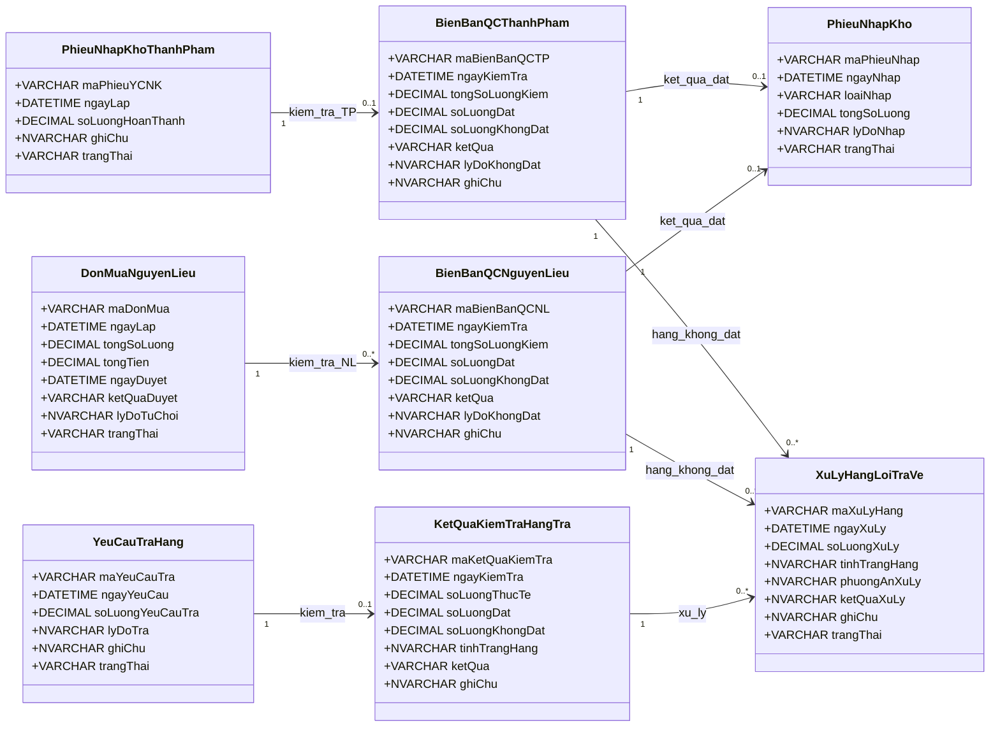

```mermaid
classDiagram
direction LR

class DonMuaNguyenLieu {
    +VARCHAR maDonMua
    +DATETIME ngayLap
    +DECIMAL tongSoLuong
    +DECIMAL tongTien
    +DATETIME ngayDuyet
    +VARCHAR ketQuaDuyet
    +NVARCHAR lyDoTuChoi
    +VARCHAR trangThai
}

class BienBanQCNguyenLieu {
    +VARCHAR maBienBanQCNL
    +DATETIME ngayKiemTra
    +DECIMAL tongSoLuongKiem
    +DECIMAL soLuongDat
    +DECIMAL soLuongKhongDat
    +VARCHAR ketQua
    +NVARCHAR lyDoKhongDat
    +NVARCHAR ghiChu
}

class PhieuNhapKhoThanhPham {
    +VARCHAR maPhieuYCNK
    +DATETIME ngayLap
    +DECIMAL soLuongHoanThanh
    +NVARCHAR ghiChu
    +VARCHAR trangThai
}

class BienBanQCThanhPham {
    +VARCHAR maBienBanQCTP
    +DATETIME ngayKiemTra
    +DECIMAL tongSoLuongKiem
    +DECIMAL soLuongDat
    +DECIMAL soLuongKhongDat
    +VARCHAR ketQua
    +NVARCHAR lyDoKhongDat
    +NVARCHAR ghiChu
}

class YeuCauTraHang {
    +VARCHAR maYeuCauTra
    +DATETIME ngayYeuCau
    +DECIMAL soLuongYeuCauTra
    +NVARCHAR lyDoTra
    +NVARCHAR ghiChu
    +VARCHAR trangThai
}

class KetQuaKiemTraHangTra {
    +VARCHAR maKetQuaKiemTra
    +DATETIME ngayKiemTra
    +DECIMAL soLuongThucTe
    +DECIMAL soLuongDat
    +DECIMAL soLuongKhongDat
    +NVARCHAR tinhTrangHang
    +VARCHAR ketQua
    +NVARCHAR ghiChu
}

class XuLyHangLoiTraVe {
    +VARCHAR maXuLyHang
    +DATETIME ngayXuLy
    +DECIMAL soLuongXuLy
    +NVARCHAR tinhTrangHang
    +NVARCHAR phuongAnXuLy
    +NVARCHAR ketQuaXuLy
    +NVARCHAR ghiChu
    +VARCHAR trangThai
}

class PhieuNhapKho {
    +VARCHAR maPhieuNhap
    +DATETIME ngayNhap
    +VARCHAR loaiNhap
    +DECIMAL tongSoLuong
    +NVARCHAR lyDoNhap
    +VARCHAR trangThai
}

DonMuaNguyenLieu "1" --> "0..*" BienBanQCNguyenLieu : kiem_tra_NL
BienBanQCNguyenLieu "1" --> "0..1" PhieuNhapKho : ket_qua_dat
PhieuNhapKhoThanhPham "1" --> "0..1" BienBanQCThanhPham : kiem_tra_TP
BienBanQCThanhPham "1" --> "0..1" PhieuNhapKho : ket_qua_dat
YeuCauTraHang "1" --> "0..1" KetQuaKiemTraHangTra : kiem_tra
KetQuaKiemTraHangTra "1" --> "0..*" XuLyHangLoiTraVe : xu_ly
BienBanQCNguyenLieu "1" --> "0..*" XuLyHangLoiTraVe : hang_khong_dat
BienBanQCThanhPham "1" --> "0..*" XuLyHangLoiTraVe : hang_khong_dat
```
