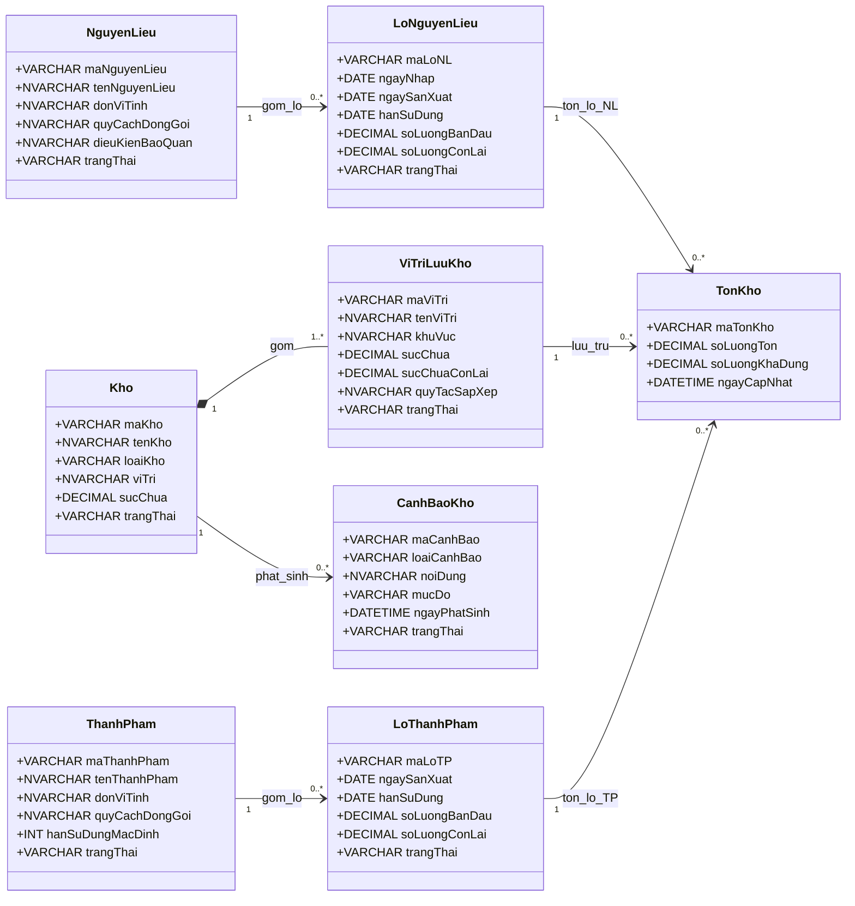

```mermaid
classDiagram
direction LR

class Kho {
    +VARCHAR maKho
    +NVARCHAR tenKho
    +VARCHAR loaiKho
    +NVARCHAR viTri
    +DECIMAL sucChua
    +VARCHAR trangThai
}

class ViTriLuuKho {
    +VARCHAR maViTri
    +NVARCHAR tenViTri
    +NVARCHAR khuVuc
    +DECIMAL sucChua
    +DECIMAL sucChuaConLai
    +NVARCHAR quyTacSapXep
    +VARCHAR trangThai
}

class TonKho {
    +VARCHAR maTonKho
    +DECIMAL soLuongTon
    +DECIMAL soLuongKhaDung
    +DATETIME ngayCapNhat
}

class NguyenLieu {
    +VARCHAR maNguyenLieu
    +NVARCHAR tenNguyenLieu
    +NVARCHAR donViTinh
    +NVARCHAR quyCachDongGoi
    +NVARCHAR dieuKienBaoQuan
    +VARCHAR trangThai
}

class LoNguyenLieu {
    +VARCHAR maLoNL
    +DATE ngayNhap
    +DATE ngaySanXuat
    +DATE hanSuDung
    +DECIMAL soLuongBanDau
    +DECIMAL soLuongConLai
    +VARCHAR trangThai
}

class ThanhPham {
    +VARCHAR maThanhPham
    +NVARCHAR tenThanhPham
    +NVARCHAR donViTinh
    +NVARCHAR quyCachDongGoi
    +INT hanSuDungMacDinh
    +VARCHAR trangThai
}

class LoThanhPham {
    +VARCHAR maLoTP
    +DATE ngaySanXuat
    +DATE hanSuDung
    +DECIMAL soLuongBanDau
    +DECIMAL soLuongConLai
    +VARCHAR trangThai
}

class CanhBaoKho {
    +VARCHAR maCanhBao
    +VARCHAR loaiCanhBao
    +NVARCHAR noiDung
    +VARCHAR mucDo
    +DATETIME ngayPhatSinh
    +VARCHAR trangThai
}

Kho "1" *-- "1..*" ViTriLuuKho : gom
ViTriLuuKho "1" --> "0..*" TonKho : luu_tru
NguyenLieu "1" --> "0..*" LoNguyenLieu : gom_lo
ThanhPham "1" --> "0..*" LoThanhPham : gom_lo
LoNguyenLieu "1" --> "0..*" TonKho : ton_lo_NL
LoThanhPham "1" --> "0..*" TonKho : ton_lo_TP
Kho "1" --> "0..*" CanhBaoKho : phat_sinh
```
