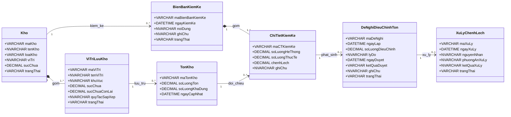

```mermaid
classDiagram
direction LR

class Kho {
    +VARCHAR maKho
    +NVARCHAR tenKho
    +VARCHAR loaiKho
    +NVARCHAR viTri
    +DECIMAL sucChua
    +VARCHAR trangThai
}

class ViTriLuuKho {
    +VARCHAR maViTri
    +NVARCHAR tenViTri
    +NVARCHAR khuVuc
    +DECIMAL sucChua
    +DECIMAL sucChuaConLai
    +NVARCHAR quyTacSapXep
    +VARCHAR trangThai
}

class TonKho {
    +VARCHAR maTonKho
    +DECIMAL soLuongTon
    +DECIMAL soLuongKhaDung
    +DATETIME ngayCapNhat
}

class BienBanKiemKe {
    +VARCHAR maBienBanKiemKe
    +DATETIME ngayKiemKe
    +NVARCHAR noiDung
    +NVARCHAR ghiChu
    +VARCHAR trangThai
}

class ChiTietKiemKe {
    +VARCHAR maCTKiemKe
    +DECIMAL soLuongHeThong
    +DECIMAL soLuongThucTe
    +DECIMAL chenhLech
    +NVARCHAR ghiChu
}

class DeNghiDieuChinhTon {
    +VARCHAR maDeNghi
    +DATETIME ngayLap
    +DECIMAL soLuongDieuChinh
    +NVARCHAR lyDo
    +DATETIME ngayDuyet
    +VARCHAR ketQuaDuyet
    +NVARCHAR ghiChu
    +VARCHAR trangThai
}

class XuLyChenhLech {
    +VARCHAR maXuLy
    +DATETIME ngayXuLy
    +NVARCHAR nguyenNhan
    +NVARCHAR phuongAnXuLy
    +NVARCHAR ketQuaXuLy
    +VARCHAR trangThai
}

Kho "1" *-- "1..*" ViTriLuuKho : gom
Kho "1" --> "0..*" BienBanKiemKe : kiem_ke
BienBanKiemKe "1" *-- "1..*" ChiTietKiemKe : gom
ViTriLuuKho "1" --> "0..*" TonKho : luu_tru
TonKho "1" --> "0..*" ChiTietKiemKe : doi_chieu
ChiTietKiemKe "1" --> "0..1" DeNghiDieuChinhTon : phat_sinh
DeNghiDieuChinhTon "1" --> "0..1" XuLyChenhLech : xu_ly
```
