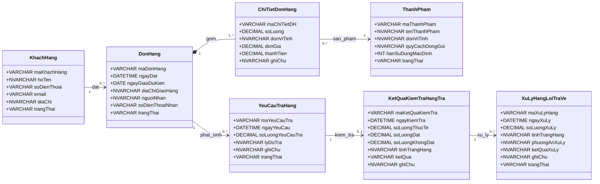

```mermaid
classDiagram
direction LR

class KhachHang {
    +VARCHAR maKhachHang
    +NVARCHAR hoTen
    +VARCHAR soDienThoai
    +VARCHAR email
    +NVARCHAR diaChi
    +VARCHAR trangThai
}

class DonHang {
    +VARCHAR maDonHang
    +DATETIME ngayDat
    +DATE ngayGiaoDuKien
    +NVARCHAR diaChiGiaoHang
    +NVARCHAR nguoiNhan
    +VARCHAR soDienThoaiNhan
    +VARCHAR trangThai
}

class ChiTietDonHang {
    +VARCHAR maChiTietDH
    +DECIMAL soLuong
    +NVARCHAR donViTinh
    +DECIMAL donGia
    +DECIMAL thanhTien
    +NVARCHAR ghiChu
}

class ThanhPham {
    +VARCHAR maThanhPham
    +NVARCHAR tenThanhPham
    +NVARCHAR donViTinh
    +NVARCHAR quyCachDongGoi
    +INT hanSuDungMacDinh
    +VARCHAR trangThai
}

class YeuCauTraHang {
    +VARCHAR maYeuCauTra
    +DATETIME ngayYeuCau
    +DECIMAL soLuongYeuCauTra
    +NVARCHAR lyDoTra
    +NVARCHAR ghiChu
    +VARCHAR trangThai
}

class KetQuaKiemTraHangTra {
    +VARCHAR maKetQuaKiemTra
    +DATETIME ngayKiemTra
    +DECIMAL soLuongThucTe
    +DECIMAL soLuongDat
    +DECIMAL soLuongKhongDat
    +NVARCHAR tinhTrangHang
    +VARCHAR ketQua
    +NVARCHAR ghiChu
}

class XuLyHangLoiTraVe {
    +VARCHAR maXuLyHang
    +DATETIME ngayXuLy
    +DECIMAL soLuongXuLy
    +NVARCHAR tinhTrangHang
    +NVARCHAR phuongAnXuLy
    +NVARCHAR ketQuaXuLy
    +NVARCHAR ghiChu
    +VARCHAR trangThai
}

KhachHang "1" --> "0..*" DonHang : dat
DonHang "1" *-- "1..*" ChiTietDonHang : gom
ChiTietDonHang "0..*" --> "1" ThanhPham : san_pham
DonHang "1" --> "0..*" YeuCauTraHang : phat_sinh
YeuCauTraHang "1" --> "0..1" KetQuaKiemTraHangTra : kiem_tra
KetQuaKiemTraHangTra "1" --> "0..*" XuLyHangLoiTraVe : xu_ly
```
