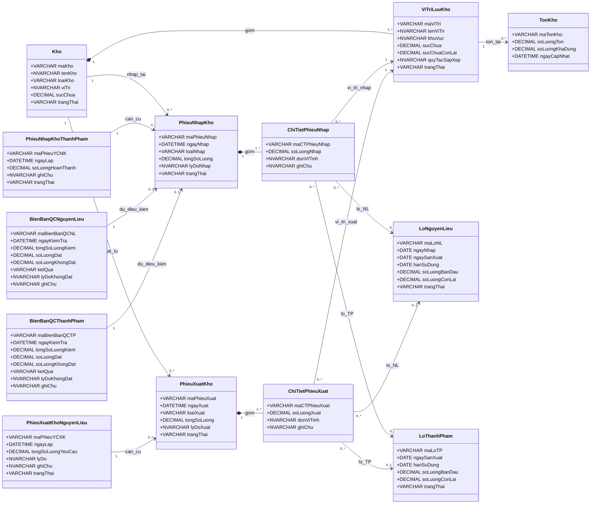

```mermaid
classDiagram
direction LR

class Kho {
    +VARCHAR maKho
    +NVARCHAR tenKho
    +VARCHAR loaiKho
    +NVARCHAR viTri
    +DECIMAL sucChua
    +VARCHAR trangThai
}

class ViTriLuuKho {
    +VARCHAR maViTri
    +NVARCHAR tenViTri
    +NVARCHAR khuVuc
    +DECIMAL sucChua
    +DECIMAL sucChuaConLai
    +NVARCHAR quyTacSapXep
    +VARCHAR trangThai
}

class PhieuNhapKho {
    +VARCHAR maPhieuNhap
    +DATETIME ngayNhap
    +VARCHAR loaiNhap
    +DECIMAL tongSoLuong
    +NVARCHAR lyDoNhap
    +VARCHAR trangThai
}

class ChiTietPhieuNhap {
    +VARCHAR maCTPhieuNhap
    +DECIMAL soLuongNhap
    +NVARCHAR donViTinh
    +NVARCHAR ghiChu
}

class PhieuXuatKho {
    +VARCHAR maPhieuXuat
    +DATETIME ngayXuat
    +VARCHAR loaiXuat
    +DECIMAL tongSoLuong
    +NVARCHAR lyDoXuat
    +VARCHAR trangThai
}

class ChiTietPhieuXuat {
    +VARCHAR maCTPhieuXuat
    +DECIMAL soLuongXuat
    +NVARCHAR donViTinh
    +NVARCHAR ghiChu
}

class PhieuXuatKhoNguyenLieu {
    +VARCHAR maPhieuYCXK
    +DATETIME ngayLap
    +DECIMAL tongSoLuongYeuCau
    +NVARCHAR lyDo
    +NVARCHAR ghiChu
    +VARCHAR trangThai
}

class PhieuNhapKhoThanhPham {
    +VARCHAR maPhieuYCNK
    +DATETIME ngayLap
    +DECIMAL soLuongHoanThanh
    +NVARCHAR ghiChu
    +VARCHAR trangThai
}

class BienBanQCNguyenLieu {
    +VARCHAR maBienBanQCNL
    +DATETIME ngayKiemTra
    +DECIMAL tongSoLuongKiem
    +DECIMAL soLuongDat
    +DECIMAL soLuongKhongDat
    +VARCHAR ketQua
    +NVARCHAR lyDoKhongDat
    +NVARCHAR ghiChu
}

class BienBanQCThanhPham {
    +VARCHAR maBienBanQCTP
    +DATETIME ngayKiemTra
    +DECIMAL tongSoLuongKiem
    +DECIMAL soLuongDat
    +DECIMAL soLuongKhongDat
    +VARCHAR ketQua
    +NVARCHAR lyDoKhongDat
    +NVARCHAR ghiChu
}

class TonKho {
    +VARCHAR maTonKho
    +DECIMAL soLuongTon
    +DECIMAL soLuongKhaDung
    +DATETIME ngayCapNhat
}

class LoNguyenLieu {
    +VARCHAR maLoNL
    +DATE ngayNhap
    +DATE ngaySanXuat
    +DATE hanSuDung
    +DECIMAL soLuongBanDau
    +DECIMAL soLuongConLai
    +VARCHAR trangThai
}

class LoThanhPham {
    +VARCHAR maLoTP
    +DATE ngaySanXuat
    +DATE hanSuDung
    +DECIMAL soLuongBanDau
    +DECIMAL soLuongConLai
    +VARCHAR trangThai
}

Kho "1" --> "0..*" PhieuNhapKho : nhap_tai
Kho "1" --> "0..*" PhieuXuatKho : xuat_tu
Kho "1" *-- "1..*" ViTriLuuKho : gom
PhieuNhapKho "1" *-- "1..*" ChiTietPhieuNhap : gom
PhieuXuatKho "1" *-- "1..*" ChiTietPhieuXuat : gom
ChiTietPhieuNhap "0..*" --> "1" ViTriLuuKho : vi_tri_nhap
ChiTietPhieuXuat "0..*" --> "1" ViTriLuuKho : vi_tri_xuat
ChiTietPhieuNhap "0..*" --> "0..1" LoNguyenLieu : lo_NL
ChiTietPhieuNhap "0..*" --> "0..1" LoThanhPham : lo_TP
ChiTietPhieuXuat "0..*" --> "0..1" LoNguyenLieu : lo_NL
ChiTietPhieuXuat "0..*" --> "0..1" LoThanhPham : lo_TP
PhieuXuatKhoNguyenLieu "1" --> "0..*" PhieuXuatKho : can_cu
PhieuNhapKhoThanhPham "1" --> "0..*" PhieuNhapKho : can_cu
BienBanQCNguyenLieu "1" --> "0..1" PhieuNhapKho : du_dieu_kien
BienBanQCThanhPham "1" --> "0..1" PhieuNhapKho : du_dieu_kien
ViTriLuuKho "1" --> "0..*" TonKho : ton_tai
```
