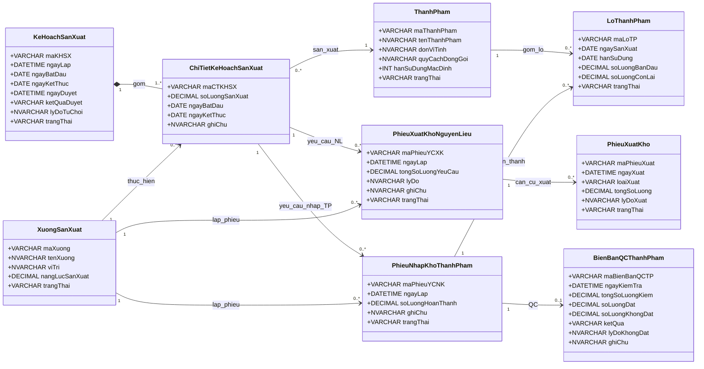

```mermaid
classDiagram
direction LR

class XuongSanXuat {
    +VARCHAR maXuong
    +NVARCHAR tenXuong
    +NVARCHAR viTri
    +DECIMAL nangLucSanXuat
    +VARCHAR trangThai
}

class KeHoachSanXuat {
    +VARCHAR maKHSX
    +DATETIME ngayLap
    +DATE ngayBatDau
    +DATE ngayKetThuc
    +DATETIME ngayDuyet
    +VARCHAR ketQuaDuyet
    +NVARCHAR lyDoTuChoi
    +VARCHAR trangThai
}

class ChiTietKeHoachSanXuat {
    +VARCHAR maCTKHSX
    +DECIMAL soLuongSanXuat
    +DATE ngayBatDau
    +DATE ngayKetThuc
    +NVARCHAR ghiChu
}

class PhieuXuatKhoNguyenLieu {
    +VARCHAR maPhieuYCXK
    +DATETIME ngayLap
    +DECIMAL tongSoLuongYeuCau
    +NVARCHAR lyDo
    +NVARCHAR ghiChu
    +VARCHAR trangThai
}

class PhieuNhapKhoThanhPham {
    +VARCHAR maPhieuYCNK
    +DATETIME ngayLap
    +DECIMAL soLuongHoanThanh
    +NVARCHAR ghiChu
    +VARCHAR trangThai
}

class PhieuXuatKho {
    +VARCHAR maPhieuXuat
    +DATETIME ngayXuat
    +VARCHAR loaiXuat
    +DECIMAL tongSoLuong
    +NVARCHAR lyDoXuat
    +VARCHAR trangThai
}

class ThanhPham {
    +VARCHAR maThanhPham
    +NVARCHAR tenThanhPham
    +NVARCHAR donViTinh
    +NVARCHAR quyCachDongGoi
    +INT hanSuDungMacDinh
    +VARCHAR trangThai
}

class LoThanhPham {
    +VARCHAR maLoTP
    +DATE ngaySanXuat
    +DATE hanSuDung
    +DECIMAL soLuongBanDau
    +DECIMAL soLuongConLai
    +VARCHAR trangThai
}

class BienBanQCThanhPham {
    +VARCHAR maBienBanQCTP
    +DATETIME ngayKiemTra
    +DECIMAL tongSoLuongKiem
    +DECIMAL soLuongDat
    +DECIMAL soLuongKhongDat
    +VARCHAR ketQua
    +NVARCHAR lyDoKhongDat
    +NVARCHAR ghiChu
}

KeHoachSanXuat "1" *-- "1..*" ChiTietKeHoachSanXuat : gom
XuongSanXuat "1" --> "0..*" ChiTietKeHoachSanXuat : thuc_hien
ChiTietKeHoachSanXuat "0..*" --> "1" ThanhPham : san_xuat
ChiTietKeHoachSanXuat "1" --> "0..*" PhieuXuatKhoNguyenLieu : yeu_cau_NL
ChiTietKeHoachSanXuat "1" --> "0..*" PhieuNhapKhoThanhPham : yeu_cau_nhap_TP
XuongSanXuat "1" --> "0..*" PhieuXuatKhoNguyenLieu : lap_phieu
XuongSanXuat "1" --> "0..*" PhieuNhapKhoThanhPham : lap_phieu
PhieuXuatKhoNguyenLieu "1" --> "0..*" PhieuXuatKho : can_cu_xuat
ThanhPham "1" --> "0..*" LoThanhPham : gom_lo
PhieuNhapKhoThanhPham "1" --> "0..*" LoThanhPham : lo_hoan_thanh
PhieuNhapKhoThanhPham "1" --> "0..1" BienBanQCThanhPham : QC
```
