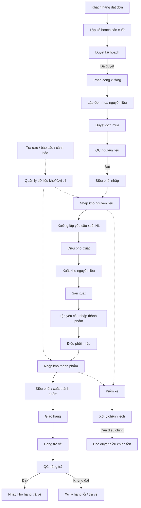
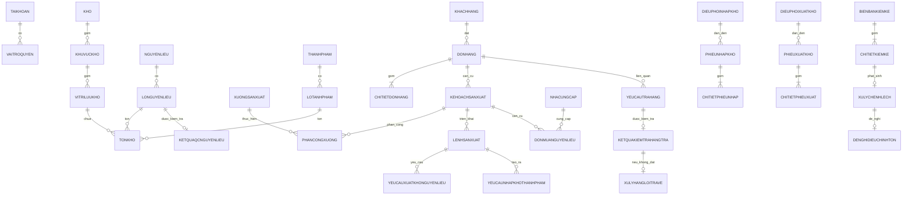

# SOFTWARE REQUIREMENTS SPECIFICATION (SRS)
## HỆ THỐNG QUẢN LÝ KHO NHÀ MÁY

> **Nguồn nghiệp vụ:** Tài liệu “Đặc tả UseCase Hệ thống kho Final(1).docx”.  
> **Mẫu cấu trúc:** `srs.md` của dự án CAB System trong repository `23669941_NguyenDinhTrong_Cabsystem`.  
> **Lưu ý số hiệu:** Tài liệu nguồn hiện có UC01–UC27, UC29 và UC30; không có heading UC28. File này giữ nguyên số hiệu đó để không tự tạo nghiệp vụ không có trong đặc tả.
>
> **Ghi chú:** Các phần Business Context, BR, Data Model và NFR được hệ thống hóa/suy ra từ các Use Case để hoàn thiện cấu trúc SRS. Khi có khác biệt, đặc tả Use Case gốc là nguồn nghiệp vụ ưu tiên.

---

Bước 1: xác định ngữ cảnh

# 1. Xác định ngữ cảnh (Business Context)

Nhà máy có nhu cầu quản lý xuyên suốt luồng vật tư và thành phẩm từ đơn hàng khách hàng, lập kế hoạch sản xuất, mua nguyên liệu, kiểm tra chất lượng, nhập/xuất kho, cấp nguyên liệu cho xưởng, nhập thành phẩm sau sản xuất, giao hàng, xử lý hàng trả về, kiểm kê và điều chỉnh tồn kho.

Hệ thống quản lý kho cần bảo đảm mọi biến động tồn kho phát sinh từ nghiệp vụ/chứng từ hợp lệ, quản lý theo lô và vị trí lưu trữ, hỗ trợ FIFO/FEFO, kiểm soát chất lượng, điều phối kho và cung cấp khả năng tra cứu, báo cáo, cảnh báo. Mục tiêu là giảm thao tác thủ công, tăng khả năng truy vết và bảo đảm số liệu tồn kho nhất quán giữa thực tế và hệ thống.

---

# 2. Business Problem

## 2.1. Dữ liệu tồn kho dễ sai lệch nếu cập nhật thủ công
Hệ thống cần gắn biến động tồn với phiếu nhập, phiếu xuất hoặc điều chỉnh tồn đã được phê duyệt.

## 2.2. Khó truy vết nguyên liệu/thành phẩm theo lô
Hệ thống cần lưu mã lô, ngày sản xuất/nhập, hạn sử dụng, số lượng còn lại, kho và vị trí.

## 2.3. Điều phối nhập/xuất cần dựa trên sức chứa và lô phù hợp
Hệ thống cần xác định kho/khu vực phù hợp khi nhập và gợi ý lô theo FIFO/FEFO khi xuất.

## 2.4. Quy trình sản xuất phụ thuộc nguyên liệu, năng lực và phê duyệt
Kế hoạch sản xuất cần được kiểm tra khả thi, phê duyệt và phân công xưởng trước khi triển khai.

## 2.5. Chất lượng hàng cần được kiểm soát trước khi nhập lại kho
Nguyên liệu và hàng trả về phải qua QC theo luồng đặc tả.

## 2.6. Chênh lệch kiểm kê cần kiểm soát và phê duyệt
Hệ thống phải ghi nhận nguyên nhân, phương án xử lý và chỉ cập nhật tồn sau phê duyệt khi cần.

## 2.7. Thiếu thông tin quản trị tập trung
Bộ phận quản lý kho và Ban giám đốc cần báo cáo tồn, nhập/xuất, hiệu suất lưu kho và cảnh báo.

# Stakeholders – Hệ thống quản lý kho

| Stakeholder | Vai trò | Mối quan tâm / Mục tiêu |
|---|---|---|
| Ban giám đốc | Decision Maker / Approver | Duyệt kế hoạch, đơn mua, điều chỉnh tồn; theo dõi báo cáo |
| Khách hàng | End User | Đặt hàng, nhận đúng sản phẩm/số lượng |
| Bộ phận lập kế hoạch sản xuất | Operational User | Lập kế hoạch, kiểm tra khả thi, phân công xưởng |
| Bộ phận mua hàng | Operational User | Lập đơn mua nguyên liệu |
| Bộ phận quản lý kho | Operational User | Điều phối, quản lý dữ liệu kho/lô, xử lý chênh lệch và hàng lỗi |
| Nhân viên kho | Operational User | Nhập/xuất thực tế và lập chứng từ |
| Bộ phận QC | Quality User | Kiểm tra nguyên liệu và hàng trả về |
| Xưởng sản xuất | Operational User | Yêu cầu cấp nguyên liệu, yêu cầu nhập thành phẩm |
| Hội đồng kiểm kê | Control User | Kiểm kê và lập biên bản |
| Quản trị hệ thống | Supporting Role | Duy trì tài khoản, quyền và hệ thống kỹ thuật |

# Stakeholder Power–Interest Matrix

| QUYỀN LỰC / MỨC ĐỘ QUAN TÂM | Thấp | Cao |
|---|---|---|
| Cao | Quản trị hệ thống | Ban giám đốc; Bộ phận quản lý kho; Bộ phận lập kế hoạch sản xuất |
| Thấp | Khách hàng | Nhân viên kho; QC; Xưởng sản xuất; Bộ phận mua hàng; Hội đồng kiểm kê |

---

Bước 3: xác định Business Goals

## 3. Business Goals

- **BG1:** Số hóa toàn bộ luồng nhập, xuất và điều chỉnh tồn kho dựa trên chứng từ.
- **BG2:** Bảo đảm tồn kho được cập nhật nhất quán sau mỗi nghiệp vụ hợp lệ.
- **BG3:** Quản lý nguyên liệu và thành phẩm theo lô, hạn sử dụng và vị trí.
- **BG4:** Áp dụng FIFO/FEFO để giảm rủi ro tồn lâu và hết hạn.
- **BG5:** Tăng khả năng truy vết từ đơn hàng/kế hoạch/lệnh sản xuất đến phiếu nhập xuất và lô.
- **BG6:** Kiểm soát chất lượng nguyên liệu và hàng trả về trước khi nhập kho.
- **BG7:** Kiểm soát chênh lệch kiểm kê bằng quy trình xử lý và phê duyệt.
- **BG8:** Hỗ trợ điều phối kho, sử dụng sức chứa hợp lý.
- **BG9:** Cung cấp tra cứu, báo cáo và cảnh báo phục vụ vận hành và quản trị.
- **BG10:** Phân quyền rõ ràng theo vai trò, hạn chế thao tác sai hoặc vượt quyền.

---

Bước 4: xác định Scope

## 4. Scope – Phạm vi hệ thống

### 4.1. In Scope

1. Đăng nhập và phân quyền theo vai trò.
2. Đặt đơn hàng thành phẩm.
3. Lập, duyệt kế hoạch sản xuất và phân công xưởng.
4. Lập/duyệt đơn mua nguyên liệu.
5. Kiểm tra chất lượng nguyên liệu.
6. Điều phối nhập kho và xuất kho.
7. Nhập kho nguyên liệu, thành phẩm và hàng trả về.
8. Lập yêu cầu xuất nguyên liệu và xuất nguyên liệu theo lệnh sản xuất.
9. Xuất thành phẩm theo đơn hàng.
10. Quản lý nguyên liệu, thành phẩm, lô, kho và vị trí lưu kho.
11. Kiểm tra, nhập lại hoặc xử lý hàng trả về/hàng lỗi.
12. Kiểm kê, xử lý chênh lệch và phê duyệt điều chỉnh tồn.
13. Tra cứu dữ liệu kho.
14. Thống kê, báo cáo và cảnh báo kho.

### 4.2. System Boundary

Luồng nghiệp vụ chính:

**Khách hàng đặt hàng → Lập kế hoạch sản xuất → Duyệt kế hoạch → Phân công xưởng → Mua/QC/Nhập nguyên liệu → Yêu cầu & xuất nguyên liệu → Sản xuất → Yêu cầu & nhập thành phẩm → Xuất thành phẩm giao hàng.**

Các luồng kiểm soát song song gồm **điều phối nhập/xuất**, **quản lý lô/vị trí**, **hàng trả về**, **kiểm kê & điều chỉnh tồn**, **tra cứu/báo cáo/cảnh báo**.

### 4.3. Out of Scope / Chưa được đặc tả rõ trong tài liệu nguồn

- Kế toán tài chính, hóa đơn và thanh toán.
- Quản lý vận tải/giao hàng sau khi đã xuất kho.
- Cổng nhà cung cấp bên ngoài.
- Tối ưu tuyến đường vận chuyển.
- Các chức năng không xuất hiện trong 29 Use Case của tài liệu nguồn.

---

Bước 5: Business Requirements

# 5. Business Requirements

| Mã | Tên Business Requirement | Diễn giải |
|---|---|---|
| BR01 | Xác thực và phân quyền | Người dùng chỉ được truy cập chức năng phù hợp với tài khoản, vai trò và quyền được cấp. |
| BR02 | Quản lý đơn hàng và kế hoạch sản xuất | Hệ thống hỗ trợ đơn hàng, lập/duyệt kế hoạch sản xuất và phân công xưởng. |
| BR03 | Mua và kiểm tra nguyên liệu | Hệ thống hỗ trợ lập/duyệt đơn mua và QC nguyên liệu trước khi nhập kho. |
| BR04 | Điều phối nhập/xuất kho | Hệ thống xác định kho, khu vực và lô phù hợp trước khi nhân viên kho thực hiện nhập/xuất. |
| BR05 | Quản lý nhập kho | Mọi nhập kho nguyên liệu, thành phẩm và hàng trả về phải có căn cứ nghiệp vụ/chứng từ và cập nhật tồn, lô, vị trí. |
| BR06 | Quản lý xuất kho | Xuất nguyên liệu/thành phẩm phải theo yêu cầu/đơn hàng hợp lệ và cập nhật tồn theo lô. |
| BR07 | Quản lý lô và hạn sử dụng | Hệ thống quản lý lô nguyên liệu/thành phẩm, ngày sản xuất, hạn dùng và hỗ trợ FIFO/FEFO. |
| BR08 | Kiểm kê và điều chỉnh tồn kho | Hệ thống hỗ trợ kiểm kê, ghi nhận chênh lệch, xử lý và phê duyệt điều chỉnh tồn. |
| BR09 | Quản lý hàng trả về/hàng lỗi | Hàng trả về phải được QC và được nhập lại hoặc xử lý theo kết quả. |
| BR10 | Quản lý danh mục và dữ liệu kho | Hệ thống quản lý nguyên liệu, thành phẩm, lô, kho và vị trí lưu trữ. |
| BR11 | Tra cứu, báo cáo và cảnh báo | Hệ thống cung cấp tra cứu, báo cáo tồn/nhập/xuất/hiệu suất và cảnh báo kho. |
| BR12 | Tính toàn vẹn tồn kho và truy vết chứng từ | Tồn kho phải được cập nhật từ nghiệp vụ/chứng từ hợp lệ, không chỉnh trực tiếp ngoài quy trình phê duyệt. |

---

Bước 6: Business Process

# 6. Business Process

| Mã | Business Process | Mô tả |
|---|---|---|
| BP01 | Xác thực & phân quyền | Người dùng đăng nhập, hệ thống xác định vai trò/quyền. |
| BP02 | Đơn hàng & kế hoạch sản xuất | Đặt hàng, lập kế hoạch, duyệt và phân công xưởng. |
| BP03 | Mua & QC nguyên liệu | Lập/duyệt đơn mua, tiếp nhận nghiệp vụ và QC nguyên liệu. |
| BP04 | Nhập kho | Điều phối nhập và lập phiếu nhập nguyên liệu/thành phẩm/hàng trả về. |
| BP05 | Cấp nguyên liệu sản xuất | Xưởng lập yêu cầu, điều phối xuất, Nhân viên kho xuất theo lô FEFO. |
| BP06 | Nhập thành phẩm sau sản xuất | Xưởng lập yêu cầu nhập, kho điều phối và Nhân viên kho nhập thành phẩm. |
| BP07 | Giao hàng | Điều phối/xuất thành phẩm theo đơn hàng và lô hợp lệ. |
| BP08 | Hàng trả về/hàng lỗi | QC hàng trả, nhập lại kho nếu đạt hoặc xử lý nếu không đạt. |
| BP09 | Kiểm kê & điều chỉnh | Kiểm kê, xử lý chênh lệch, lập đề nghị và phê duyệt điều chỉnh tồn. |
| BP10 | Quản lý dữ liệu kho | Quản lý nguyên liệu, thành phẩm, lô, kho và vị trí. |
| BP11 | Tra cứu, báo cáo & cảnh báo | Tra cứu dữ liệu, tổng hợp báo cáo và cảnh báo vận hành. |

## 6.1. Tổng quan quy trình nghiệp vụ

---

Bước 7: phân rã yêu cầu chức năng

# 7. Functional Requirements

> Các FR dưới đây được phân rã trực tiếp từ mục tiêu, luồng chính, hậu điều kiện và ngoại lệ của từng Use Case để tạo ma trận truy xuất tương tự CAB System.

## 7.1 Đăng nhập hệ thống – UC01

| Mã | Functional Requirement | Diễn giải |
|---|---|---|
| FR01 | Đăng nhập hệ thống - truy cập/thực hiện | Hệ thống cho phép Tất cả các Actor thực hiện chức năng Đăng nhập hệ thống khi đáp ứng tiền điều kiện và quyền truy cập. |
| FR02 | Đăng nhập hệ thống - xử lý nghiệp vụ | Hệ thống phải kiểm tra dữ liệu/trạng thái liên quan và thực hiện luồng nghiệp vụ chính của Đăng nhập hệ thống. |
| FR03 | Đăng nhập hệ thống - lưu/cập nhật kết quả | Hệ thống phải lưu hoặc cập nhật kết quả theo hậu điều kiện của Đăng nhập hệ thống, đồng thời không làm thay đổi dữ liệu khi thao tác thất bại. |

## 7.2 Lập kế hoạch sản xuất – UC02

| Mã | Functional Requirement | Diễn giải |
|---|---|---|
| FR04 | Lập kế hoạch sản xuất - truy cập/thực hiện | Hệ thống cho phép Bộ phận lập kế hoạch sản xuất thực hiện chức năng Lập kế hoạch sản xuất khi đáp ứng tiền điều kiện và quyền truy cập. |
| FR05 | Lập kế hoạch sản xuất - xử lý nghiệp vụ | Hệ thống phải kiểm tra dữ liệu/trạng thái liên quan và thực hiện luồng nghiệp vụ chính của Lập kế hoạch sản xuất. |
| FR06 | Lập kế hoạch sản xuất - lưu/cập nhật kết quả | Hệ thống phải lưu hoặc cập nhật kết quả theo hậu điều kiện của Lập kế hoạch sản xuất, đồng thời không làm thay đổi dữ liệu khi thao tác thất bại. |

## 7.3 Duyệt kế hoạch sản xuất – UC03

| Mã | Functional Requirement | Diễn giải |
|---|---|---|
| FR07 | Duyệt kế hoạch sản xuất - truy cập/thực hiện | Hệ thống cho phép Ban giám đốc thực hiện chức năng Duyệt kế hoạch sản xuất khi đáp ứng tiền điều kiện và quyền truy cập. |
| FR08 | Duyệt kế hoạch sản xuất - xử lý nghiệp vụ | Hệ thống phải kiểm tra dữ liệu/trạng thái liên quan và thực hiện luồng nghiệp vụ chính của Duyệt kế hoạch sản xuất. |
| FR09 | Duyệt kế hoạch sản xuất - lưu/cập nhật kết quả | Hệ thống phải lưu hoặc cập nhật kết quả theo hậu điều kiện của Duyệt kế hoạch sản xuất, đồng thời không làm thay đổi dữ liệu khi thao tác thất bại. |

## 7.4 Phân công xưởng sản xuất – UC04

| Mã | Functional Requirement | Diễn giải |
|---|---|---|
| FR10 | Phân công xưởng sản xuất - truy cập/thực hiện | Hệ thống cho phép Bộ phận lập kế hoạch sản xuất thực hiện chức năng Phân công xưởng sản xuất khi đáp ứng tiền điều kiện và quyền truy cập. |
| FR11 | Phân công xưởng sản xuất - xử lý nghiệp vụ | Hệ thống phải kiểm tra dữ liệu/trạng thái liên quan và thực hiện luồng nghiệp vụ chính của Phân công xưởng sản xuất. |
| FR12 | Phân công xưởng sản xuất - lưu/cập nhật kết quả | Hệ thống phải lưu hoặc cập nhật kết quả theo hậu điều kiện của Phân công xưởng sản xuất, đồng thời không làm thay đổi dữ liệu khi thao tác thất bại. |

## 7.5 Thống kê báo cáo & Cảnh báo kho – UC05

| Mã | Functional Requirement | Diễn giải |
|---|---|---|
| FR13 | Thống kê báo cáo & Cảnh báo kho - truy cập/thực hiện | Hệ thống cho phép Bộ phận quản lý kho; Ban giám đốc thực hiện chức năng Thống kê báo cáo & Cảnh báo kho khi đáp ứng tiền điều kiện và quyền truy cập. |
| FR14 | Thống kê báo cáo & Cảnh báo kho - xử lý nghiệp vụ | Hệ thống phải kiểm tra dữ liệu/trạng thái liên quan và thực hiện luồng nghiệp vụ chính của Thống kê báo cáo & Cảnh báo kho. |
| FR15 | Thống kê báo cáo & Cảnh báo kho - lưu/cập nhật kết quả | Hệ thống phải lưu hoặc cập nhật kết quả theo hậu điều kiện của Thống kê báo cáo & Cảnh báo kho, đồng thời không làm thay đổi dữ liệu khi thao tác thất bại. |

## 7.6 Tra cứu dữ liệu kho – UC06

| Mã | Functional Requirement | Diễn giải |
|---|---|---|
| FR16 | Tra cứu dữ liệu kho - truy cập/thực hiện | Hệ thống cho phép Bộ phận quản lý kho; Nhân viên kho thực hiện chức năng Tra cứu dữ liệu kho khi đáp ứng tiền điều kiện và quyền truy cập. |
| FR17 | Tra cứu dữ liệu kho - xử lý nghiệp vụ | Hệ thống phải kiểm tra dữ liệu/trạng thái liên quan và thực hiện luồng nghiệp vụ chính của Tra cứu dữ liệu kho. |
| FR18 | Tra cứu dữ liệu kho - lưu/cập nhật kết quả | Hệ thống phải lưu hoặc cập nhật kết quả theo hậu điều kiện của Tra cứu dữ liệu kho, đồng thời không làm thay đổi dữ liệu khi thao tác thất bại. |

## 7.7 Lập biên bản kiểm kê – UC07

| Mã | Functional Requirement | Diễn giải |
|---|---|---|
| FR19 | Lập biên bản kiểm kê - truy cập/thực hiện | Hệ thống cho phép Hội đồng kiểm kê thực hiện chức năng Lập biên bản kiểm kê khi đáp ứng tiền điều kiện và quyền truy cập. |
| FR20 | Lập biên bản kiểm kê - xử lý nghiệp vụ | Hệ thống phải kiểm tra dữ liệu/trạng thái liên quan và thực hiện luồng nghiệp vụ chính của Lập biên bản kiểm kê. |
| FR21 | Lập biên bản kiểm kê - lưu/cập nhật kết quả | Hệ thống phải lưu hoặc cập nhật kết quả theo hậu điều kiện của Lập biên bản kiểm kê, đồng thời không làm thay đổi dữ liệu khi thao tác thất bại. |

## 7.8 Xử lý chênh lệch kiểm kê – UC08

| Mã | Functional Requirement | Diễn giải |
|---|---|---|
| FR22 | Xử lý chênh lệch kiểm kê - truy cập/thực hiện | Hệ thống cho phép Bộ phận quản lý kho thực hiện chức năng Xử lý chênh lệch kiểm kê khi đáp ứng tiền điều kiện và quyền truy cập. |
| FR23 | Xử lý chênh lệch kiểm kê - xử lý nghiệp vụ | Hệ thống phải kiểm tra dữ liệu/trạng thái liên quan và thực hiện luồng nghiệp vụ chính của Xử lý chênh lệch kiểm kê. |
| FR24 | Xử lý chênh lệch kiểm kê - lưu/cập nhật kết quả | Hệ thống phải lưu hoặc cập nhật kết quả theo hậu điều kiện của Xử lý chênh lệch kiểm kê, đồng thời không làm thay đổi dữ liệu khi thao tác thất bại. |

## 7.9 Phê duyệt điều chỉnh tồn kho – UC09

| Mã | Functional Requirement | Diễn giải |
|---|---|---|
| FR25 | Phê duyệt điều chỉnh tồn kho - truy cập/thực hiện | Hệ thống cho phép Ban giám đốc thực hiện chức năng Phê duyệt điều chỉnh tồn kho khi đáp ứng tiền điều kiện và quyền truy cập. |
| FR26 | Phê duyệt điều chỉnh tồn kho - xử lý nghiệp vụ | Hệ thống phải kiểm tra dữ liệu/trạng thái liên quan và thực hiện luồng nghiệp vụ chính của Phê duyệt điều chỉnh tồn kho. |
| FR27 | Phê duyệt điều chỉnh tồn kho - lưu/cập nhật kết quả | Hệ thống phải lưu hoặc cập nhật kết quả theo hậu điều kiện của Phê duyệt điều chỉnh tồn kho, đồng thời không làm thay đổi dữ liệu khi thao tác thất bại. |

## 7.10 Quản lý nguyên liệu – UC10

| Mã | Functional Requirement | Diễn giải |
|---|---|---|
| FR28 | Quản lý nguyên liệu - truy cập/thực hiện | Hệ thống cho phép Bộ phận quản lý kho thực hiện chức năng Quản lý nguyên liệu khi đáp ứng tiền điều kiện và quyền truy cập. |
| FR29 | Quản lý nguyên liệu - xử lý nghiệp vụ | Hệ thống phải kiểm tra dữ liệu/trạng thái liên quan và thực hiện luồng nghiệp vụ chính của Quản lý nguyên liệu. |
| FR30 | Quản lý nguyên liệu - lưu/cập nhật kết quả | Hệ thống phải lưu hoặc cập nhật kết quả theo hậu điều kiện của Quản lý nguyên liệu, đồng thời không làm thay đổi dữ liệu khi thao tác thất bại. |

## 7.11 Đặt đơn hàng – UC11

| Mã | Functional Requirement | Diễn giải |
|---|---|---|
| FR31 | Đặt đơn hàng - truy cập/thực hiện | Hệ thống cho phép Khách hàng thực hiện chức năng Đặt đơn hàng khi đáp ứng tiền điều kiện và quyền truy cập. |
| FR32 | Đặt đơn hàng - xử lý nghiệp vụ | Hệ thống phải kiểm tra dữ liệu/trạng thái liên quan và thực hiện luồng nghiệp vụ chính của Đặt đơn hàng. |
| FR33 | Đặt đơn hàng - lưu/cập nhật kết quả | Hệ thống phải lưu hoặc cập nhật kết quả theo hậu điều kiện của Đặt đơn hàng, đồng thời không làm thay đổi dữ liệu khi thao tác thất bại. |

## 7.12 Xuất kho thành phẩm giao hàng – UC12

| Mã | Functional Requirement | Diễn giải |
|---|---|---|
| FR34 | Xuất kho thành phẩm giao hàng - truy cập/thực hiện | Hệ thống cho phép Nhân viên kho thực hiện chức năng Xuất kho thành phẩm giao hàng khi đáp ứng tiền điều kiện và quyền truy cập. |
| FR35 | Xuất kho thành phẩm giao hàng - xử lý nghiệp vụ | Hệ thống phải kiểm tra dữ liệu/trạng thái liên quan và thực hiện luồng nghiệp vụ chính của Xuất kho thành phẩm giao hàng. |
| FR36 | Xuất kho thành phẩm giao hàng - lưu/cập nhật kết quả | Hệ thống phải lưu hoặc cập nhật kết quả theo hậu điều kiện của Xuất kho thành phẩm giao hàng, đồng thời không làm thay đổi dữ liệu khi thao tác thất bại. |

## 7.13 Điều phối nhập kho – UC13

| Mã | Functional Requirement | Diễn giải |
|---|---|---|
| FR37 | Điều phối nhập kho - truy cập/thực hiện | Hệ thống cho phép Bộ phận quản lý kho thực hiện chức năng Điều phối nhập kho khi đáp ứng tiền điều kiện và quyền truy cập. |
| FR38 | Điều phối nhập kho - xử lý nghiệp vụ | Hệ thống phải kiểm tra dữ liệu/trạng thái liên quan và thực hiện luồng nghiệp vụ chính của Điều phối nhập kho. |
| FR39 | Điều phối nhập kho - lưu/cập nhật kết quả | Hệ thống phải lưu hoặc cập nhật kết quả theo hậu điều kiện của Điều phối nhập kho, đồng thời không làm thay đổi dữ liệu khi thao tác thất bại. |

## 7.14 Kiểm tra hàng trả về – UC14

| Mã | Functional Requirement | Diễn giải |
|---|---|---|
| FR40 | Kiểm tra hàng trả về - truy cập/thực hiện | Hệ thống cho phép Bộ phận QC thực hiện chức năng Kiểm tra hàng trả về khi đáp ứng tiền điều kiện và quyền truy cập. |
| FR41 | Kiểm tra hàng trả về - xử lý nghiệp vụ | Hệ thống phải kiểm tra dữ liệu/trạng thái liên quan và thực hiện luồng nghiệp vụ chính của Kiểm tra hàng trả về. |
| FR42 | Kiểm tra hàng trả về - lưu/cập nhật kết quả | Hệ thống phải lưu hoặc cập nhật kết quả theo hậu điều kiện của Kiểm tra hàng trả về, đồng thời không làm thay đổi dữ liệu khi thao tác thất bại. |

## 7.15 Điều phối xuất kho – UC15

| Mã | Functional Requirement | Diễn giải |
|---|---|---|
| FR43 | Điều phối xuất kho - truy cập/thực hiện | Hệ thống cho phép Bộ phận quản lý kho thực hiện chức năng Điều phối xuất kho khi đáp ứng tiền điều kiện và quyền truy cập. |
| FR44 | Điều phối xuất kho - xử lý nghiệp vụ | Hệ thống phải kiểm tra dữ liệu/trạng thái liên quan và thực hiện luồng nghiệp vụ chính của Điều phối xuất kho. |
| FR45 | Điều phối xuất kho - lưu/cập nhật kết quả | Hệ thống phải lưu hoặc cập nhật kết quả theo hậu điều kiện của Điều phối xuất kho, đồng thời không làm thay đổi dữ liệu khi thao tác thất bại. |

## 7.16 Nhập kho thành phẩm – UC16

| Mã | Functional Requirement | Diễn giải |
|---|---|---|
| FR46 | Nhập kho thành phẩm - truy cập/thực hiện | Hệ thống cho phép Nhân viên kho thực hiện chức năng Nhập kho thành phẩm khi đáp ứng tiền điều kiện và quyền truy cập. |
| FR47 | Nhập kho thành phẩm - xử lý nghiệp vụ | Hệ thống phải kiểm tra dữ liệu/trạng thái liên quan và thực hiện luồng nghiệp vụ chính của Nhập kho thành phẩm. |
| FR48 | Nhập kho thành phẩm - lưu/cập nhật kết quả | Hệ thống phải lưu hoặc cập nhật kết quả theo hậu điều kiện của Nhập kho thành phẩm, đồng thời không làm thay đổi dữ liệu khi thao tác thất bại. |

## 7.17 Nhập kho hàng trả về – UC17

| Mã | Functional Requirement | Diễn giải |
|---|---|---|
| FR49 | Nhập kho hàng trả về - truy cập/thực hiện | Hệ thống cho phép Nhân viên kho thực hiện chức năng Nhập kho hàng trả về khi đáp ứng tiền điều kiện và quyền truy cập. |
| FR50 | Nhập kho hàng trả về - xử lý nghiệp vụ | Hệ thống phải kiểm tra dữ liệu/trạng thái liên quan và thực hiện luồng nghiệp vụ chính của Nhập kho hàng trả về. |
| FR51 | Nhập kho hàng trả về - lưu/cập nhật kết quả | Hệ thống phải lưu hoặc cập nhật kết quả theo hậu điều kiện của Nhập kho hàng trả về, đồng thời không làm thay đổi dữ liệu khi thao tác thất bại. |

## 7.18 Xử lý hàng lỗi và hàng trả về – UC18

| Mã | Functional Requirement | Diễn giải |
|---|---|---|
| FR52 | Xử lý hàng lỗi và hàng trả về - truy cập/thực hiện | Hệ thống cho phép Bộ phận quản lý kho (phối hợp Bộ phận QC) thực hiện chức năng Xử lý hàng lỗi và hàng trả về khi đáp ứng tiền điều kiện và quyền truy cập. |
| FR53 | Xử lý hàng lỗi và hàng trả về - xử lý nghiệp vụ | Hệ thống phải kiểm tra dữ liệu/trạng thái liên quan và thực hiện luồng nghiệp vụ chính của Xử lý hàng lỗi và hàng trả về. |
| FR54 | Xử lý hàng lỗi và hàng trả về - lưu/cập nhật kết quả | Hệ thống phải lưu hoặc cập nhật kết quả theo hậu điều kiện của Xử lý hàng lỗi và hàng trả về, đồng thời không làm thay đổi dữ liệu khi thao tác thất bại. |

## 7.19 Quản lý dữ liệu kho – UC19

| Mã | Functional Requirement | Diễn giải |
|---|---|---|
| FR55 | Quản lý dữ liệu kho - truy cập/thực hiện | Hệ thống cho phép Bộ phận quản lý kho thực hiện chức năng Quản lý dữ liệu kho khi đáp ứng tiền điều kiện và quyền truy cập. |
| FR56 | Quản lý dữ liệu kho - xử lý nghiệp vụ | Hệ thống phải kiểm tra dữ liệu/trạng thái liên quan và thực hiện luồng nghiệp vụ chính của Quản lý dữ liệu kho. |
| FR57 | Quản lý dữ liệu kho - lưu/cập nhật kết quả | Hệ thống phải lưu hoặc cập nhật kết quả theo hậu điều kiện của Quản lý dữ liệu kho, đồng thời không làm thay đổi dữ liệu khi thao tác thất bại. |

## 7.20 Quản lý lô thành phẩm – UC20

| Mã | Functional Requirement | Diễn giải |
|---|---|---|
| FR58 | Quản lý lô thành phẩm - truy cập/thực hiện | Hệ thống cho phép Bộ phận quản lý kho thực hiện chức năng Quản lý lô thành phẩm khi đáp ứng tiền điều kiện và quyền truy cập. |
| FR59 | Quản lý lô thành phẩm - xử lý nghiệp vụ | Hệ thống phải kiểm tra dữ liệu/trạng thái liên quan và thực hiện luồng nghiệp vụ chính của Quản lý lô thành phẩm. |
| FR60 | Quản lý lô thành phẩm - lưu/cập nhật kết quả | Hệ thống phải lưu hoặc cập nhật kết quả theo hậu điều kiện của Quản lý lô thành phẩm, đồng thời không làm thay đổi dữ liệu khi thao tác thất bại. |

## 7.21 Nhập kho nguyên liệu – UC21

| Mã | Functional Requirement | Diễn giải |
|---|---|---|
| FR61 | Nhập kho nguyên liệu - truy cập/thực hiện | Hệ thống cho phép Nhân viên kho thực hiện chức năng Nhập kho nguyên liệu khi đáp ứng tiền điều kiện và quyền truy cập. |
| FR62 | Nhập kho nguyên liệu - xử lý nghiệp vụ | Hệ thống phải kiểm tra dữ liệu/trạng thái liên quan và thực hiện luồng nghiệp vụ chính của Nhập kho nguyên liệu. |
| FR63 | Nhập kho nguyên liệu - lưu/cập nhật kết quả | Hệ thống phải lưu hoặc cập nhật kết quả theo hậu điều kiện của Nhập kho nguyên liệu, đồng thời không làm thay đổi dữ liệu khi thao tác thất bại. |

## 7.22 Lập phiếu yêu cầu xuất kho nguyên liệu – UC22

| Mã | Functional Requirement | Diễn giải |
|---|---|---|
| FR64 | Lập phiếu yêu cầu xuất kho nguyên liệu - truy cập/thực hiện | Hệ thống cho phép Xưởng sản xuất thực hiện chức năng Lập phiếu yêu cầu xuất kho nguyên liệu khi đáp ứng tiền điều kiện và quyền truy cập. |
| FR65 | Lập phiếu yêu cầu xuất kho nguyên liệu - xử lý nghiệp vụ | Hệ thống phải kiểm tra dữ liệu/trạng thái liên quan và thực hiện luồng nghiệp vụ chính của Lập phiếu yêu cầu xuất kho nguyên liệu. |
| FR66 | Lập phiếu yêu cầu xuất kho nguyên liệu - lưu/cập nhật kết quả | Hệ thống phải lưu hoặc cập nhật kết quả theo hậu điều kiện của Lập phiếu yêu cầu xuất kho nguyên liệu, đồng thời không làm thay đổi dữ liệu khi thao tác thất bại. |

## 7.23 Xuất kho nguyên liệu – UC23

| Mã | Functional Requirement | Diễn giải |
|---|---|---|
| FR67 | Xuất kho nguyên liệu - truy cập/thực hiện | Hệ thống cho phép Nhân viên kho thực hiện chức năng Xuất kho nguyên liệu khi đáp ứng tiền điều kiện và quyền truy cập. |
| FR68 | Xuất kho nguyên liệu - xử lý nghiệp vụ | Hệ thống phải kiểm tra dữ liệu/trạng thái liên quan và thực hiện luồng nghiệp vụ chính của Xuất kho nguyên liệu. |
| FR69 | Xuất kho nguyên liệu - lưu/cập nhật kết quả | Hệ thống phải lưu hoặc cập nhật kết quả theo hậu điều kiện của Xuất kho nguyên liệu, đồng thời không làm thay đổi dữ liệu khi thao tác thất bại. |

## 7.24 Lập phiếu yêu cầu nhập kho thành phẩm – UC24

| Mã | Functional Requirement | Diễn giải |
|---|---|---|
| FR70 | Lập phiếu yêu cầu nhập kho thành phẩm - truy cập/thực hiện | Hệ thống cho phép Xưởng sản xuất thực hiện chức năng Lập phiếu yêu cầu nhập kho thành phẩm khi đáp ứng tiền điều kiện và quyền truy cập. |
| FR71 | Lập phiếu yêu cầu nhập kho thành phẩm - xử lý nghiệp vụ | Hệ thống phải kiểm tra dữ liệu/trạng thái liên quan và thực hiện luồng nghiệp vụ chính của Lập phiếu yêu cầu nhập kho thành phẩm. |
| FR72 | Lập phiếu yêu cầu nhập kho thành phẩm - lưu/cập nhật kết quả | Hệ thống phải lưu hoặc cập nhật kết quả theo hậu điều kiện của Lập phiếu yêu cầu nhập kho thành phẩm, đồng thời không làm thay đổi dữ liệu khi thao tác thất bại. |

## 7.25 Quản lý thành phẩm – UC25

| Mã | Functional Requirement | Diễn giải |
|---|---|---|
| FR73 | Quản lý thành phẩm - truy cập/thực hiện | Hệ thống cho phép Bộ phận quản lý kho thực hiện chức năng Quản lý thành phẩm khi đáp ứng tiền điều kiện và quyền truy cập. |
| FR74 | Quản lý thành phẩm - xử lý nghiệp vụ | Hệ thống phải kiểm tra dữ liệu/trạng thái liên quan và thực hiện luồng nghiệp vụ chính của Quản lý thành phẩm. |
| FR75 | Quản lý thành phẩm - lưu/cập nhật kết quả | Hệ thống phải lưu hoặc cập nhật kết quả theo hậu điều kiện của Quản lý thành phẩm, đồng thời không làm thay đổi dữ liệu khi thao tác thất bại. |

## 7.26 Lập đơn mua nguyên liệu – UC26

| Mã | Functional Requirement | Diễn giải |
|---|---|---|
| FR76 | Lập đơn mua nguyên liệu - truy cập/thực hiện | Hệ thống cho phép Bộ phận mua hàng thực hiện chức năng Lập đơn mua nguyên liệu khi đáp ứng tiền điều kiện và quyền truy cập. |
| FR77 | Lập đơn mua nguyên liệu - xử lý nghiệp vụ | Hệ thống phải kiểm tra dữ liệu/trạng thái liên quan và thực hiện luồng nghiệp vụ chính của Lập đơn mua nguyên liệu. |
| FR78 | Lập đơn mua nguyên liệu - lưu/cập nhật kết quả | Hệ thống phải lưu hoặc cập nhật kết quả theo hậu điều kiện của Lập đơn mua nguyên liệu, đồng thời không làm thay đổi dữ liệu khi thao tác thất bại. |

## 7.27 Duyệt đơn mua nguyên liệu – UC27

| Mã | Functional Requirement | Diễn giải |
|---|---|---|
| FR79 | Duyệt đơn mua nguyên liệu - truy cập/thực hiện | Hệ thống cho phép Ban giám đốc thực hiện chức năng Duyệt đơn mua nguyên liệu khi đáp ứng tiền điều kiện và quyền truy cập. |
| FR80 | Duyệt đơn mua nguyên liệu - xử lý nghiệp vụ | Hệ thống phải kiểm tra dữ liệu/trạng thái liên quan và thực hiện luồng nghiệp vụ chính của Duyệt đơn mua nguyên liệu. |
| FR81 | Duyệt đơn mua nguyên liệu - lưu/cập nhật kết quả | Hệ thống phải lưu hoặc cập nhật kết quả theo hậu điều kiện của Duyệt đơn mua nguyên liệu, đồng thời không làm thay đổi dữ liệu khi thao tác thất bại. |

## 7.28 Kiểm tra chất lượng nguyên liệu – UC29

| Mã | Functional Requirement | Diễn giải |
|---|---|---|
| FR82 | Kiểm tra chất lượng nguyên liệu - truy cập/thực hiện | Hệ thống cho phép Bộ phận QC thực hiện chức năng Kiểm tra chất lượng nguyên liệu khi đáp ứng tiền điều kiện và quyền truy cập. |
| FR83 | Kiểm tra chất lượng nguyên liệu - xử lý nghiệp vụ | Hệ thống phải kiểm tra dữ liệu/trạng thái liên quan và thực hiện luồng nghiệp vụ chính của Kiểm tra chất lượng nguyên liệu. |
| FR84 | Kiểm tra chất lượng nguyên liệu - lưu/cập nhật kết quả | Hệ thống phải lưu hoặc cập nhật kết quả theo hậu điều kiện của Kiểm tra chất lượng nguyên liệu, đồng thời không làm thay đổi dữ liệu khi thao tác thất bại. |

## 7.29 Quản lý lô nguyên liệu – UC30

| Mã | Functional Requirement | Diễn giải |
|---|---|---|
| FR85 | Quản lý lô nguyên liệu - truy cập/thực hiện | Hệ thống cho phép Bộ phận quản lý kho thực hiện chức năng Quản lý lô nguyên liệu khi đáp ứng tiền điều kiện và quyền truy cập. |
| FR86 | Quản lý lô nguyên liệu - xử lý nghiệp vụ | Hệ thống phải kiểm tra dữ liệu/trạng thái liên quan và thực hiện luồng nghiệp vụ chính của Quản lý lô nguyên liệu. |
| FR87 | Quản lý lô nguyên liệu - lưu/cập nhật kết quả | Hệ thống phải lưu hoặc cập nhật kết quả theo hậu điều kiện của Quản lý lô nguyên liệu, đồng thời không làm thay đổi dữ liệu khi thao tác thất bại. |

## 7.30. Ma trận FR → UC

| UC | FR |
|---|---|
| UC01 – Đăng nhập hệ thống | FR01, FR02, FR03 |
| UC02 – Lập kế hoạch sản xuất | FR04, FR05, FR06 |
| UC03 – Duyệt kế hoạch sản xuất | FR07, FR08, FR09 |
| UC04 – Phân công xưởng sản xuất | FR10, FR11, FR12 |
| UC05 – Thống kê báo cáo & Cảnh báo kho | FR13, FR14, FR15 |
| UC06 – Tra cứu dữ liệu kho | FR16, FR17, FR18 |
| UC07 – Lập biên bản kiểm kê | FR19, FR20, FR21 |
| UC08 – Xử lý chênh lệch kiểm kê | FR22, FR23, FR24 |
| UC09 – Phê duyệt điều chỉnh tồn kho | FR25, FR26, FR27 |
| UC10 – Quản lý nguyên liệu | FR28, FR29, FR30 |
| UC11 – Đặt đơn hàng | FR31, FR32, FR33 |
| UC12 – Xuất kho thành phẩm giao hàng | FR34, FR35, FR36 |
| UC13 – Điều phối nhập kho | FR37, FR38, FR39 |
| UC14 – Kiểm tra hàng trả về | FR40, FR41, FR42 |
| UC15 – Điều phối xuất kho | FR43, FR44, FR45 |
| UC16 – Nhập kho thành phẩm | FR46, FR47, FR48 |
| UC17 – Nhập kho hàng trả về | FR49, FR50, FR51 |
| UC18 – Xử lý hàng lỗi và hàng trả về | FR52, FR53, FR54 |
| UC19 – Quản lý dữ liệu kho | FR55, FR56, FR57 |
| UC20 – Quản lý lô thành phẩm | FR58, FR59, FR60 |
| UC21 – Nhập kho nguyên liệu | FR61, FR62, FR63 |
| UC22 – Lập phiếu yêu cầu xuất kho nguyên liệu | FR64, FR65, FR66 |
| UC23 – Xuất kho nguyên liệu | FR67, FR68, FR69 |
| UC24 – Lập phiếu yêu cầu nhập kho thành phẩm | FR70, FR71, FR72 |
| UC25 – Quản lý thành phẩm | FR73, FR74, FR75 |
| UC26 – Lập đơn mua nguyên liệu | FR76, FR77, FR78 |
| UC27 – Duyệt đơn mua nguyên liệu | FR79, FR80, FR81 |
| UC29 – Kiểm tra chất lượng nguyên liệu | FR82, FR83, FR84 |
| UC30 – Quản lý lô nguyên liệu | FR85, FR86, FR87 |

---

Bước 8: Business Rules & exceptions

# 8. Business Rules & Exceptions

## 8.1. Business Rules

| Mã | Business Rule | Diễn giải |
|---|---|---|
| BRL01 | Phân quyền | Mọi chức năng chỉ được thực hiện bởi Actor có quyền tương ứng. |
| BRL02 | Không chỉnh tồn trực tiếp | Số lượng tồn kho không được sửa tự do; thay đổi tồn phải phát sinh từ nhập, xuất hoặc điều chỉnh đã được phê duyệt. |
| BRL03 | Căn cứ chứng từ | Mọi nghiệp vụ nhập/xuất phải gắn với chứng từ hoặc yêu cầu nghiệp vụ trước đó. |
| BRL04 | QC nguyên liệu | Nguyên liệu chỉ được nhập kho khi kết quả kiểm tra chất lượng đạt yêu cầu. |
| BRL05 | QC hàng trả về | Hàng trả về chỉ được nhập lại kho khi QC kết luận đạt. |
| BRL06 | Đơn hàng | Đơn hàng chỉ được tạo khi sản phẩm còn kinh doanh, số lượng > 0 và thông tin giao nhận hợp lệ. |
| BRL07 | Kế hoạch sản xuất | Kế hoạch chỉ triển khai sau khi Ban giám đốc phê duyệt. |
| BRL08 | Phân công xưởng | Chỉ phân công xưởng khi năng lực và lịch sản xuất đáp ứng kế hoạch. |
| BRL09 | Yêu cầu xuất nguyên liệu | Phiếu yêu cầu xuất nguyên liệu phải gắn với lệnh sản xuất đang hoạt động. |
| BRL10 | Yêu cầu nhập thành phẩm | Phiếu yêu cầu nhập thành phẩm phải gắn với lệnh sản xuất đã hoàn thành. |
| BRL11 | FIFO/FEFO | Khi lựa chọn lô để xuất, hệ thống ưu tiên FIFO/FEFO tùy loại hàng và thông tin hạn sử dụng. |
| BRL12 | Lô hết hạn | Không cho phép xuất lô đã hết hạn sử dụng. |
| BRL13 | Số lượng xuất | Số lượng xuất của từng lô không được vượt tồn khả dụng; tổng lô chọn phải đáp ứng yêu cầu. |
| BRL14 | Vị trí lưu kho | Chỉ cho nhập vào vị trí phù hợp loại hàng và đủ sức chứa. |
| BRL15 | Kiểm kê | Biên bản kiểm kê phải ghi số lượng hệ thống, số lượng thực tế và chênh lệch. |
| BRL16 | Điều chỉnh tồn | Điều chỉnh tồn do kiểm kê chỉ được thực hiện sau khi Ban giám đốc phê duyệt. |
| BRL17 | Xóa dữ liệu danh mục | Không xóa nguyên liệu/thành phẩm/lô đang được tham chiếu bởi nghiệp vụ đã phát sinh. |
| BRL18 | Mã duy nhất | Mã đơn hàng, mã phiếu và mã lô phải bảo đảm tính duy nhất theo phạm vi quản lý. |
| BRL19 | Cảnh báo kho | Cảnh báo phải dựa trên dữ liệu tồn, lô, hạn sử dụng và ngưỡng cấu hình hợp lệ. |
| BRL20 | Truy vết | Các nghiệp vụ nhập/xuất, kiểm kê, điều chỉnh và xử lý hàng phải truy ngược được chứng từ/lô liên quan. |

## 8.2. Các ngoại lệ chính

- **E01:** Đăng nhập thiếu/sai thông tin hoặc tài khoản không hoạt động → từ chối truy cập.
- **E02:** Không có dữ liệu ở trạng thái chờ xử lý → thông báo và kết thúc/cho chọn lại.
- **E03:** Dữ liệu nghiệp vụ thiếu hoặc không hợp lệ → không lưu, yêu cầu bổ sung.
- **E04:** Số lượng bằng 0, âm hoặc vượt giới hạn/tồn khả dụng → từ chối thao tác.
- **E05:** Không đủ nguyên liệu/thành phẩm → không cho xác nhận nghiệp vụ cần tồn kho.
- **E06:** Không có lô phù hợp FIFO/FEFO hoặc lô hết hạn → không cho xuất lô đó.
- **E07:** Không có vị trí đủ sức chứa/phù hợp → yêu cầu chọn phương án/vị trí khác.
- **E08:** Dữ liệu đã được xử lý hoặc không đúng trạng thái → không xử lý lặp.
- **E09:** Không thể cập nhật CSDL → không ghi nhận trạng thái nửa hoàn tất.
- **E10:** Không thể tạo phiếu/chứng từ → không cập nhật tồn kho tương ứng.
- **E11:** Không truy xuất được dữ liệu chi tiết → thông báo và quay lại danh sách.
- **E12:** QC không đạt → không đưa vào luồng nhập kho đạt; chuyển luồng xử lý.
- **E13:** Kiểm kê có chênh lệch → bắt buộc qua xử lý chênh lệch trước điều chỉnh.
- **E14:** Điều chỉnh tồn chưa được duyệt → không cập nhật số lượng tồn.
- **E15:** Dữ liệu danh mục/lô đang được sử dụng → không cho xóa.

---

Bước 9: mô hình hóa hệ thống (Data Modeling)

# 9. Data Modeling

> Đây là mô hình dữ liệu logic đề xuất từ các đối tượng xuất hiện trong Use Case; tên bảng vật lý có thể thay đổi khi thiết kế CSDL.

## 9.1. Các Entity chính

| Mã | Entity | Mô tả |
|---|---|---|
| E01 | TaiKhoan | Thông tin đăng nhập, trạng thái tài khoản và liên kết vai trò. |
| E02 | VaiTroQuyen | Vai trò và quyền truy cập chức năng. |
| E03 | KhachHang | Thông tin khách hàng đặt đơn. |
| E04 | DonHang | Đơn hàng thành phẩm và thông tin giao nhận. |
| E05 | ChiTietDonHang | Sản phẩm và số lượng trong đơn hàng. |
| E06 | KeHoachSanXuat | Kế hoạch sản xuất theo đơn hàng/nhu cầu. |
| E07 | PhanCongXuong | Thông tin xưởng, số lượng và thời gian được phân công. |
| E08 | XuongSanXuat | Thông tin xưởng, năng lực và lịch sản xuất. |
| E09 | LenhSanXuat | Lệnh sản xuất làm căn cứ cấp nguyên liệu/nhập thành phẩm. |
| E10 | NguyenLieu | Danh mục nguyên liệu. |
| E11 | ThanhPham | Danh mục thành phẩm. |
| E12 | LoNguyenLieu | Mã lô, ngày nhập/sản xuất, hạn dùng, số lượng còn lại. |
| E13 | LoThanhPham | Mã lô, ngày sản xuất, hạn dùng, số lượng còn lại. |
| E14 | Kho | Kho nguyên liệu, thành phẩm, hàng lỗi/trả về. |
| E15 | KhuVucKho | Khu vực trong kho và sức chứa. |
| E16 | ViTriLuuKho | Kệ/ô/vị trí lưu trữ cụ thể. |
| E17 | TonKho | Số lượng tồn theo hàng/lô/kho/vị trí. |
| E18 | DonMuaNguyenLieu | Đơn mua nguyên liệu và trạng thái phê duyệt. |
| E19 | NhaCungCap | Thông tin nhà cung cấp nguyên liệu. |
| E20 | KetQuaQCNguyenLieu | Kết quả kiểm tra chất lượng nguyên liệu. |
| E21 | YeuCauNhapKhoThanhPham | Yêu cầu nhập thành phẩm từ xưởng. |
| E22 | YeuCauXuatKhoNguyenLieu | Yêu cầu cấp nguyên liệu theo lệnh sản xuất. |
| E23 | DieuPhoiNhapKho | Kho/khu vực được chỉ định cho lô nhập. |
| E24 | DieuPhoiXuatKho | Kho/lô/số lượng được chỉ định cho yêu cầu xuất. |
| E25 | PhieuNhapKho | Chứng từ nhập kho; phân loại nguyên liệu/thành phẩm/trả về. |
| E26 | ChiTietPhieuNhap | Hàng, lô, số lượng, vị trí của phiếu nhập. |
| E27 | PhieuXuatKho | Chứng từ xuất kho; phân loại nguyên liệu/thành phẩm. |
| E28 | ChiTietPhieuXuat | Hàng, lô và số lượng của phiếu xuất. |
| E29 | BienBanKiemKe | Thông tin đợt/biên bản kiểm kê. |
| E30 | ChiTietKiemKe | Tồn hệ thống, thực tế và chênh lệch theo lô/vị trí. |
| E31 | XuLyChenhLech | Nguyên nhân và phương án xử lý chênh lệch. |
| E32 | DeNghiDieuChinhTon | Đề nghị điều chỉnh và trạng thái phê duyệt. |
| E33 | YeuCauTraHang | Yêu cầu trả hàng gắn đơn hàng/phiếu xuất. |
| E34 | KetQuaKiemTraHangTra | Kết quả QC hàng trả về. |
| E35 | XuLyHangLoiTraVe | Phân loại/phương án xử lý hàng lỗi hoặc trả về. |
| E36 | CanhBaoKho | Cảnh báo tồn thấp/cao, sắp hết hạn và các cảnh báo kho. |

## 9.2. Quan hệ dữ liệu tổng quan

## 9.3. Nguyên tắc dữ liệu tồn kho

- Tồn kho nên quản lý tối thiểu theo **mặt hàng + lô + kho + vị trí**.
- Phiếu nhập/xuất và điều chỉnh tồn là nguồn phát sinh biến động tồn.
- Lô nguyên liệu/thành phẩm giữ thông tin phục vụ FEFO và truy vết.
- Chứng từ phải giữ liên kết ngược đến nghiệp vụ nguồn: đơn hàng, lệnh sản xuất, yêu cầu nhập/xuất, kiểm kê hoặc trả hàng.

---

Bước 10: yêu cầu phi chức năng

# 10. Non-Functional Requirements

> Các NFR dưới đây là yêu cầu thiết kế bổ sung để hoàn thiện SRS theo cấu trúc CAB System; chúng không phải câu chữ trực tiếp từ tài liệu Use Case.

| Mã | Nhóm | Yêu cầu phi chức năng | Diễn giải |
|---|---|---|---|
| NFR01 | Performance | Thời gian phản hồi | Các thao tác tra cứu, xem danh sách, xác nhận nghiệp vụ thông thường cần phản hồi phù hợp với hoạt động kho. |
| NFR02 | Performance | Xử lý đồng thời | Hệ thống phải hỗ trợ nhiều bộ phận thao tác đồng thời mà không làm sai lệch tồn kho. |
| NFR03 | Reliability | Tính nhất quán tồn kho | Cập nhật phiếu và tồn kho phải nhất quán; lỗi giữa chừng không được tạo trạng thái nửa hoàn tất. |
| NFR04 | Reliability | Chống xử lý lặp | Một yêu cầu/phiếu ở trạng thái đã xử lý không được xử lý lại gây cộng/trừ tồn lần hai. |
| NFR05 | Security | Xác thực | Chức năng nghiệp vụ yêu cầu người dùng được xác thực. |
| NFR06 | Security | Phân quyền | Quyền truy cập phải được kiểm soát theo Actor/vai trò. |
| NFR07 | Auditability | Truy vết | Các thay đổi tồn kho, phê duyệt, QC và xử lý chênh lệch cần lưu người thực hiện, thời gian và chứng từ liên quan. |
| NFR08 | Data Integrity | Toàn vẹn tham chiếu | Phiếu nhập/xuất, lô, đơn hàng, kế hoạch, lệnh sản xuất và kiểm kê phải duy trì liên kết dữ liệu hợp lệ. |
| NFR09 | Availability | Tính sẵn sàng | Các chức năng kho cốt lõi cần duy trì hoạt động ổn định trong giờ vận hành. |
| NFR10 | Usability | Dễ sử dụng | Giao diện phải phân tách rõ danh sách chờ xử lý, trạng thái và thao tác theo từng vai trò. |
| NFR11 | Maintainability | Khả năng bảo trì | Quy tắc tồn kho, FIFO/FEFO, cảnh báo và phê duyệt nên được tách rõ để dễ thay đổi. |
| NFR12 | Scalability | Khả năng mở rộng | Thiết kế dữ liệu phải hỗ trợ thêm kho, khu vực, vị trí, sản phẩm và lô. |
| NFR13 | Recoverability | Khôi phục lỗi | Khi lỗi CSDL/ghi phiếu, hệ thống phải giữ dữ liệu nghiệp vụ ở trạng thái có thể xử lý lại an toàn. |
| NFR14 | Validation | Kiểm tra dữ liệu | Số lượng phải hợp lệ; mã duy nhất; hạn dùng/ngày sản xuất và trạng thái nghiệp vụ phải được kiểm tra. |
| NFR15 | Reporting | Độ tin cậy báo cáo | Báo cáo/cảnh báo chỉ tổng hợp từ dữ liệu nghiệp vụ đã được ghi nhận hợp lệ. |

---

Bước 11: tiến hành thiết kế các Use Case

# 11. Use Case Overview

```mermaid
flowchart LR
    KH[Khách hàng]
    KHQL[BP Quản lý kho]
    NVK[Nhân viên kho]
    QC[BP QC]
    KHXS[Bộ phận lập kế hoạch SX]
    XUONG[Xưởng sản xuất]
    BGD[Ban giám đốc]
    MUA[Bộ phận mua hàng]
    HDKK[Hội đồng kiểm kê]

    UC01((UC01<br/>Đăng nhập hệ thống))
    UC02((UC02<br/>Lập kế hoạch sản xuất))
    UC03((UC03<br/>Duyệt kế hoạch sản xuất))
    UC04((UC04<br/>Phân công xưởng sản xuất))
    UC05((UC05<br/>Thống kê báo cáo & Cảnh báo kho))
    UC06((UC06<br/>Tra cứu dữ liệu kho))
    UC07((UC07<br/>Lập biên bản kiểm kê))
    UC08((UC08<br/>Xử lý chênh lệch kiểm kê))
    UC09((UC09<br/>Phê duyệt điều chỉnh tồn kho))
    UC10((UC10<br/>Quản lý nguyên liệu))
    UC11((UC11<br/>Đặt đơn hàng))
    UC12((UC12<br/>Xuất kho thành phẩm giao hàng))
    UC13((UC13<br/>Điều phối nhập kho))
    UC14((UC14<br/>Kiểm tra hàng trả về))
    UC15((UC15<br/>Điều phối xuất kho))
    UC16((UC16<br/>Nhập kho thành phẩm))
    UC17((UC17<br/>Nhập kho hàng trả về))
    UC18((UC18<br/>Xử lý hàng lỗi và hàng trả về))
    UC19((UC19<br/>Quản lý dữ liệu kho))
    UC20((UC20<br/>Quản lý lô thành phẩm))
    UC21((UC21<br/>Nhập kho nguyên liệu))
    UC22((UC22<br/>Lập phiếu yêu cầu xuất kho nguyên liệu))
    UC23((UC23<br/>Xuất kho nguyên liệu))
    UC24((UC24<br/>Lập phiếu yêu cầu nhập kho thành phẩm))
    UC25((UC25<br/>Quản lý thành phẩm))
    UC26((UC26<br/>Lập đơn mua nguyên liệu))
    UC27((UC27<br/>Duyệt đơn mua nguyên liệu))
    UC29((UC29<br/>Kiểm tra chất lượng nguyên liệu))
    UC30((UC30<br/>Quản lý lô nguyên liệu))
    KH --> UC01
    KH --> UC11
    KHQL --> UC01
    KHQL --> UC05
    KHQL --> UC06
    KHQL --> UC08
    KHQL --> UC10
    KHQL --> UC13
    KHQL --> UC15
    KHQL --> UC18
    KHQL --> UC19
    KHQL --> UC20
    KHQL --> UC25
    KHQL --> UC30
    NVK --> UC01
    NVK --> UC06
    NVK --> UC12
    NVK --> UC16
    NVK --> UC17
    NVK --> UC21
    NVK --> UC23
    QC --> UC01
    QC --> UC14
    QC --> UC29
    KHXS --> UC01
    KHXS --> UC02
    KHXS --> UC04
    XUONG --> UC01
    XUONG --> UC22
    XUONG --> UC24
    BGD --> UC01
    BGD --> UC03
    BGD --> UC05
    BGD --> UC09
    BGD --> UC27
    MUA --> UC01
    MUA --> UC26
    HDKK --> UC01
    HDKK --> UC07
```

> Quan hệ trên thể hiện Actor chính/phạm vi thao tác. Các quan hệ nghiệp vụ giữa Use Case được mô tả chi tiết trong Business Process và từng đặc tả UC.

---

Bước 12: đặc tả Use Case

# 12. Use Case Specifications

## UC01 – Đăng nhập hệ thống

| Thành phần | Nội dung |
|---|---|
| Use Case ID | UC01 |
| Tên | Đăng nhập hệ thống |
| Actor | Tất cả các Actor |
| Mục tiêu | Xác thực người dùng, xác định vai trò và cấp quyền truy cập phù hợp. |
| Tiền điều kiện | Người dùng có tài khoản hợp lệ; hệ thống hoạt động bình thường. |
| Hậu điều kiện | Đăng nhập thành công tạo phiên và hiển thị chức năng đúng quyền; thất bại không cho truy cập. |

### Luồng chính

1. Chọn chức năng đăng nhập.
2. Nhập tên đăng nhập và mật khẩu.
3. Hệ thống kiểm tra dữ liệu, xác thực tài khoản và trạng thái hoạt động.
4. Hệ thống xác định vai trò/quyền.
5. Hệ thống tạo phiên đăng nhập và hiển thị giao diện phù hợp.

### Ngoại lệ / luồng thay thế chính

- E1: Thiếu thông tin đăng nhập → yêu cầu nhập đủ.
- E2: Sai thông tin/tài khoản không tồn tại → từ chối đăng nhập.
- E3: Tài khoản bị khóa/không hoạt động → từ chối truy cập.
- E4: Lỗi CSDL hoặc không tạo được phiên → thông báo lỗi và kết thúc.

## UC02 – Lập kế hoạch sản xuất

| Thành phần | Nội dung |
|---|---|
| Use Case ID | UC02 |
| Tên | Lập kế hoạch sản xuất |
| Actor | Bộ phận lập kế hoạch sản xuất |
| Mục tiêu | Lập kế hoạch sản xuất dựa trên đơn hàng, nhu cầu, năng lực và tình trạng nguyên vật liệu. |
| Tiền điều kiện | Đã đăng nhập và có quyền; dữ liệu đơn hàng, nhu cầu, năng lực sản xuất và nguyên vật liệu sẵn sàng. |
| Hậu điều kiện | Kế hoạch được lưu với trạng thái “Chờ duyệt”. |

### Luồng chính

1. Chọn chức năng lập kế hoạch sản xuất.
2. Chọn đơn hàng đủ điều kiện.
3. Nhập sản phẩm/nguyên liệu, số lượng và thời gian dự kiến.
4. Kiểm tra khả thi theo nguyên vật liệu, thời gian và năng lực sản xuất.
5. Xác nhận và lưu kế hoạch với trạng thái “Chờ duyệt”.

### Ngoại lệ / luồng thay thế chính

- E1: Không có đơn hàng phù hợp → kết thúc.
- E2: Thiếu nguyên vật liệu hoặc năng lực → điều chỉnh kế hoạch.
- E3: Thông tin kế hoạch không hợp lệ → yêu cầu bổ sung.
- E4: Không thể truy xuất/lưu dữ liệu → thông báo lỗi.

## UC03 – Duyệt kế hoạch sản xuất

| Thành phần | Nội dung |
|---|---|
| Use Case ID | UC03 |
| Tên | Duyệt kế hoạch sản xuất |
| Actor | Ban giám đốc |
| Mục tiêu | Phê duyệt, yêu cầu điều chỉnh hoặc từ chối kế hoạch sản xuất. |
| Tiền điều kiện | Kế hoạch sản xuất ở trạng thái “Chờ duyệt”; Ban giám đốc đã đăng nhập và có quyền. |
| Hậu điều kiện | Kế hoạch chuyển sang “Đã duyệt”, “Yêu cầu điều chỉnh” hoặc “Từ chối”. |

### Luồng chính

1. Mở danh sách kế hoạch chờ duyệt.
2. Chọn kế hoạch và xem chi tiết.
3. Đối chiếu nhu cầu, nguyên vật liệu, năng lực và thời gian.
4. Chọn Phê duyệt/Từ chối/Yêu cầu điều chỉnh.
5. Hệ thống ghi nhận kết quả và cập nhật trạng thái.

### Ngoại lệ / luồng thay thế chính

- E1: Không có kế hoạch chờ duyệt → thông báo.
- E2: Thông tin kế hoạch không truy xuất được → quay lại danh sách.
- E3: Từ chối/yêu cầu điều chỉnh phải ghi nhận nội dung phù hợp.

## UC04 – Phân công xưởng sản xuất

| Thành phần | Nội dung |
|---|---|
| Use Case ID | UC04 |
| Tên | Phân công xưởng sản xuất |
| Actor | Bộ phận lập kế hoạch sản xuất |
| Mục tiêu | Phân công xưởng phù hợp cho kế hoạch sản xuất đã duyệt. |
| Tiền điều kiện | Kế hoạch đã duyệt và ở trạng thái “Chờ phân công”; dữ liệu xưởng, năng lực và lịch sản xuất có sẵn. |
| Hậu điều kiện | Thông tin xưởng, sản phẩm, số lượng và thời gian được lưu; xưởng nhận thông tin phân công. |

### Luồng chính

1. Chọn kế hoạch chờ phân công.
2. Xem chi tiết kế hoạch.
3. Chọn xưởng sản xuất.
4. Hệ thống kiểm tra năng lực và lịch sản xuất.
5. Xác nhận phân công; hệ thống lưu và gửi thông tin đến xưởng.

### Ngoại lệ / luồng thay thế chính

- E1: Xưởng không đủ năng lực/lịch không phù hợp → chọn xưởng hoặc thời gian khác.
- E2: Người dùng hủy → không lưu.
- E3: Không lấy được dữ liệu xưởng/kế hoạch → thông báo lỗi.
- E4: Không gửi được thông tin đến xưởng → vẫn giữ dữ liệu phân công để gửi lại.

## UC05 – Thống kê báo cáo & Cảnh báo kho

| Thành phần | Nội dung |
|---|---|
| Use Case ID | UC05 |
| Tên | Thống kê báo cáo & Cảnh báo kho |
| Actor | Bộ phận quản lý kho; Ban giám đốc |
| Mục tiêu | Xem báo cáo tồn kho, nhập/xuất, hiệu suất lưu kho và cảnh báo. |
| Tiền điều kiện | Đã đăng nhập và có quyền; dữ liệu kho đã được cập nhật. |
| Hậu điều kiện | Hiển thị báo cáo/cảnh báo theo điều kiện lọc, không thay đổi dữ liệu kho. |

### Luồng chính

1. Chọn chức năng báo cáo/cảnh báo.
2. Chọn loại báo cáo hoặc cảnh báo.
3. Chọn khoảng thời gian và bộ lọc.
4. Hệ thống tổng hợp dữ liệu.
5. Hiển thị báo cáo/cảnh báo và chi tiết liên quan.

### Ngoại lệ / luồng thay thế chính

- E1: Không có dữ liệu → thông báo và cho đổi bộ lọc.
- E2: Không tổng hợp/hiển thị được → thông báo lỗi.
- E3: Không lấy được chi tiết → quay lại danh sách.

## UC06 – Tra cứu dữ liệu kho

| Thành phần | Nội dung |
|---|---|
| Use Case ID | UC06 |
| Tên | Tra cứu dữ liệu kho |
| Actor | Bộ phận quản lý kho; Nhân viên kho |
| Mục tiêu | Tra cứu nguyên liệu, thành phẩm, lô, tồn kho và vị trí lưu kho. |
| Tiền điều kiện | Đã đăng nhập và có quyền tra cứu. |
| Hậu điều kiện | Thông tin phù hợp được hiển thị; dữ liệu không bị thay đổi. |

### Luồng chính

1. Chọn loại dữ liệu cần tra cứu.
2. Nhập tiêu chí như mã/tên, mã lô, kho, vị trí, trạng thái.
3. Hệ thống kiểm tra tiêu chí.
4. Tìm kiếm và hiển thị danh sách kết quả.
5. Chọn bản ghi để xem chi tiết.

### Ngoại lệ / luồng thay thế chính

- E1: Không nhập tiêu chí → yêu cầu nhập.
- E2: Tiêu chí không hợp lệ → yêu cầu chỉnh sửa.
- E3: Không tìm thấy dữ liệu → thông báo và cho tra cứu lại.

## UC07 – Lập biên bản kiểm kê

| Thành phần | Nội dung |
|---|---|
| Use Case ID | UC07 |
| Tên | Lập biên bản kiểm kê |
| Actor | Hội đồng kiểm kê |
| Mục tiêu | Ghi nhận kiểm kê thực tế và xác định chênh lệch so với tồn hệ thống. |
| Tiền điều kiện | Có yêu cầu/kế hoạch kiểm kê; Hội đồng kiểm kê đã đăng nhập. |
| Hậu điều kiện | Biên bản kiểm kê được lưu; chênh lệch (nếu có) được ghi nhận để xử lý. |

### Luồng chính

1. Chọn đợt kiểm kê.
2. Hệ thống hiển thị hàng hóa theo kho/khu vực/vị trí/lô.
3. Nhập số lượng thực tế.
4. Hệ thống đối chiếu với tồn hệ thống và tính chênh lệch.
5. Xác nhận và lưu biên bản kiểm kê.

### Ngoại lệ / luồng thay thế chính

- E1: Số liệu khớp → ghi nhận không chênh lệch.
- E2: Có chênh lệch → ghi nhận chi tiết.
- E3: Số lượng kiểm kê không hợp lệ → nhập lại.
- E4: Không lưu được → không ghi nhận kết quả.

## UC08 – Xử lý chênh lệch kiểm kê

| Thành phần | Nội dung |
|---|---|
| Use Case ID | UC08 |
| Tên | Xử lý chênh lệch kiểm kê |
| Actor | Bộ phận quản lý kho |
| Mục tiêu | Xác định nguyên nhân, phương án xử lý và nhu cầu điều chỉnh tồn kho. |
| Tiền điều kiện | Kết quả kiểm kê có chênh lệch; Bộ phận quản lý kho đã đăng nhập. |
| Hậu điều kiện | Kết quả xử lý được lưu; nếu cần điều chỉnh thì lập đề nghị “Chờ phê duyệt”. |

### Luồng chính

1. Chọn kết quả kiểm kê chưa xử lý.
2. Xem thông tin tồn hệ thống, thực tế, chênh lệch, lô và vị trí.
3. Phân tích nguyên nhân.
4. Nhập nguyên nhân/phương án xử lý.
5. Xác nhận; hệ thống đánh dấu đã xử lý và xác định có cần điều chỉnh tồn.

### Ngoại lệ / luồng thay thế chính

- E1: Không cần điều chỉnh → lưu kết quả và kết thúc.
- E2: Cần điều chỉnh → lập đề nghị chờ phê duyệt.
- E3: Thông tin xử lý thiếu → yêu cầu bổ sung.
- E4: Không lập được đề nghị → vẫn giữ kết quả xử lý đã lưu.

## UC09 – Phê duyệt điều chỉnh tồn kho

| Thành phần | Nội dung |
|---|---|
| Use Case ID | UC09 |
| Tên | Phê duyệt điều chỉnh tồn kho |
| Actor | Ban giám đốc |
| Mục tiêu | Phê duyệt hoặc từ chối đề nghị điều chỉnh tồn kho từ kiểm kê. |
| Tiền điều kiện | Đề nghị ở trạng thái “Chờ phê duyệt”; Ban giám đốc đã đăng nhập và có quyền. |
| Hậu điều kiện | Được duyệt thì cập nhật tồn và lưu lịch sử; từ chối thì tồn không đổi. |

### Luồng chính

1. Mở danh sách đề nghị chờ phê duyệt.
2. Chọn đề nghị và xem kết quả kiểm kê liên quan.
3. Đối chiếu số lượng trước/sau và nguyên nhân.
4. Chọn Phê duyệt hoặc Từ chối.
5. Hệ thống cập nhật trạng thái, tồn kho (nếu duyệt) và lịch sử xử lý.

### Ngoại lệ / luồng thay thế chính

- E1: Không có đề nghị chờ duyệt → thông báo.
- E2: Đề nghị đã xử lý → không cho xử lý lại.
- E3: Từ chối phải nhập lý do.
- E4: Lỗi cập nhật tồn → giữ trạng thái “Chờ phê duyệt”.

## UC10 – Quản lý nguyên liệu

| Thành phần | Nội dung |
|---|---|
| Use Case ID | UC10 |
| Tên | Quản lý nguyên liệu |
| Actor | Bộ phận quản lý kho |
| Mục tiêu | Thêm, cập nhật, xóa danh mục nguyên liệu. |
| Tiền điều kiện | Đã đăng nhập và có quyền quản lý nguyên liệu. |
| Hậu điều kiện | Danh mục nguyên liệu được cập nhật theo thao tác hợp lệ. |

### Luồng chính

1. Mở danh mục nguyên liệu.
2. Chọn Thêm/Cập nhật/Xóa.
3. Nhập hoặc chỉnh sửa thông tin nguyên liệu.
4. Hệ thống kiểm tra dữ liệu và điều kiện thao tác.
5. Xác nhận; hệ thống lưu thay đổi.

### Ngoại lệ / luồng thay thế chính

- E1: Mã nguyên liệu trùng/thiếu dữ liệu → yêu cầu sửa.
- E2: Không tìm thấy nguyên liệu → quay lại danh sách.
- E3: Nguyên liệu đang được dùng trong lô/nghiệp vụ → không cho xóa.
- E4: Lỗi lưu → giữ nguyên dữ liệu.

## UC11 – Đặt đơn hàng

| Thành phần | Nội dung |
|---|---|
| Use Case ID | UC11 |
| Tên | Đặt đơn hàng |
| Actor | Khách hàng |
| Mục tiêu | Tạo đơn hàng thành phẩm làm căn cứ lập kế hoạch sản xuất và giao hàng. |
| Tiền điều kiện | Khách hàng đã đăng nhập. |
| Hậu điều kiện | Đơn hàng hợp lệ được lưu với mã duy nhất và trạng thái “Mới / Chờ xử lý”. |

### Luồng chính

1. Mở chức năng Đặt đơn hàng.
2. Chọn thành phẩm và số lượng.
3. Nhập thông tin nhận hàng.
4. Hệ thống kiểm tra sản phẩm, số lượng và thông tin bắt buộc.
5. Xác nhận; hệ thống sinh mã đơn, lưu và đưa vào danh sách chờ lập kế hoạch.

### Ngoại lệ / luồng thay thế chính

- E1: Khách hàng hủy trước xác nhận → không lưu.
- E2: Sản phẩm ngừng kinh doanh → chọn lại.
- E3: Số lượng ≤ 0 → nhập lại.
- E4: Thiếu thông tin nhận hàng → bổ sung.

## UC12 – Xuất kho thành phẩm giao hàng

| Thành phần | Nội dung |
|---|---|
| Use Case ID | UC12 |
| Tên | Xuất kho thành phẩm giao hàng |
| Actor | Nhân viên kho |
| Mục tiêu | Lập phiếu xuất thành phẩm theo đơn hàng và cập nhật tồn kho. |
| Tiền điều kiện | Có đơn hàng hợp lệ chờ giao; thành phẩm đủ số lượng. |
| Hậu điều kiện | Phiếu xuất được lưu; tồn thành phẩm giảm theo lô; đơn chuyển “Đã xuất / Đang giao”. |

### Luồng chính

1. Chọn đơn hàng cần giao.
2. Kiểm tra đơn hàng và tồn kho khả dụng.
3. Hệ thống gợi ý lô theo kế hoạch/FIFO/FEFO.
4. Chọn lô và số lượng xuất.
5. Lập phiếu xuất; xác nhận; hệ thống trừ tồn và cập nhật trạng thái đơn.

### Ngoại lệ / luồng thay thế chính

- E1: Không có đơn cần giao → kết thúc.
- E2: Đơn không hợp lệ/đã xuất → từ chối.
- E3: Tồn không đủ → không cho xuất.
- E4: Lô hết hạn hoặc số lượng vượt tồn → chọn lại.

## UC13 – Điều phối nhập kho

| Thành phần | Nội dung |
|---|---|
| Use Case ID | UC13 |
| Tên | Điều phối nhập kho |
| Actor | Bộ phận quản lý kho |
| Mục tiêu | Xác định kho/khu vực tiếp nhận cho lô hàng đủ điều kiện nhập. |
| Tiền điều kiện | Lô nguyên liệu, thành phẩm hoặc hàng trả về đã đủ điều kiện nhập và đang chờ điều phối. |
| Hậu điều kiện | Kho/khu vực được xác định; thông tin điều phối chuyển cho Nhân viên kho. |

### Luồng chính

1. Chọn lô hàng chờ điều phối.
2. Hệ thống xác định kho theo loại hàng và hiển thị chứng từ liên quan.
3. Hệ thống lọc khu vực phù hợp theo sức chứa/quy tắc sắp xếp.
4. Chọn khu vực.
5. Xác nhận và chuyển thông tin điều phối cho Nhân viên kho.

### Ngoại lệ / luồng thay thế chính

- E1: Không có khu vực đủ sức chứa → chọn khu vực tạm/đề xuất xử lý.
- E2: Không có lô chờ điều phối → kết thúc.
- E3: Không xác định được kho do dữ liệu thiếu/sai → đánh dấu chờ xử lý thủ công.

## UC14 – Kiểm tra hàng trả về

| Thành phần | Nội dung |
|---|---|
| Use Case ID | UC14 |
| Tên | Kiểm tra hàng trả về |
| Actor | Bộ phận QC |
| Mục tiêu | Kiểm tra số lượng và chất lượng hàng khách trả lại. |
| Tiền điều kiện | Có yêu cầu trả hàng “Chờ kiểm tra”; hàng đã chuyển đến kho. |
| Hậu điều kiện | Kết quả đạt/không đạt được ghi nhận và chuyển sang luồng xử lý tương ứng. |

### Luồng chính

1. Chọn yêu cầu trả hàng chờ kiểm tra.
2. Xem đơn hàng gốc, phiếu xuất và thông tin trả hàng.
3. Kiểm đếm số lượng thực nhận.
4. Đánh giá tình trạng/chất lượng.
5. Kết luận đạt để nhập lại kho hoặc không đạt để xử lý hàng lỗi.

### Ngoại lệ / luồng thay thế chính

- E1: Số lượng thực nhận lệch → ghi nhận sai lệch và đối chiếu.
- E2: Không có yêu cầu chờ kiểm tra → kết thúc.
- E3: Không xác định được nguồn gốc lô/đơn → yêu cầu xác minh.

## UC15 – Điều phối xuất kho

| Thành phần | Nội dung |
|---|---|
| Use Case ID | UC15 |
| Tên | Điều phối xuất kho |
| Actor | Bộ phận quản lý kho |
| Mục tiêu | Xác định kho, lô và số lượng cần xuất theo yêu cầu xuất kho. |
| Tiền điều kiện | Có yêu cầu xuất nguyên liệu hoặc thành phẩm hợp lệ đang chờ điều phối. |
| Hậu điều kiện | Thông tin kho/lô/số lượng được chuyển cho Nhân viên kho để lập phiếu xuất. |

### Luồng chính

1. Chọn yêu cầu xuất kho.
2. Xác định kho và danh sách lô khả dụng.
3. Sắp xếp/gợi ý lô theo FIFO/FEFO.
4. Chọn lô và số lượng.
5. Kiểm tra đủ số lượng, xác nhận và lập phiếu điều phối.

### Ngoại lệ / luồng thay thế chính

- E1: Có thể chọn lô khác gợi ý nếu còn hợp lệ/đủ số lượng.
- E2: Không có yêu cầu chờ điều phối → kết thúc.
- E3: Không xác định được kho → chờ xử lý thủ công.
- E4: Tổng tồn các lô không đủ → đánh dấu chờ bổ sung hàng.

## UC16 – Nhập kho thành phẩm

| Thành phần | Nội dung |
|---|---|
| Use Case ID | UC16 |
| Tên | Nhập kho thành phẩm |
| Actor | Nhân viên kho |
| Mục tiêu | Tạo phiếu nhập kho thành phẩm từ phiếu yêu cầu nhập và cập nhật tồn/lô/vị trí. |
| Tiền điều kiện | Thành phẩm đã hoàn thành sản xuất; thông tin thành phẩm tồn tại; Nhân viên kho có quyền. |
| Hậu điều kiện | Phiếu nhập thành phẩm được tạo; tồn, lô sản xuất và vị trí lưu trữ được cập nhật. |

### Luồng chính

1. Mở chức năng Nhập kho thành phẩm.
2. Lấy dữ liệu từ phiếu yêu cầu nhập kho thành phẩm.
3. Kiểm tra thông tin và số lượng.
4. Chọn vị trí lưu trữ và kiểm tra sức chứa.
5. Xác nhận; hệ thống tạo phiếu nhập, cập nhật tồn/lô/vị trí.

### Ngoại lệ / luồng thay thế chính

- E1: Thông tin sản xuất/thành phẩm hoặc số lượng không hợp lệ → sửa/đối chiếu.
- E2: Vị trí không phù hợp → chọn vị trí khác.
- E3: Lỗi tạo phiếu/cập nhật tồn → không ghi nhận nhập kho.

## UC17 – Nhập kho hàng trả về

| Thành phần | Nội dung |
|---|---|
| Use Case ID | UC17 |
| Tên | Nhập kho hàng trả về |
| Actor | Nhân viên kho |
| Mục tiêu | Nhập lại kho hàng trả về đã được QC xác định đủ điều kiện. |
| Tiền điều kiện | Hàng trả về đã được kiểm tra đạt; Nhân viên kho đã đăng nhập và có quyền. |
| Hậu điều kiện | Phiếu nhập hàng trả về được tạo; tồn kho và vị trí lưu được cập nhật. |

### Luồng chính

1. Mở danh sách hàng trả về đủ điều kiện.
2. Chọn hàng từ phiếu kiểm tra hàng trả về.
3. Xem sản phẩm, số lượng, lô và kết quả QC.
4. Chọn vị trí lưu trữ.
5. Xác nhận; tạo phiếu nhập và cập nhật tồn/vị trí.

### Ngoại lệ / luồng thay thế chính

- E1: Không có vị trí phù hợp → chọn vị trí khác.
- E2: Thông tin hàng trả về thiếu/sai → bổ sung.
- E3: Lỗi nhập kho → không tạo phiếu.

## UC18 – Xử lý hàng lỗi và hàng trả về

| Thành phần | Nội dung |
|---|---|
| Use Case ID | UC18 |
| Tên | Xử lý hàng lỗi và hàng trả về |
| Actor | Bộ phận quản lý kho (phối hợp Bộ phận QC) |
| Mục tiêu | Phân loại và ghi nhận phương án xử lý hàng lỗi/hàng trả về không đủ điều kiện nhập lại. |
| Tiền điều kiện | Có hàng lỗi hoặc hàng trả về không đạt; Bộ phận quản lý kho có quyền. |
| Hậu điều kiện | Loại hàng, phương án xử lý và trạng thái xử lý được cập nhật. |

### Luồng chính

1. Mở danh sách hàng cần xử lý.
2. Chọn hàng/lô.
3. Xem tình trạng và phân loại.
4. Chọn phương án xử lý.
5. Xác nhận; hệ thống cập nhật trạng thái và lịch sử xử lý.

### Ngoại lệ / luồng thay thế chính

- E1: Có thể chọn phương án khác trước xác nhận.
- E2: Không có hàng cần xử lý → kết thúc.
- E3: Không đủ thông tin tình trạng → tạm dừng để bổ sung.
- E4: Lỗi cập nhật → chưa ghi nhận xử lý.

## UC19 – Quản lý dữ liệu kho

| Thành phần | Nội dung |
|---|---|
| Use Case ID | UC19 |
| Tên | Quản lý dữ liệu kho |
| Actor | Bộ phận quản lý kho |
| Mục tiêu | Quản lý dữ liệu danh mục kho, hàng hóa, lô và vị trí lưu kho. |
| Tiền điều kiện | Đã đăng nhập và có quyền quản lý dữ liệu kho. |
| Hậu điều kiện | Dữ liệu được thêm/cập nhật/xóa theo điều kiện hợp lệ. |

### Luồng chính

1. Chọn nhóm dữ liệu cần quản lý.
2. Chọn Thêm/Cập nhật/Xóa.
3. Nhập/chỉnh sửa dữ liệu.
4. Hệ thống kiểm tra đầy đủ, hợp lệ, trùng lặp và điều kiện xóa.
5. Xác nhận; hệ thống lưu thay đổi.

### Ngoại lệ / luồng thay thế chính

- E1: Dữ liệu thiếu/trùng → yêu cầu sửa.
- E2: Dữ liệu đang được sử dụng → không cho xóa.
- E3: Lỗi hệ thống → không thay đổi dữ liệu.

## UC20 – Quản lý lô thành phẩm

| Thành phần | Nội dung |
|---|---|
| Use Case ID | UC20 |
| Tên | Quản lý lô thành phẩm |
| Actor | Bộ phận quản lý kho |
| Mục tiêu | Quản lý mã lô, ngày sản xuất, hạn sử dụng và số lượng còn lại của thành phẩm. |
| Tiền điều kiện | Đã đăng nhập, có quyền; danh mục thành phẩm đã tồn tại. |
| Hậu điều kiện | Thông tin lô được cập nhật và dùng cho truy vết/FEFO. |

### Luồng chính

1. Mở danh sách lô thành phẩm.
2. Chọn Thêm/Cập nhật/Xóa/Tìm kiếm.
3. Nhập mã lô, thành phẩm, ngày sản xuất, hạn dùng nếu có, số lượng còn lại.
4. Hệ thống kiểm tra dữ liệu và tính duy nhất.
5. Xác nhận và lưu thay đổi.

### Ngoại lệ / luồng thay thế chính

- E1: Mã lô trùng/thiếu dữ liệu/số lượng âm → yêu cầu sửa.
- E2: Lô đã phát sinh giao dịch → không xóa.
- E3: Người dùng hủy → không lưu.
- E4: Lỗi lưu → không ghi nhận thay đổi.

## UC21 – Nhập kho nguyên liệu

| Thành phần | Nội dung |
|---|---|
| Use Case ID | UC21 |
| Tên | Nhập kho nguyên liệu |
| Actor | Nhân viên kho |
| Mục tiêu | Tạo phiếu nhập nguyên liệu đã QC đạt và cập nhật tồn, lô, vị trí. |
| Tiền điều kiện | Nhân viên kho có quyền; thông tin tiếp nhận và kết quả QC đã được ghi nhận. |
| Hậu điều kiện | Phiếu nhập nguyên liệu được tạo; tồn, lô và vị trí lưu kho được cập nhật. |

### Luồng chính

1. Mở chức năng Nhập kho nguyên liệu.
2. Chọn nguyên liệu từ danh sách đã kiểm định đạt.
3. Xem thông tin và kết quả QC.
4. Chọn/nhập số lượng, lô và vị trí.
5. Xác nhận; hệ thống tạo phiếu nhập và cập nhật tồn/lô/vị trí.

### Ngoại lệ / luồng thay thế chính

- E1: Không có nguyên liệu đủ điều kiện → kết thúc.
- E2: Thông tin số lượng/lô/vị trí chưa hợp lệ → bổ sung rồi kiểm tra lại.

## UC22 – Lập phiếu yêu cầu xuất kho nguyên liệu

| Thành phần | Nội dung |
|---|---|
| Use Case ID | UC22 |
| Tên | Lập phiếu yêu cầu xuất kho nguyên liệu |
| Actor | Xưởng sản xuất |
| Mục tiêu | Tạo yêu cầu cấp nguyên liệu theo lệnh sản xuất. |
| Tiền điều kiện | Xưởng đã đăng nhập và có quyền; có lệnh sản xuất đang hoạt động. |
| Hậu điều kiện | Phiếu yêu cầu xuất kho nguyên liệu được tạo và chuyển để xử lý. |

### Luồng chính

1. Mở chức năng lập phiếu yêu cầu.
2. Chọn lệnh sản xuất đang hoạt động.
3. Hệ thống hiển thị nguyên liệu và số lượng theo lệnh.
4. Xác nhận/điều chỉnh số lượng cần xuất.
5. Hệ thống kiểm tra và tạo phiếu yêu cầu.

### Ngoại lệ / luồng thay thế chính

- E1: Không có lệnh sản xuất phù hợp → kết thúc.
- E2: Thông tin phiếu thiếu/không hợp lệ → bổ sung.
- E3: Số lượng điều chỉnh được ghi nhận trước khi xác nhận.

## UC23 – Xuất kho nguyên liệu

| Thành phần | Nội dung |
|---|---|
| Use Case ID | UC23 |
| Tên | Xuất kho nguyên liệu |
| Actor | Nhân viên kho |
| Mục tiêu | Xuất nguyên liệu theo phiếu yêu cầu gắn với lệnh sản xuất và cập nhật tồn theo lô. |
| Tiền điều kiện | Nhân viên kho có quyền; có phiếu yêu cầu “Chờ xử lý”. |
| Hậu điều kiện | Phiếu xuất được lưu; nguyên liệu/tồn/lô được cập nhật; yêu cầu chuyển “Đã xử lý”. |

### Luồng chính

1. Chọn phiếu yêu cầu chờ xử lý.
2. Kiểm tra liên kết lệnh sản xuất và tồn kho.
3. Hệ thống gợi ý lô theo FEFO.
4. Chọn một hoặc nhiều lô đủ số lượng.
5. Xác nhận; lưu phiếu xuất, trừ tồn/lô và cập nhật trạng thái yêu cầu.

### Ngoại lệ / luồng thay thế chính

- E1: Một lô không đủ → bổ sung lô tiếp theo theo FEFO.
- E2: Không đủ tổng tồn → không xuất.
- E3: Không có lô phù hợp FEFO → kết thúc.
- E4: Phiếu không còn chờ xử lý/không gắn được LSX → từ chối.

## UC24 – Lập phiếu yêu cầu nhập kho thành phẩm

| Thành phần | Nội dung |
|---|---|
| Use Case ID | UC24 |
| Tên | Lập phiếu yêu cầu nhập kho thành phẩm |
| Actor | Xưởng sản xuất |
| Mục tiêu | Tạo yêu cầu nhập thành phẩm sau khi hoàn thành lệnh sản xuất. |
| Tiền điều kiện | Xưởng có quyền; thông tin lệnh sản xuất đã được ghi nhận. |
| Hậu điều kiện | Phiếu yêu cầu nhập kho thành phẩm được tạo và gửi Nhân viên kho. |

### Luồng chính

1. Mở chức năng lập yêu cầu nhập thành phẩm.
2. Chọn lệnh sản xuất đã hoàn thành.
3. Xem lệnh và lô sản xuất.
4. Nhập/xác nhận thành phẩm, số lượng, ngày sản xuất và hạn dùng nếu áp dụng.
5. Xác nhận; hệ thống tạo và gửi phiếu yêu cầu.

### Ngoại lệ / luồng thay thế chính

- E1: Thành phẩm không quản lý hạn dùng → không bắt buộc hạn dùng.
- E2: Không có lệnh đủ điều kiện → kết thúc.
- E3: Thông tin phiếu chưa hợp lệ → bổ sung.

## UC25 – Quản lý thành phẩm

| Thành phần | Nội dung |
|---|---|
| Use Case ID | UC25 |
| Tên | Quản lý thành phẩm |
| Actor | Bộ phận quản lý kho |
| Mục tiêu | Thêm, cập nhật, xóa danh mục thành phẩm. |
| Tiền điều kiện | Đã đăng nhập và có quyền quản lý thành phẩm. |
| Hậu điều kiện | Danh mục thành phẩm được cập nhật theo thao tác hợp lệ. |

### Luồng chính

1. Mở danh mục thành phẩm.
2. Chọn Thêm/Cập nhật/Xóa.
3. Nhập/chỉnh sửa tên, đơn vị, quy cách đóng gói, hạn dùng mặc định nếu áp dụng.
4. Hệ thống kiểm tra dữ liệu/trùng lặp/điều kiện xóa.
5. Xác nhận và lưu.

### Ngoại lệ / luồng thay thế chính

- E1: Thông tin thiếu/trùng → yêu cầu sửa.
- E2: Thành phẩm đang được tham chiếu → không cho xóa.
- E3: Lỗi lưu → không thay đổi dữ liệu.

## UC26 – Lập đơn mua nguyên liệu

| Thành phần | Nội dung |
|---|---|
| Use Case ID | UC26 |
| Tên | Lập đơn mua nguyên liệu |
| Actor | Bộ phận mua hàng |
| Mục tiêu | Lập đơn mua nguyên liệu dựa trên kế hoạch sản xuất đã duyệt và tồn kho. |
| Tiền điều kiện | Đã đăng nhập. |
| Hậu điều kiện | Đơn mua được lưu với trạng thái “Chờ phê duyệt”. |

### Luồng chính

1. Chọn kế hoạch sản xuất đã duyệt.
2. Xem danh sách nguyên liệu cần mua và tồn hiện tại.
3. Chọn nguyên liệu, nhập số lượng.
4. Chọn nhà cung cấp, nhập đơn giá dự kiến/thông tin cần thiết.
5. Kiểm tra, xác nhận và lưu đơn mua “Chờ phê duyệt”.

### Ngoại lệ / luồng thay thế chính

- E1: Số lượng không hợp lệ → nhập lại.
- E2: Không tìm thấy nhà cung cấp phù hợp → chọn lại.
- E3: Dữ liệu không hợp lệ → sửa.
- E4: Lỗi lưu CSDL → không chuyển trạng thái chờ phê duyệt.

## UC27 – Duyệt đơn mua nguyên liệu

| Thành phần | Nội dung |
|---|---|
| Use Case ID | UC27 |
| Tên | Duyệt đơn mua nguyên liệu |
| Actor | Ban giám đốc |
| Mục tiêu | Phê duyệt hoặc từ chối đơn mua nguyên liệu. |
| Tiền điều kiện | Có đơn mua “Chờ phê duyệt”; Ban giám đốc đã đăng nhập. |
| Hậu điều kiện | Đơn mua chuyển “Đã phê duyệt” hoặc “Từ chối”; kết quả được lưu. |

### Luồng chính

1. Mở danh sách đơn mua chờ phê duyệt.
2. Chọn đơn mua và xem chi tiết.
3. Kiểm tra nguyên liệu, số lượng, nhà cung cấp.
4. Chọn phê duyệt hoặc từ chối.
5. Hệ thống cập nhật trạng thái và lưu kết quả.

### Ngoại lệ / luồng thay thế chính

- E1: Không có đơn chờ duyệt → kết thúc.
- E2: Từ chối → nhập lý do rồi xác nhận.
- E3: Người dùng hủy thao tác → giữ nguyên trạng thái.

## UC29 – Kiểm tra chất lượng nguyên liệu

| Thành phần | Nội dung |
|---|---|
| Use Case ID | UC29 |
| Tên | Kiểm tra chất lượng nguyên liệu |
| Actor | Bộ phận QC |
| Mục tiêu | Kiểm tra chất lượng lô nguyên liệu đã tiếp nhận trước khi nhập kho. |
| Tiền điều kiện | QC đã đăng nhập; nguyên liệu đã tiếp nhận và đang “Chờ kiểm tra chất lượng”. |
| Hậu điều kiện | Kết quả QC được lưu; nguyên liệu chuyển “Đạt chất lượng” hoặc “Không đạt chất lượng”. |

### Luồng chính

1. Mở danh sách lô chờ QC.
2. Chọn lô từ phiếu nhận nguyên liệu.
3. Xem thông tin lô.
4. Thực hiện kiểm tra và nhập kết quả.
5. Xác nhận; hệ thống lưu kết quả và cập nhật trạng thái.

### Ngoại lệ / luồng thay thế chính

- E1: Không đạt → nhập lý do/thông tin liên quan và lưu trạng thái không đạt.
- E2: Thiếu kết quả → yêu cầu bổ sung.
- E3: Không thể kiểm tra → ghi nhận nguyên nhân và chuyển “Chờ xử lý”.

## UC30 – Quản lý lô nguyên liệu

| Thành phần | Nội dung |
|---|---|
| Use Case ID | UC30 |
| Tên | Quản lý lô nguyên liệu |
| Actor | Bộ phận quản lý kho |
| Mục tiêu | Thêm, cập nhật, xóa thông tin lô nguyên liệu phục vụ tồn kho và hạn dùng. |
| Tiền điều kiện | Đăng nhập thành công với vai trò Bộ phận quản lý kho. |
| Hậu điều kiện | Thông tin lô được thêm/cập nhật/xóa theo thao tác hợp lệ. |

### Luồng chính

1. Mở danh sách lô nguyên liệu.
2. Chọn Thêm/Cập nhật/Xóa.
3. Nhập/chỉnh sửa mã lô, ngày nhập, hạn sử dụng, số lượng còn lại.
4. Hệ thống kiểm tra dữ liệu.
5. Xác nhận; lưu thay đổi và cập nhật danh sách.

### Ngoại lệ / luồng thay thế chính

- E1: Mã lô trùng → nhập mã khác.
- E2: Thiếu/sai dữ liệu → nhập lại.
- E3: Hủy thao tác → không lưu thay đổi.

---

Bước 13: Acceptance Criteria (Tiêu chí chấp nhận) AC

# 13. Acceptance Criteria

## AC01 – Đăng nhập hệ thống

| Mã | Tiêu chí chấp nhận |
|---|---|
| AC01.1 | Actor có quyền và đáp ứng tiền điều kiện có thể truy cập chức năng Đăng nhập hệ thống. |
| AC01.2 | Với dữ liệu hợp lệ, hệ thống hoàn tất luồng chính và đạt hậu điều kiện: Đăng nhập thành công tạo phiên và hiển thị chức năng đúng quyền; thất bại không cho truy cập. |
| AC01.3 | Khi dữ liệu/trạng thái không hợp lệ, hệ thống không ghi nhận kết quả sai và xử lý theo ngoại lệ của UC01. |

## AC02 – Lập kế hoạch sản xuất

| Mã | Tiêu chí chấp nhận |
|---|---|
| AC02.1 | Actor có quyền và đáp ứng tiền điều kiện có thể truy cập chức năng Lập kế hoạch sản xuất. |
| AC02.2 | Với dữ liệu hợp lệ, hệ thống hoàn tất luồng chính và đạt hậu điều kiện: Kế hoạch được lưu với trạng thái “Chờ duyệt”. |
| AC02.3 | Khi dữ liệu/trạng thái không hợp lệ, hệ thống không ghi nhận kết quả sai và xử lý theo ngoại lệ của UC02. |

## AC03 – Duyệt kế hoạch sản xuất

| Mã | Tiêu chí chấp nhận |
|---|---|
| AC03.1 | Actor có quyền và đáp ứng tiền điều kiện có thể truy cập chức năng Duyệt kế hoạch sản xuất. |
| AC03.2 | Với dữ liệu hợp lệ, hệ thống hoàn tất luồng chính và đạt hậu điều kiện: Kế hoạch chuyển sang “Đã duyệt”, “Yêu cầu điều chỉnh” hoặc “Từ chối”. |
| AC03.3 | Khi dữ liệu/trạng thái không hợp lệ, hệ thống không ghi nhận kết quả sai và xử lý theo ngoại lệ của UC03. |

## AC04 – Phân công xưởng sản xuất

| Mã | Tiêu chí chấp nhận |
|---|---|
| AC04.1 | Actor có quyền và đáp ứng tiền điều kiện có thể truy cập chức năng Phân công xưởng sản xuất. |
| AC04.2 | Với dữ liệu hợp lệ, hệ thống hoàn tất luồng chính và đạt hậu điều kiện: Thông tin xưởng, sản phẩm, số lượng và thời gian được lưu; xưởng nhận thông tin phân công. |
| AC04.3 | Khi dữ liệu/trạng thái không hợp lệ, hệ thống không ghi nhận kết quả sai và xử lý theo ngoại lệ của UC04. |

## AC05 – Thống kê báo cáo & Cảnh báo kho

| Mã | Tiêu chí chấp nhận |
|---|---|
| AC05.1 | Actor có quyền và đáp ứng tiền điều kiện có thể truy cập chức năng Thống kê báo cáo & Cảnh báo kho. |
| AC05.2 | Với dữ liệu hợp lệ, hệ thống hoàn tất luồng chính và đạt hậu điều kiện: Hiển thị báo cáo/cảnh báo theo điều kiện lọc, không thay đổi dữ liệu kho. |
| AC05.3 | Khi dữ liệu/trạng thái không hợp lệ, hệ thống không ghi nhận kết quả sai và xử lý theo ngoại lệ của UC05. |

## AC06 – Tra cứu dữ liệu kho

| Mã | Tiêu chí chấp nhận |
|---|---|
| AC06.1 | Actor có quyền và đáp ứng tiền điều kiện có thể truy cập chức năng Tra cứu dữ liệu kho. |
| AC06.2 | Với dữ liệu hợp lệ, hệ thống hoàn tất luồng chính và đạt hậu điều kiện: Thông tin phù hợp được hiển thị; dữ liệu không bị thay đổi. |
| AC06.3 | Khi dữ liệu/trạng thái không hợp lệ, hệ thống không ghi nhận kết quả sai và xử lý theo ngoại lệ của UC06. |

## AC07 – Lập biên bản kiểm kê

| Mã | Tiêu chí chấp nhận |
|---|---|
| AC07.1 | Actor có quyền và đáp ứng tiền điều kiện có thể truy cập chức năng Lập biên bản kiểm kê. |
| AC07.2 | Với dữ liệu hợp lệ, hệ thống hoàn tất luồng chính và đạt hậu điều kiện: Biên bản kiểm kê được lưu; chênh lệch (nếu có) được ghi nhận để xử lý. |
| AC07.3 | Khi dữ liệu/trạng thái không hợp lệ, hệ thống không ghi nhận kết quả sai và xử lý theo ngoại lệ của UC07. |

## AC08 – Xử lý chênh lệch kiểm kê

| Mã | Tiêu chí chấp nhận |
|---|---|
| AC08.1 | Actor có quyền và đáp ứng tiền điều kiện có thể truy cập chức năng Xử lý chênh lệch kiểm kê. |
| AC08.2 | Với dữ liệu hợp lệ, hệ thống hoàn tất luồng chính và đạt hậu điều kiện: Kết quả xử lý được lưu; nếu cần điều chỉnh thì lập đề nghị “Chờ phê duyệt”. |
| AC08.3 | Khi dữ liệu/trạng thái không hợp lệ, hệ thống không ghi nhận kết quả sai và xử lý theo ngoại lệ của UC08. |

## AC09 – Phê duyệt điều chỉnh tồn kho

| Mã | Tiêu chí chấp nhận |
|---|---|
| AC09.1 | Actor có quyền và đáp ứng tiền điều kiện có thể truy cập chức năng Phê duyệt điều chỉnh tồn kho. |
| AC09.2 | Với dữ liệu hợp lệ, hệ thống hoàn tất luồng chính và đạt hậu điều kiện: Được duyệt thì cập nhật tồn và lưu lịch sử; từ chối thì tồn không đổi. |
| AC09.3 | Khi dữ liệu/trạng thái không hợp lệ, hệ thống không ghi nhận kết quả sai và xử lý theo ngoại lệ của UC09. |

## AC10 – Quản lý nguyên liệu

| Mã | Tiêu chí chấp nhận |
|---|---|
| AC10.1 | Actor có quyền và đáp ứng tiền điều kiện có thể truy cập chức năng Quản lý nguyên liệu. |
| AC10.2 | Với dữ liệu hợp lệ, hệ thống hoàn tất luồng chính và đạt hậu điều kiện: Danh mục nguyên liệu được cập nhật theo thao tác hợp lệ. |
| AC10.3 | Khi dữ liệu/trạng thái không hợp lệ, hệ thống không ghi nhận kết quả sai và xử lý theo ngoại lệ của UC10. |

## AC11 – Đặt đơn hàng

| Mã | Tiêu chí chấp nhận |
|---|---|
| AC11.1 | Actor có quyền và đáp ứng tiền điều kiện có thể truy cập chức năng Đặt đơn hàng. |
| AC11.2 | Với dữ liệu hợp lệ, hệ thống hoàn tất luồng chính và đạt hậu điều kiện: Đơn hàng hợp lệ được lưu với mã duy nhất và trạng thái “Mới / Chờ xử lý”. |
| AC11.3 | Khi dữ liệu/trạng thái không hợp lệ, hệ thống không ghi nhận kết quả sai và xử lý theo ngoại lệ của UC11. |

## AC12 – Xuất kho thành phẩm giao hàng

| Mã | Tiêu chí chấp nhận |
|---|---|
| AC12.1 | Actor có quyền và đáp ứng tiền điều kiện có thể truy cập chức năng Xuất kho thành phẩm giao hàng. |
| AC12.2 | Với dữ liệu hợp lệ, hệ thống hoàn tất luồng chính và đạt hậu điều kiện: Phiếu xuất được lưu; tồn thành phẩm giảm theo lô; đơn chuyển “Đã xuất / Đang giao”. |
| AC12.3 | Khi dữ liệu/trạng thái không hợp lệ, hệ thống không ghi nhận kết quả sai và xử lý theo ngoại lệ của UC12. |

## AC13 – Điều phối nhập kho

| Mã | Tiêu chí chấp nhận |
|---|---|
| AC13.1 | Actor có quyền và đáp ứng tiền điều kiện có thể truy cập chức năng Điều phối nhập kho. |
| AC13.2 | Với dữ liệu hợp lệ, hệ thống hoàn tất luồng chính và đạt hậu điều kiện: Kho/khu vực được xác định; thông tin điều phối chuyển cho Nhân viên kho. |
| AC13.3 | Khi dữ liệu/trạng thái không hợp lệ, hệ thống không ghi nhận kết quả sai và xử lý theo ngoại lệ của UC13. |

## AC14 – Kiểm tra hàng trả về

| Mã | Tiêu chí chấp nhận |
|---|---|
| AC14.1 | Actor có quyền và đáp ứng tiền điều kiện có thể truy cập chức năng Kiểm tra hàng trả về. |
| AC14.2 | Với dữ liệu hợp lệ, hệ thống hoàn tất luồng chính và đạt hậu điều kiện: Kết quả đạt/không đạt được ghi nhận và chuyển sang luồng xử lý tương ứng. |
| AC14.3 | Khi dữ liệu/trạng thái không hợp lệ, hệ thống không ghi nhận kết quả sai và xử lý theo ngoại lệ của UC14. |

## AC15 – Điều phối xuất kho

| Mã | Tiêu chí chấp nhận |
|---|---|
| AC15.1 | Actor có quyền và đáp ứng tiền điều kiện có thể truy cập chức năng Điều phối xuất kho. |
| AC15.2 | Với dữ liệu hợp lệ, hệ thống hoàn tất luồng chính và đạt hậu điều kiện: Thông tin kho/lô/số lượng được chuyển cho Nhân viên kho để lập phiếu xuất. |
| AC15.3 | Khi dữ liệu/trạng thái không hợp lệ, hệ thống không ghi nhận kết quả sai và xử lý theo ngoại lệ của UC15. |

## AC16 – Nhập kho thành phẩm

| Mã | Tiêu chí chấp nhận |
|---|---|
| AC16.1 | Actor có quyền và đáp ứng tiền điều kiện có thể truy cập chức năng Nhập kho thành phẩm. |
| AC16.2 | Với dữ liệu hợp lệ, hệ thống hoàn tất luồng chính và đạt hậu điều kiện: Phiếu nhập thành phẩm được tạo; tồn, lô sản xuất và vị trí lưu trữ được cập nhật. |
| AC16.3 | Khi dữ liệu/trạng thái không hợp lệ, hệ thống không ghi nhận kết quả sai và xử lý theo ngoại lệ của UC16. |

## AC17 – Nhập kho hàng trả về

| Mã | Tiêu chí chấp nhận |
|---|---|
| AC17.1 | Actor có quyền và đáp ứng tiền điều kiện có thể truy cập chức năng Nhập kho hàng trả về. |
| AC17.2 | Với dữ liệu hợp lệ, hệ thống hoàn tất luồng chính và đạt hậu điều kiện: Phiếu nhập hàng trả về được tạo; tồn kho và vị trí lưu được cập nhật. |
| AC17.3 | Khi dữ liệu/trạng thái không hợp lệ, hệ thống không ghi nhận kết quả sai và xử lý theo ngoại lệ của UC17. |

## AC18 – Xử lý hàng lỗi và hàng trả về

| Mã | Tiêu chí chấp nhận |
|---|---|
| AC18.1 | Actor có quyền và đáp ứng tiền điều kiện có thể truy cập chức năng Xử lý hàng lỗi và hàng trả về. |
| AC18.2 | Với dữ liệu hợp lệ, hệ thống hoàn tất luồng chính và đạt hậu điều kiện: Loại hàng, phương án xử lý và trạng thái xử lý được cập nhật. |
| AC18.3 | Khi dữ liệu/trạng thái không hợp lệ, hệ thống không ghi nhận kết quả sai và xử lý theo ngoại lệ của UC18. |

## AC19 – Quản lý dữ liệu kho

| Mã | Tiêu chí chấp nhận |
|---|---|
| AC19.1 | Actor có quyền và đáp ứng tiền điều kiện có thể truy cập chức năng Quản lý dữ liệu kho. |
| AC19.2 | Với dữ liệu hợp lệ, hệ thống hoàn tất luồng chính và đạt hậu điều kiện: Dữ liệu được thêm/cập nhật/xóa theo điều kiện hợp lệ. |
| AC19.3 | Khi dữ liệu/trạng thái không hợp lệ, hệ thống không ghi nhận kết quả sai và xử lý theo ngoại lệ của UC19. |

## AC20 – Quản lý lô thành phẩm

| Mã | Tiêu chí chấp nhận |
|---|---|
| AC20.1 | Actor có quyền và đáp ứng tiền điều kiện có thể truy cập chức năng Quản lý lô thành phẩm. |
| AC20.2 | Với dữ liệu hợp lệ, hệ thống hoàn tất luồng chính và đạt hậu điều kiện: Thông tin lô được cập nhật và dùng cho truy vết/FEFO. |
| AC20.3 | Khi dữ liệu/trạng thái không hợp lệ, hệ thống không ghi nhận kết quả sai và xử lý theo ngoại lệ của UC20. |

## AC21 – Nhập kho nguyên liệu

| Mã | Tiêu chí chấp nhận |
|---|---|
| AC21.1 | Actor có quyền và đáp ứng tiền điều kiện có thể truy cập chức năng Nhập kho nguyên liệu. |
| AC21.2 | Với dữ liệu hợp lệ, hệ thống hoàn tất luồng chính và đạt hậu điều kiện: Phiếu nhập nguyên liệu được tạo; tồn, lô và vị trí lưu kho được cập nhật. |
| AC21.3 | Khi dữ liệu/trạng thái không hợp lệ, hệ thống không ghi nhận kết quả sai và xử lý theo ngoại lệ của UC21. |

## AC22 – Lập phiếu yêu cầu xuất kho nguyên liệu

| Mã | Tiêu chí chấp nhận |
|---|---|
| AC22.1 | Actor có quyền và đáp ứng tiền điều kiện có thể truy cập chức năng Lập phiếu yêu cầu xuất kho nguyên liệu. |
| AC22.2 | Với dữ liệu hợp lệ, hệ thống hoàn tất luồng chính và đạt hậu điều kiện: Phiếu yêu cầu xuất kho nguyên liệu được tạo và chuyển để xử lý. |
| AC22.3 | Khi dữ liệu/trạng thái không hợp lệ, hệ thống không ghi nhận kết quả sai và xử lý theo ngoại lệ của UC22. |

## AC23 – Xuất kho nguyên liệu

| Mã | Tiêu chí chấp nhận |
|---|---|
| AC23.1 | Actor có quyền và đáp ứng tiền điều kiện có thể truy cập chức năng Xuất kho nguyên liệu. |
| AC23.2 | Với dữ liệu hợp lệ, hệ thống hoàn tất luồng chính và đạt hậu điều kiện: Phiếu xuất được lưu; nguyên liệu/tồn/lô được cập nhật; yêu cầu chuyển “Đã xử lý”. |
| AC23.3 | Khi dữ liệu/trạng thái không hợp lệ, hệ thống không ghi nhận kết quả sai và xử lý theo ngoại lệ của UC23. |

## AC24 – Lập phiếu yêu cầu nhập kho thành phẩm

| Mã | Tiêu chí chấp nhận |
|---|---|
| AC24.1 | Actor có quyền và đáp ứng tiền điều kiện có thể truy cập chức năng Lập phiếu yêu cầu nhập kho thành phẩm. |
| AC24.2 | Với dữ liệu hợp lệ, hệ thống hoàn tất luồng chính và đạt hậu điều kiện: Phiếu yêu cầu nhập kho thành phẩm được tạo và gửi Nhân viên kho. |
| AC24.3 | Khi dữ liệu/trạng thái không hợp lệ, hệ thống không ghi nhận kết quả sai và xử lý theo ngoại lệ của UC24. |

## AC25 – Quản lý thành phẩm

| Mã | Tiêu chí chấp nhận |
|---|---|
| AC25.1 | Actor có quyền và đáp ứng tiền điều kiện có thể truy cập chức năng Quản lý thành phẩm. |
| AC25.2 | Với dữ liệu hợp lệ, hệ thống hoàn tất luồng chính và đạt hậu điều kiện: Danh mục thành phẩm được cập nhật theo thao tác hợp lệ. |
| AC25.3 | Khi dữ liệu/trạng thái không hợp lệ, hệ thống không ghi nhận kết quả sai và xử lý theo ngoại lệ của UC25. |

## AC26 – Lập đơn mua nguyên liệu

| Mã | Tiêu chí chấp nhận |
|---|---|
| AC26.1 | Actor có quyền và đáp ứng tiền điều kiện có thể truy cập chức năng Lập đơn mua nguyên liệu. |
| AC26.2 | Với dữ liệu hợp lệ, hệ thống hoàn tất luồng chính và đạt hậu điều kiện: Đơn mua được lưu với trạng thái “Chờ phê duyệt”. |
| AC26.3 | Khi dữ liệu/trạng thái không hợp lệ, hệ thống không ghi nhận kết quả sai và xử lý theo ngoại lệ của UC26. |

## AC27 – Duyệt đơn mua nguyên liệu

| Mã | Tiêu chí chấp nhận |
|---|---|
| AC27.1 | Actor có quyền và đáp ứng tiền điều kiện có thể truy cập chức năng Duyệt đơn mua nguyên liệu. |
| AC27.2 | Với dữ liệu hợp lệ, hệ thống hoàn tất luồng chính và đạt hậu điều kiện: Đơn mua chuyển “Đã phê duyệt” hoặc “Từ chối”; kết quả được lưu. |
| AC27.3 | Khi dữ liệu/trạng thái không hợp lệ, hệ thống không ghi nhận kết quả sai và xử lý theo ngoại lệ của UC27. |

## AC29 – Kiểm tra chất lượng nguyên liệu

| Mã | Tiêu chí chấp nhận |
|---|---|
| AC29.1 | Actor có quyền và đáp ứng tiền điều kiện có thể truy cập chức năng Kiểm tra chất lượng nguyên liệu. |
| AC29.2 | Với dữ liệu hợp lệ, hệ thống hoàn tất luồng chính và đạt hậu điều kiện: Kết quả QC được lưu; nguyên liệu chuyển “Đạt chất lượng” hoặc “Không đạt chất lượng”. |
| AC29.3 | Khi dữ liệu/trạng thái không hợp lệ, hệ thống không ghi nhận kết quả sai và xử lý theo ngoại lệ của UC29. |

## AC30 – Quản lý lô nguyên liệu

| Mã | Tiêu chí chấp nhận |
|---|---|
| AC30.1 | Actor có quyền và đáp ứng tiền điều kiện có thể truy cập chức năng Quản lý lô nguyên liệu. |
| AC30.2 | Với dữ liệu hợp lệ, hệ thống hoàn tất luồng chính và đạt hậu điều kiện: Thông tin lô được thêm/cập nhật/xóa theo thao tác hợp lệ. |
| AC30.3 | Khi dữ liệu/trạng thái không hợp lệ, hệ thống không ghi nhận kết quả sai và xử lý theo ngoại lệ của UC30. |

---

Bước 14: Truy xuất nguồn gốc yêu cầu (RTM)

# 14. Requirement Traceability Matrix (RTM)

| BR | Business Requirement | FR | Use Case | AC |
|---|---|---|---|---|
| BR01 | Xác thực và phân quyền | FR01, FR02, FR03 | UC01 – Đăng nhập hệ thống | AC01.1–AC01.3 |
| BR02 | Quản lý đơn hàng và kế hoạch sản xuất | FR04, FR05, FR06 | UC02 – Lập kế hoạch sản xuất | AC02.1–AC02.3 |
| BR02 | Quản lý đơn hàng và kế hoạch sản xuất | FR07, FR08, FR09 | UC03 – Duyệt kế hoạch sản xuất | AC03.1–AC03.3 |
| BR02 | Quản lý đơn hàng và kế hoạch sản xuất | FR10, FR11, FR12 | UC04 – Phân công xưởng sản xuất | AC04.1–AC04.3 |
| BR02 | Quản lý đơn hàng và kế hoạch sản xuất | FR31, FR32, FR33 | UC11 – Đặt đơn hàng | AC11.1–AC11.3 |
| BR02 | Quản lý đơn hàng và kế hoạch sản xuất | FR64, FR65, FR66 | UC22 – Lập phiếu yêu cầu xuất kho nguyên liệu | AC22.1–AC22.3 |
| BR02 | Quản lý đơn hàng và kế hoạch sản xuất | FR70, FR71, FR72 | UC24 – Lập phiếu yêu cầu nhập kho thành phẩm | AC24.1–AC24.3 |
| BR03 | Mua và kiểm tra nguyên liệu | FR76, FR77, FR78 | UC26 – Lập đơn mua nguyên liệu | AC26.1–AC26.3 |
| BR03 | Mua và kiểm tra nguyên liệu | FR79, FR80, FR81 | UC27 – Duyệt đơn mua nguyên liệu | AC27.1–AC27.3 |
| BR03 | Mua và kiểm tra nguyên liệu | FR82, FR83, FR84 | UC29 – Kiểm tra chất lượng nguyên liệu | AC29.1–AC29.3 |
| BR03 | Mua và kiểm tra nguyên liệu | FR61, FR62, FR63 | UC21 – Nhập kho nguyên liệu | AC21.1–AC21.3 |
| BR04 | Điều phối nhập/xuất kho | FR37, FR38, FR39 | UC13 – Điều phối nhập kho | AC13.1–AC13.3 |
| BR04 | Điều phối nhập/xuất kho | FR43, FR44, FR45 | UC15 – Điều phối xuất kho | AC15.1–AC15.3 |
| BR05 | Quản lý nhập kho | FR46, FR47, FR48 | UC16 – Nhập kho thành phẩm | AC16.1–AC16.3 |
| BR05 | Quản lý nhập kho | FR49, FR50, FR51 | UC17 – Nhập kho hàng trả về | AC17.1–AC17.3 |
| BR05 | Quản lý nhập kho | FR61, FR62, FR63 | UC21 – Nhập kho nguyên liệu | AC21.1–AC21.3 |
| BR06 | Quản lý xuất kho | FR34, FR35, FR36 | UC12 – Xuất kho thành phẩm giao hàng | AC12.1–AC12.3 |
| BR06 | Quản lý xuất kho | FR67, FR68, FR69 | UC23 – Xuất kho nguyên liệu | AC23.1–AC23.3 |
| BR07 | Quản lý lô và hạn sử dụng | FR34, FR35, FR36 | UC12 – Xuất kho thành phẩm giao hàng | AC12.1–AC12.3 |
| BR07 | Quản lý lô và hạn sử dụng | FR43, FR44, FR45 | UC15 – Điều phối xuất kho | AC15.1–AC15.3 |
| BR07 | Quản lý lô và hạn sử dụng | FR58, FR59, FR60 | UC20 – Quản lý lô thành phẩm | AC20.1–AC20.3 |
| BR07 | Quản lý lô và hạn sử dụng | FR67, FR68, FR69 | UC23 – Xuất kho nguyên liệu | AC23.1–AC23.3 |
| BR07 | Quản lý lô và hạn sử dụng | FR70, FR71, FR72 | UC24 – Lập phiếu yêu cầu nhập kho thành phẩm | AC24.1–AC24.3 |
| BR07 | Quản lý lô và hạn sử dụng | FR85, FR86, FR87 | UC30 – Quản lý lô nguyên liệu | AC30.1–AC30.3 |
| BR08 | Kiểm kê và điều chỉnh tồn kho | FR19, FR20, FR21 | UC07 – Lập biên bản kiểm kê | AC07.1–AC07.3 |
| BR08 | Kiểm kê và điều chỉnh tồn kho | FR22, FR23, FR24 | UC08 – Xử lý chênh lệch kiểm kê | AC08.1–AC08.3 |
| BR08 | Kiểm kê và điều chỉnh tồn kho | FR25, FR26, FR27 | UC09 – Phê duyệt điều chỉnh tồn kho | AC09.1–AC09.3 |
| BR09 | Quản lý hàng trả về/hàng lỗi | FR40, FR41, FR42 | UC14 – Kiểm tra hàng trả về | AC14.1–AC14.3 |
| BR09 | Quản lý hàng trả về/hàng lỗi | FR49, FR50, FR51 | UC17 – Nhập kho hàng trả về | AC17.1–AC17.3 |
| BR09 | Quản lý hàng trả về/hàng lỗi | FR52, FR53, FR54 | UC18 – Xử lý hàng lỗi và hàng trả về | AC18.1–AC18.3 |
| BR10 | Quản lý danh mục và dữ liệu kho | FR28, FR29, FR30 | UC10 – Quản lý nguyên liệu | AC10.1–AC10.3 |
| BR10 | Quản lý danh mục và dữ liệu kho | FR55, FR56, FR57 | UC19 – Quản lý dữ liệu kho | AC19.1–AC19.3 |
| BR10 | Quản lý danh mục và dữ liệu kho | FR58, FR59, FR60 | UC20 – Quản lý lô thành phẩm | AC20.1–AC20.3 |
| BR10 | Quản lý danh mục và dữ liệu kho | FR73, FR74, FR75 | UC25 – Quản lý thành phẩm | AC25.1–AC25.3 |
| BR10 | Quản lý danh mục và dữ liệu kho | FR85, FR86, FR87 | UC30 – Quản lý lô nguyên liệu | AC30.1–AC30.3 |
| BR11 | Tra cứu, báo cáo và cảnh báo | FR13, FR14, FR15 | UC05 – Thống kê báo cáo & Cảnh báo kho | AC05.1–AC05.3 |
| BR11 | Tra cứu, báo cáo và cảnh báo | FR16, FR17, FR18 | UC06 – Tra cứu dữ liệu kho | AC06.1–AC06.3 |
| BR12 | Tính toàn vẹn tồn kho và truy vết chứng từ | FR19, FR20, FR21 | UC07 – Lập biên bản kiểm kê | AC07.1–AC07.3 |
| BR12 | Tính toàn vẹn tồn kho và truy vết chứng từ | FR22, FR23, FR24 | UC08 – Xử lý chênh lệch kiểm kê | AC08.1–AC08.3 |
| BR12 | Tính toàn vẹn tồn kho và truy vết chứng từ | FR25, FR26, FR27 | UC09 – Phê duyệt điều chỉnh tồn kho | AC09.1–AC09.3 |
| BR12 | Tính toàn vẹn tồn kho và truy vết chứng từ | FR34, FR35, FR36 | UC12 – Xuất kho thành phẩm giao hàng | AC12.1–AC12.3 |
| BR12 | Tính toàn vẹn tồn kho và truy vết chứng từ | FR46, FR47, FR48 | UC16 – Nhập kho thành phẩm | AC16.1–AC16.3 |
| BR12 | Tính toàn vẹn tồn kho và truy vết chứng từ | FR49, FR50, FR51 | UC17 – Nhập kho hàng trả về | AC17.1–AC17.3 |
| BR12 | Tính toàn vẹn tồn kho và truy vết chứng từ | FR61, FR62, FR63 | UC21 – Nhập kho nguyên liệu | AC21.1–AC21.3 |
| BR12 | Tính toàn vẹn tồn kho và truy vết chứng từ | FR67, FR68, FR69 | UC23 – Xuất kho nguyên liệu | AC23.1–AC23.3 |

---

# Phụ lục A – Danh sách Use Case theo tài liệu nguồn

| UC | Tên |
|---|---|
| UC01 | Đăng nhập hệ thống |
| UC02 | Lập kế hoạch sản xuất |
| UC03 | Duyệt kế hoạch sản xuất |
| UC04 | Phân công xưởng sản xuất |
| UC05 | Thống kê báo cáo & Cảnh báo kho |
| UC06 | Tra cứu dữ liệu kho |
| UC07 | Lập biên bản kiểm kê |
| UC08 | Xử lý chênh lệch kiểm kê |
| UC09 | Phê duyệt điều chỉnh tồn kho |
| UC10 | Quản lý nguyên liệu |
| UC11 | Đặt đơn hàng |
| UC12 | Xuất kho thành phẩm giao hàng |
| UC13 | Điều phối nhập kho |
| UC14 | Kiểm tra hàng trả về |
| UC15 | Điều phối xuất kho |
| UC16 | Nhập kho thành phẩm |
| UC17 | Nhập kho hàng trả về |
| UC18 | Xử lý hàng lỗi và hàng trả về |
| UC19 | Quản lý dữ liệu kho |
| UC20 | Quản lý lô thành phẩm |
| UC21 | Nhập kho nguyên liệu |
| UC22 | Lập phiếu yêu cầu xuất kho nguyên liệu |
| UC23 | Xuất kho nguyên liệu |
| UC24 | Lập phiếu yêu cầu nhập kho thành phẩm |
| UC25 | Quản lý thành phẩm |
| UC26 | Lập đơn mua nguyên liệu |
| UC27 | Duyệt đơn mua nguyên liệu |
| UC29 | Kiểm tra chất lượng nguyên liệu |
| UC30 | Quản lý lô nguyên liệu |

> **Ghi chú về UC28:** Không tìm thấy tiêu đề/đặc tả UC28 trong tài liệu nguồn 60 trang. Vì vậy SRS không tự thêm UC28. Khi nhóm bổ sung UC28 vào tài liệu đặc tả, cần cập nhật các mục 7, 11, 12, 13 và 14 tương ứng.

# Phụ lục B – Chuỗi chứng từ/nghiệp vụ cốt lõi

- Đơn hàng → Kế hoạch sản xuất → Phê duyệt → Phân công xưởng/Lệnh sản xuất.
- Kế hoạch sản xuất → Đơn mua nguyên liệu → Phê duyệt → QC nguyên liệu → Phiếu nhập kho nguyên liệu.
- Lệnh sản xuất → Phiếu yêu cầu xuất kho nguyên liệu → Điều phối xuất → Phiếu xuất kho nguyên liệu.
- Lệnh sản xuất hoàn thành → Phiếu yêu cầu nhập kho thành phẩm → Điều phối nhập → Phiếu nhập kho thành phẩm.
- Đơn hàng → Điều phối/xuất thành phẩm → Phiếu xuất kho thành phẩm.
- Trả hàng → Kiểm tra hàng trả về → Phiếu nhập hàng trả về hoặc xử lý hàng lỗi/trả về.
- Kiểm kê → Biên bản kiểm kê → Xử lý chênh lệch → Đề nghị điều chỉnh tồn → Phê duyệt → Cập nhật tồn.
