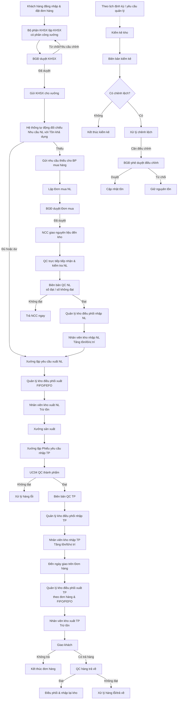
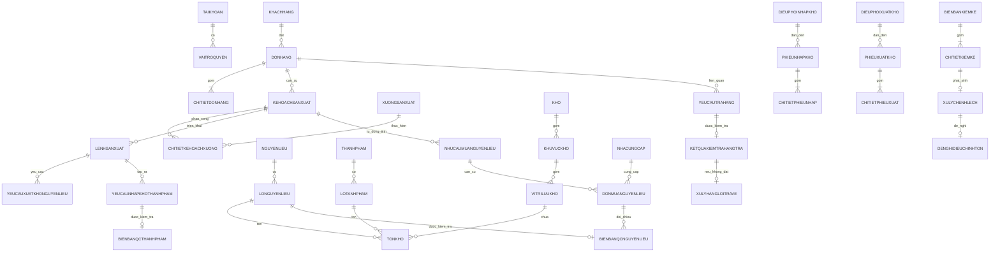

# SOFTWARE REQUIREMENTS SPECIFICATION (SRS)
## HỆ THỐNG QUẢN LÝ KHO NHÀ MÁY

> **Nguồn nghiệp vụ:** Tài liệu “Đặc tả UseCase Hệ thống kho Final(1).docx”.  
> **Mẫu cấu trúc:** `srs.md` của dự án CAB System trong repository `23669941_NguyenDinhTrong_Cabsystem`.  
> **Phiên bản cập nhật nghiệp vụ:** Tài liệu này đã được đồng bộ theo luồng nghiệp vụ được nhóm chốt sau khi rà soát đặc tả gốc.
>
> **Các thay đổi nghiệp vụ chính:** (1) phân công xưởng được thực hiện ngay trong UC02 – Lập kế hoạch sản xuất, không còn là Use Case độc lập; (2) **UC04 được sử dụng cho Kiểm tra chất lượng thành phẩm** trước khi điều phối nhập kho thành phẩm; (3) sau khi KHSX được duyệt, hệ thống tự động đối chiếu nhu cầu nguyên liệu với tồn khả dụng và chỉ phát sinh nhu cầu mua phần còn thiếu; (4) không tách UC Tiếp nhận giao hàng – QC nguyên liệu trực tiếp tiếp nhận và kiểm tra khi NCC giao hàng; (5) hàng trả về là nhánh sau giao hàng; (6) kiểm kê là quy trình định kỳ chạy song song với luồng vận hành chính.
>
> **Ghi chú:** Các phần Business Context, BR, Data Model và NFR được hệ thống hóa từ đặc tả gốc và quyết định nghiệp vụ mới đã chốt.

---

Bước 1: xác định ngữ cảnh

# 1. Xác định ngữ cảnh (Business Context)

Nhà máy có nhu cầu quản lý xuyên suốt luồng từ khách hàng đặt hàng, lập và duyệt kế hoạch sản xuất có phân công xưởng, tự động đối chiếu nhu cầu nguyên liệu với tồn kho, mua nguyên liệu khi thiếu, QC nguyên liệu tại thời điểm nhà cung cấp giao hàng, điều phối nhập/xuất, cấp nguyên liệu cho xưởng, sản xuất, QC thành phẩm, nhập thành phẩm, xuất giao khách, xử lý hàng trả về, đồng thời thực hiện kiểm kê định kỳ và điều chỉnh tồn kho khi được phê duyệt.

Hệ thống quản lý kho cần bảo đảm mọi biến động tồn kho phát sinh từ nghiệp vụ/chứng từ hợp lệ, quản lý theo lô và vị trí lưu trữ, hỗ trợ FIFO/FEFO, kiểm soát chất lượng, điều phối kho và cung cấp khả năng tra cứu, báo cáo, cảnh báo. Mục tiêu là giảm thao tác thủ công, tăng khả năng truy vết và bảo đảm số liệu tồn kho nhất quán giữa thực tế và hệ thống.

---

# 2. Business Problem

## 2.1. Dữ liệu tồn kho dễ sai lệch nếu cập nhật thủ công
Hệ thống cần gắn biến động tồn với phiếu nhập, phiếu xuất hoặc điều chỉnh tồn đã được phê duyệt.

## 2.2. Khó truy vết nguyên liệu/thành phẩm theo lô
Hệ thống cần lưu mã lô, ngày sản xuất/nhập, hạn sử dụng, số lượng còn lại, kho và vị trí.

## 2.3. Điều phối nhập/xuất cần dựa trên sức chứa và lô phù hợp
Hệ thống cần xác định kho/khu vực phù hợp khi nhập và gợi ý lô theo FIFO/FEFO khi xuất.

## 2.4. Kế hoạch sản xuất cần gắn xưởng và tự động xác định thiếu nguyên liệu

Kế hoạch sản xuất phải được lập theo đơn hàng, bao gồm xưởng thực hiện, sản phẩm, số lượng, thời gian và nhu cầu nguyên liệu. Sau khi Ban giám đốc duyệt, hệ thống phải tự động đối chiếu nhu cầu nguyên liệu với tồn khả dụng; chỉ phần thiếu mới được chuyển thành nhu cầu mua.

## 2.5. Chất lượng nguyên liệu và thành phẩm cần được kiểm soát trước khi nhập kho

Nguyên liệu được QC trực tiếp khi nhà cung cấp giao đến kho; biên bản QC phải tách rõ số lượng đạt và không đạt, phần không đạt được trả nhà cung cấp và không được cộng tồn. Thành phẩm sau sản xuất phải qua QC thành phẩm; chỉ số lượng đạt mới được điều phối và nhập kho thành phẩm.

## 2.6. Chênh lệch kiểm kê cần kiểm soát và phê duyệt
Hệ thống phải ghi nhận nguyên nhân, phương án xử lý và chỉ cập nhật tồn sau phê duyệt khi cần.

## 2.7. Thiếu thông tin quản trị tập trung
Bộ phận quản lý kho và Ban giám đốc cần báo cáo tồn, nhập/xuất, hiệu suất lưu kho và cảnh báo.

# Stakeholders – Hệ thống quản lý kho

| Stakeholder | Vai trò | Mối quan tâm / Mục tiêu |
|---|---|---|
| Ban giám đốc | Decision Maker / Approver | Duyệt kế hoạch, đơn mua, điều chỉnh tồn; theo dõi báo cáo |
| Khách hàng | End User | Đặt hàng, nhận đúng sản phẩm/số lượng |
| Bộ phận lập kế hoạch sản xuất | Operational User | Lập kế hoạch, kiểm tra khả thi, phân công xưởng |
| Bộ phận mua hàng | Operational User | Lập đơn mua nguyên liệu |
| Bộ phận quản lý kho | Operational User | Điều phối, quản lý dữ liệu kho/lô, xử lý chênh lệch và hàng lỗi |
| Nhân viên kho | Operational User | Nhập/xuất thực tế và lập chứng từ |
| Bộ phận QC | Quality User | Kiểm tra nguyên liệu và hàng trả về |
| Xưởng sản xuất | Operational User | Yêu cầu cấp nguyên liệu, yêu cầu nhập thành phẩm |
| Hội đồng kiểm kê | Control User | Kiểm kê và lập biên bản |
| Quản trị hệ thống | Supporting Role | Duy trì tài khoản, quyền và hệ thống kỹ thuật |

# Stakeholder Power–Interest Matrix

| QUYỀN LỰC / MỨC ĐỘ QUAN TÂM | Thấp | Cao |
|---|---|---|
| Cao | Quản trị hệ thống | Ban giám đốc; Bộ phận quản lý kho; Bộ phận lập kế hoạch sản xuất |
| Thấp | Khách hàng | Nhân viên kho; QC; Xưởng sản xuất; Bộ phận mua hàng; Hội đồng kiểm kê |

---

Bước 3: xác định Business Goals

## 3. Business Goals

- **BG1:** Số hóa toàn bộ luồng nhập, xuất và điều chỉnh tồn kho dựa trên chứng từ.
- **BG2:** Bảo đảm tồn kho được cập nhật nhất quán sau mỗi nghiệp vụ hợp lệ.
- **BG3:** Quản lý nguyên liệu và thành phẩm theo lô, hạn sử dụng và vị trí.
- **BG4:** Áp dụng FIFO/FEFO để giảm rủi ro tồn lâu và hết hạn.
- **BG5:** Tăng khả năng truy vết từ đơn hàng/kế hoạch/lệnh sản xuất đến phiếu nhập xuất và lô.
- **BG6:** Kiểm soát chất lượng nguyên liệu và hàng trả về trước khi nhập kho.
- **BG7:** Kiểm soát chênh lệch kiểm kê bằng quy trình xử lý và phê duyệt.
- **BG8:** Hỗ trợ điều phối kho, sử dụng sức chứa hợp lý.
- **BG9:** Cung cấp tra cứu, báo cáo và cảnh báo phục vụ vận hành và quản trị.
- **BG10:** Phân quyền rõ ràng theo vai trò, hạn chế thao tác sai hoặc vượt quyền.

---

Bước 4: xác định Scope

## 4. Scope – Phạm vi hệ thống
### 4.1. In Scope

1. Đăng nhập và phân quyền theo vai trò.
2. Khách hàng đặt đơn hàng thành phẩm.
3. Lập kế hoạch sản xuất theo đơn hàng, trong đó **chọn/phân công xưởng ngay trong kế hoạch**.
4. Ban giám đốc duyệt, từ chối hoặc yêu cầu điều chỉnh KHSX.
5. Sau khi KHSX được duyệt, hệ thống **tự động đối chiếu nhu cầu nguyên liệu với tồn khả dụng**; nếu đủ/dư thì không mua, nếu thiếu thì gửi nhu cầu thiếu cho Bộ phận mua hàng.
6. Lập và duyệt Đơn mua nguyên liệu cho đúng phần còn thiếu.
7. Nhà cung cấp giao nguyên liệu vật lý đến kho; Bộ phận QC trực tiếp tiếp nhận, đối chiếu PO và kiểm tra chất lượng. Không tách Use Case Tiếp nhận giao hàng.
8. Lập Biên bản QC nguyên liệu, ghi rõ tổng giao, số lượng đạt, số lượng không đạt; phần không đạt được trả NCC và không nhập tồn.
9. Điều phối nhập kho và nhập kho nguyên liệu đạt QC.
10. Xưởng lập Phiếu yêu cầu xuất kho nguyên liệu; Quản lý kho điều phối lô theo FIFO/FEFO; Nhân viên kho xuất và hệ thống trừ tồn.
11. Xưởng sản xuất theo KHSX đã duyệt.
12. Xưởng lập Phiếu yêu cầu nhập kho thành phẩm sau khi sản xuất hoàn thành.
13. **UC04 – Kiểm tra chất lượng thành phẩm**: QC kiểm tra và lập biên bản; số lượng đạt được chuyển điều phối nhập kho, số lượng không đạt chuyển xử lý hàng lỗi.
14. Điều phối và nhập kho thành phẩm đạt QC; cập nhật tồn, lô và vị trí.
15. Đến ngày giao hàng trên Đơn hàng, Quản lý kho điều phối xuất thành phẩm theo đơn hàng/lô; Nhân viên kho lập phiếu xuất và giao khách.
16. Xử lý hàng khách trả về: QC → đạt thì điều phối/nhập lại kho, không đạt thì xử lý hàng lỗi/trả về.
17. Kiểm kê kho theo lịch định kỳ hoặc yêu cầu quản lý; xử lý chênh lệch và chỉ điều chỉnh tồn sau khi BGĐ phê duyệt.
18. Quản lý nguyên liệu, thành phẩm, lô, kho, khu vực/vị trí lưu trữ.
19. Tra cứu dữ liệu kho, thống kê, báo cáo và cảnh báo.

### 4.2. System Boundary

**Luồng nghiệp vụ chính:**

Khách hàng đặt hàng → Lập KHSX + phân công xưởng → BGĐ duyệt → Hệ thống tự động đối chiếu nhu cầu NL với tồn khả dụng → nếu thiếu: mua NL → BGĐ duyệt PO → NCC giao hàng → QC nguyên liệu → điều phối/nhập NL → Xưởng yêu cầu xuất NL → điều phối/xuất NL → sản xuất → yêu cầu nhập TP → QC thành phẩm → điều phối/nhập TP → đến ngày giao hàng: điều phối/xuất TP theo Đơn hàng → giao khách → nếu phát sinh trả hàng: QC hàng trả → nhập lại hoặc xử lý hàng lỗi.

**Quy trình song song:** kiểm kê định kỳ → lập biên bản → xử lý chênh lệch → đề nghị điều chỉnh (nếu cần) → BGĐ phê duyệt → cập nhật tồn. Quản lý danh mục/lô/vị trí và tra cứu/báo cáo/cảnh báo chạy xuyên suốt.

### 4.3. Out of Scope / Không tách thành Use Case độc lập

* Kế toán tài chính, hóa đơn và thanh toán.
* Quản lý vận tải/tối ưu tuyến đường sau khi hàng đã xuất kho.
* Cổng nhà cung cấp bên ngoài.
* **Tiếp nhận giao hàng** không phải UC riêng: NCC đưa hàng đến kho và Bộ phận QC trực tiếp tiếp nhận, đối chiếu và kiểm tra trong UC29.
* Hoạt động gia công/sản xuất chi tiết bên trong xưởng không thuộc phạm vi quản lý kho; hệ thống chỉ quản lý đầu vào nguyên liệu, kết quả thành phẩm và chứng từ liên quan.

---

Bước 5: Business Requirements

# 5. Business Requirements

| Mã | Tên Business Requirement | Diễn giải |
|---|---|---|
| BR01 | Xác thực và phân quyền | Người dùng chỉ được truy cập chức năng phù hợp với tài khoản, vai trò và quyền được cấp. |
| BR02 | Đơn hàng và KHSX tích hợp phân công xưởng | KHSX phải được lập theo đơn hàng và chứa xưởng thực hiện, sản phẩm, số lượng, thời gian, nhu cầu nguyên liệu trước khi gửi BGĐ duyệt. |
| BR03 | Tự động đối chiếu nhu cầu nguyên liệu | Sau khi KHSX được duyệt, hệ thống tự động tính phần thiếu = max(0, nhu cầu theo KHSX − tồn khả dụng); chỉ phần thiếu được gửi Bộ phận mua hàng. |
| BR04 | Mua và QC nguyên liệu | Bộ phận mua hàng lập PO cho phần thiếu, BGĐ duyệt; khi NCC giao hàng, QC trực tiếp kiểm tra và lập biên bản ghi rõ số đạt/không đạt; phần không đạt trả NCC. |
| BR05 | Điều phối nhập/xuất kho | Quản lý kho xác định kho, khu vực/vị trí và lô phù hợp trước khi Nhân viên kho nhập/xuất. |
| BR06 | Quản lý nhập kho | Chỉ nguyên liệu/thành phẩm/hàng trả đủ điều kiện QC mới được nhập; hệ thống cập nhật tồn, lô và vị trí sau phiếu nhập hợp lệ. |
| BR07 | Cấp nguyên liệu sản xuất | Xưởng phải lập phiếu yêu cầu xuất NL; quản lý kho điều phối lô theo FIFO/FEFO; Nhân viên kho xuất và hệ thống trừ tồn. |
| BR08 | QC và nhập thành phẩm | Thành phẩm sau sản xuất phải có Phiếu yêu cầu nhập và Biên bản QC thành phẩm; chỉ số đạt được điều phối/nhập kho, số không đạt chuyển xử lý hàng lỗi. |
| BR09 | Xuất thành phẩm theo đơn hàng | Đến ngày giao, Quản lý kho lấy Đơn hàng làm căn cứ điều phối xuất đúng sản phẩm/số lượng/lô; Nhân viên kho lập phiếu xuất và hệ thống trừ tồn. |
| BR10 | Quản lý hàng trả về/hàng lỗi | Sau giao hàng, hàng trả về phải qua QC; đạt thì nhập lại kho, không đạt thì chuyển xử lý hàng lỗi/trả về. |
| BR11 | Kiểm kê và điều chỉnh tồn định kỳ | Kiểm kê là quy trình song song theo lịch; chênh lệch phải được xử lý và chỉ cập nhật tồn sau khi BGĐ phê duyệt điều chỉnh. |
| BR12 | Quản lý lô, dữ liệu kho và truy vết | Hệ thống quản lý nguyên liệu, thành phẩm, lô, kho, vị trí; mọi biến động tồn phải truy vết được chứng từ nguồn và không được chỉnh trực tiếp. |
| BR13 | Tra cứu, báo cáo và cảnh báo | Hệ thống cung cấp tra cứu, báo cáo tồn/nhập/xuất/hiệu suất và cảnh báo vận hành. |

---

Bước 6: Business Process

# 6. Business Process

| Mã | Business Process | Mô tả |
|---|---|---|
| BP01 | Xác thực & phân quyền | Người dùng đăng nhập, hệ thống xác định vai trò/quyền. |
| BP02 | Đơn hàng & KHSX | Khách đặt hàng; Bộ phận KHSX lập kế hoạch có phân công xưởng; BGĐ duyệt; kế hoạch đã duyệt được gửi xưởng. |
| BP03 | Đối chiếu nhu cầu nguyên liệu | Sau phê duyệt KHSX, hệ thống tự động so nhu cầu NL với tồn khả dụng; đủ/dư thì không mua, thiếu thì tạo/gửi nhu cầu thiếu cho Bộ phận mua hàng. |
| BP04 | Mua & QC nguyên liệu | Bộ phận mua lập PO cho phần thiếu, BGĐ duyệt; NCC giao hàng; QC trực tiếp tiếp nhận, đối chiếu và lập biên bản số đạt/không đạt; không đạt trả NCC. |
| BP05 | Nhập kho nguyên liệu | Quản lý kho điều phối kho/vị trí cho số đạt QC; Nhân viên kho lập PNK NL; hệ thống tăng tồn/lô/vị trí. |
| BP06 | Cấp nguyên liệu sản xuất | Xưởng lập yêu cầu xuất NL; Quản lý kho điều phối lô theo FIFO/FEFO; Nhân viên kho lập PXK NL; hệ thống trừ tồn. |
| BP07 | Sản xuất & QC thành phẩm | Xưởng sản xuất, lập yêu cầu nhập TP; QC kiểm tra thành phẩm và lập biên bản đạt/không đạt. |
| BP08 | Nhập kho thành phẩm | Số TP đạt QC được Quản lý kho điều phối; Nhân viên kho lập PNK TP; hệ thống tăng tồn/lô/vị trí. |
| BP09 | Xuất giao khách | Đến ngày giao trên Đơn hàng, Quản lý kho điều phối lô/số lượng; Nhân viên kho lập PXK TP; hệ thống trừ tồn và cập nhật trạng thái đơn. |
| BP10 | Hàng trả về/hàng lỗi | Nếu khách trả hàng, QC kiểm tra; đạt thì điều phối/nhập lại, không đạt thì xử lý hàng lỗi/trả về. |
| BP11 | Kiểm kê & điều chỉnh | Theo lịch định kỳ/yêu cầu: kiểm đếm, lập biên bản, xử lý chênh lệch, đề nghị và phê duyệt điều chỉnh. |
| BP12 | Quản lý dữ liệu kho | Quản lý nguyên liệu, thành phẩm, lô, kho, vị trí; hỗ trợ truy vết. |
| BP13 | Tra cứu, báo cáo & cảnh báo | Tra cứu dữ liệu, tổng hợp báo cáo và cảnh báo vận hành. |

## 6.1. Tổng quan quy trình nghiệp vụ

### 6.2. Quy tắc tự động đối chiếu nhu cầu nguyên liệu

Với từng nguyên liệu trong KHSX đã duyệt:

`SoLuongThieu = max(0, NhuCauTheoKHSX - TonKhaDung)`

- `SoLuongThieu = 0`: tồn đủ hoặc dư → không phát sinh mua.
- `SoLuongThieu > 0`: hệ thống tạo/gửi nhu cầu thiếu cho Bộ phận mua hàng; PO chỉ được lập cho phần thiếu cần mua.
- Tồn khả dụng phải loại trừ lượng đã giữ/chờ xuất cho nghiệp vụ khác nếu hệ thống áp dụng cơ chế reservation.

---

Bước 7: phân rã yêu cầu chức năng

# 7. Functional Requirements

> Các FR dưới đây được phân rã trực tiếp từ mục tiêu, luồng chính, hậu điều kiện và ngoại lệ của từng Use Case để tạo ma trận truy xuất tương tự CAB System.

## 7.1 Đăng nhập hệ thống – UC01

| Mã | Functional Requirement | Diễn giải |
|---|---|---|
| FR01 | Đăng nhập hệ thống - truy cập/thực hiện | Hệ thống cho phép Tất cả các Actor thực hiện chức năng Đăng nhập hệ thống khi đáp ứng tiền điều kiện và quyền truy cập. |
| FR02 | Đăng nhập hệ thống - xử lý nghiệp vụ | Hệ thống phải kiểm tra dữ liệu/trạng thái liên quan và thực hiện luồng nghiệp vụ chính của Đăng nhập hệ thống. |
| FR03 | Đăng nhập hệ thống - lưu/cập nhật kết quả | Hệ thống phải lưu hoặc cập nhật kết quả theo hậu điều kiện của Đăng nhập hệ thống, đồng thời không làm thay đổi dữ liệu khi thao tác thất bại. |

## 7.2 Lập kế hoạch sản xuất – UC02

| Mã | Functional Requirement | Diễn giải |
|---|---|---|
| FR04 | Lập KHSX theo đơn hàng | Bộ phận lập KHSX chọn đơn hàng đủ điều kiện và lập kế hoạch với sản phẩm, số lượng, thời gian và nhu cầu nguyên liệu. |
| FR05 | Phân công xưởng trong KHSX | Ngay trong quá trình lập KHSX, người dùng phải chọn xưởng thực hiện; hệ thống kiểm tra năng lực/lịch xưởng trước khi cho lưu. |
| FR06 | Gửi KHSX chờ duyệt | KHSX hợp lệ được lưu với trạng thái “Chờ duyệt” và chứa đầy đủ đơn hàng, xưởng, sản phẩm, số lượng, thời gian, nhu cầu NL. |

## 7.3 Duyệt kế hoạch sản xuất – UC03

| Mã | Functional Requirement | Diễn giải |
|---|---|---|
| FR07 | Xem và duyệt KHSX | BGĐ xem toàn bộ nội dung KHSX, bao gồm xưởng đã phân công, và chọn Duyệt/Từ chối/Yêu cầu điều chỉnh. |
| FR08 | Gửi kế hoạch đã duyệt cho xưởng | Khi duyệt, hệ thống chuyển trạng thái KHSX sang “Đã duyệt” và gửi/hiển thị kế hoạch cho xưởng được phân công. |
| FR09 | Tự động đối chiếu nhu cầu NL | Ngay sau khi KHSX được duyệt, hệ thống tự động so nhu cầu từng NL với tồn khả dụng; đủ/dư không phát sinh mua, thiếu thì ghi nhận số thiếu và gửi nhu cầu cho Bộ phận mua hàng. |

## 7.4 Kiểm tra chất lượng thành phẩm – UC04

| Mã | Functional Requirement | Diễn giải |
|---|---|---|
| FR10 | Tiếp nhận thành phẩm chờ QC | QC xem Phiếu yêu cầu nhập kho thành phẩm sau sản xuất và thông tin KHSX/lô liên quan. |
| FR11 | Kiểm tra và phân loại số lượng | QC ghi tổng số kiểm tra, số đạt, số không đạt, tiêu chí/kết quả và lý do không đạt. |
| FR12 | Lập Biên bản QC thành phẩm | Hệ thống lưu Biên bản QC thành phẩm; số đạt chuyển “Đủ điều kiện điều phối nhập”, số không đạt chuyển luồng xử lý hàng lỗi và không được cộng tồn thành phẩm đạt. |

## 7.5 Thống kê báo cáo & Cảnh báo kho – UC05

| Mã | Functional Requirement | Diễn giải |
|---|---|---|
| FR13 | Thống kê báo cáo & Cảnh báo kho - truy cập/thực hiện | Hệ thống cho phép Bộ phận quản lý kho; Ban giám đốc thực hiện chức năng Thống kê báo cáo & Cảnh báo kho khi đáp ứng tiền điều kiện và quyền truy cập. |
| FR14 | Thống kê báo cáo & Cảnh báo kho - xử lý nghiệp vụ | Hệ thống phải kiểm tra dữ liệu/trạng thái liên quan và thực hiện luồng nghiệp vụ chính của Thống kê báo cáo & Cảnh báo kho. |
| FR15 | Thống kê báo cáo & Cảnh báo kho - lưu/cập nhật kết quả | Hệ thống phải lưu hoặc cập nhật kết quả theo hậu điều kiện của Thống kê báo cáo & Cảnh báo kho, đồng thời không làm thay đổi dữ liệu khi thao tác thất bại. |

## 7.6 Tra cứu dữ liệu kho – UC06

| Mã | Functional Requirement | Diễn giải |
|---|---|---|
| FR16 | Tra cứu dữ liệu kho - truy cập/thực hiện | Hệ thống cho phép Bộ phận quản lý kho; Nhân viên kho thực hiện chức năng Tra cứu dữ liệu kho khi đáp ứng tiền điều kiện và quyền truy cập. |
| FR17 | Tra cứu dữ liệu kho - xử lý nghiệp vụ | Hệ thống phải kiểm tra dữ liệu/trạng thái liên quan và thực hiện luồng nghiệp vụ chính của Tra cứu dữ liệu kho. |
| FR18 | Tra cứu dữ liệu kho - lưu/cập nhật kết quả | Hệ thống phải lưu hoặc cập nhật kết quả theo hậu điều kiện của Tra cứu dữ liệu kho, đồng thời không làm thay đổi dữ liệu khi thao tác thất bại. |

## 7.7 Lập biên bản kiểm kê – UC07

| Mã | Functional Requirement | Diễn giải |
|---|---|---|
| FR19 | Lập biên bản kiểm kê - truy cập/thực hiện | Hệ thống cho phép Hội đồng kiểm kê thực hiện chức năng Lập biên bản kiểm kê khi đáp ứng tiền điều kiện và quyền truy cập. |
| FR20 | Lập biên bản kiểm kê - xử lý nghiệp vụ | Hệ thống phải kiểm tra dữ liệu/trạng thái liên quan và thực hiện luồng nghiệp vụ chính của Lập biên bản kiểm kê. |
| FR21 | Lập biên bản kiểm kê - lưu/cập nhật kết quả | Hệ thống phải lưu hoặc cập nhật kết quả theo hậu điều kiện của Lập biên bản kiểm kê, đồng thời không làm thay đổi dữ liệu khi thao tác thất bại. |

## 7.8 Xử lý chênh lệch kiểm kê – UC08

| Mã | Functional Requirement | Diễn giải |
|---|---|---|
| FR22 | Xử lý chênh lệch kiểm kê - truy cập/thực hiện | Hệ thống cho phép Bộ phận quản lý kho thực hiện chức năng Xử lý chênh lệch kiểm kê khi đáp ứng tiền điều kiện và quyền truy cập. |
| FR23 | Xử lý chênh lệch kiểm kê - xử lý nghiệp vụ | Hệ thống phải kiểm tra dữ liệu/trạng thái liên quan và thực hiện luồng nghiệp vụ chính của Xử lý chênh lệch kiểm kê. |
| FR24 | Xử lý chênh lệch kiểm kê - lưu/cập nhật kết quả | Hệ thống phải lưu hoặc cập nhật kết quả theo hậu điều kiện của Xử lý chênh lệch kiểm kê, đồng thời không làm thay đổi dữ liệu khi thao tác thất bại. |

## 7.9 Phê duyệt điều chỉnh tồn kho – UC09

| Mã | Functional Requirement | Diễn giải |
|---|---|---|
| FR25 | Phê duyệt điều chỉnh tồn kho - truy cập/thực hiện | Hệ thống cho phép Ban giám đốc thực hiện chức năng Phê duyệt điều chỉnh tồn kho khi đáp ứng tiền điều kiện và quyền truy cập. |
| FR26 | Phê duyệt điều chỉnh tồn kho - xử lý nghiệp vụ | Hệ thống phải kiểm tra dữ liệu/trạng thái liên quan và thực hiện luồng nghiệp vụ chính của Phê duyệt điều chỉnh tồn kho. |
| FR27 | Phê duyệt điều chỉnh tồn kho - lưu/cập nhật kết quả | Hệ thống phải lưu hoặc cập nhật kết quả theo hậu điều kiện của Phê duyệt điều chỉnh tồn kho, đồng thời không làm thay đổi dữ liệu khi thao tác thất bại. |

## 7.10 Quản lý nguyên liệu – UC10

| Mã | Functional Requirement | Diễn giải |
|---|---|---|
| FR28 | Quản lý nguyên liệu - truy cập/thực hiện | Hệ thống cho phép Bộ phận quản lý kho thực hiện chức năng Quản lý nguyên liệu khi đáp ứng tiền điều kiện và quyền truy cập. |
| FR29 | Quản lý nguyên liệu - xử lý nghiệp vụ | Hệ thống phải kiểm tra dữ liệu/trạng thái liên quan và thực hiện luồng nghiệp vụ chính của Quản lý nguyên liệu. |
| FR30 | Quản lý nguyên liệu - lưu/cập nhật kết quả | Hệ thống phải lưu hoặc cập nhật kết quả theo hậu điều kiện của Quản lý nguyên liệu, đồng thời không làm thay đổi dữ liệu khi thao tác thất bại. |

## 7.11 Đặt đơn hàng – UC11

| Mã | Functional Requirement | Diễn giải |
|---|---|---|
| FR31 | Đặt đơn hàng - truy cập/thực hiện | Hệ thống cho phép Khách hàng thực hiện chức năng Đặt đơn hàng khi đáp ứng tiền điều kiện và quyền truy cập. |
| FR32 | Đặt đơn hàng - xử lý nghiệp vụ | Hệ thống phải kiểm tra dữ liệu/trạng thái liên quan và thực hiện luồng nghiệp vụ chính của Đặt đơn hàng. |
| FR33 | Đặt đơn hàng - lưu/cập nhật kết quả | Hệ thống phải lưu hoặc cập nhật kết quả theo hậu điều kiện của Đặt đơn hàng, đồng thời không làm thay đổi dữ liệu khi thao tác thất bại. |

## 7.12 Xuất kho thành phẩm giao hàng – UC12

| Mã | Functional Requirement | Diễn giải |
|---|---|---|
| FR34 | Lấy Đơn hàng làm căn cứ xuất | Đến ngày giao, hệ thống cho phép xử lý các Đơn hàng đủ điều kiện; Đơn hàng là chứng từ chính xác định sản phẩm, số lượng và khách nhận. |
| FR35 | Xuất đúng lô/số lượng | Phiếu xuất phải sử dụng kết quả điều phối, tuân thủ FIFO/FEFO, không dùng lô hết hạn và không vượt tồn khả dụng. |
| FR36 | Cập nhật tồn và trạng thái đơn | Sau khi xuất thành công, hệ thống trừ tồn theo lô/vị trí, tạo phiếu xuất và cập nhật trạng thái Đơn hàng “Đã xuất/Đang giao”. |

## 7.13 Điều phối nhập kho – UC13

| Mã | Functional Requirement | Diễn giải |
|---|---|---|
| FR37 | Điều phối nhập kho - truy cập/thực hiện | Hệ thống cho phép Bộ phận quản lý kho thực hiện chức năng Điều phối nhập kho khi đáp ứng tiền điều kiện và quyền truy cập. |
| FR38 | Điều phối nhập kho - xử lý nghiệp vụ | Hệ thống phải kiểm tra dữ liệu/trạng thái liên quan và thực hiện luồng nghiệp vụ chính của Điều phối nhập kho. |
| FR39 | Điều phối nhập kho - lưu/cập nhật kết quả | Hệ thống phải lưu hoặc cập nhật kết quả theo hậu điều kiện của Điều phối nhập kho, đồng thời không làm thay đổi dữ liệu khi thao tác thất bại. |

## 7.14 Kiểm tra hàng trả về – UC14

| Mã | Functional Requirement | Diễn giải |
|---|---|---|
| FR40 | Kiểm tra hàng trả về - truy cập/thực hiện | Hệ thống cho phép Bộ phận QC thực hiện chức năng Kiểm tra hàng trả về khi đáp ứng tiền điều kiện và quyền truy cập. |
| FR41 | Kiểm tra hàng trả về - xử lý nghiệp vụ | Hệ thống phải kiểm tra dữ liệu/trạng thái liên quan và thực hiện luồng nghiệp vụ chính của Kiểm tra hàng trả về. |
| FR42 | Kiểm tra hàng trả về - lưu/cập nhật kết quả | Hệ thống phải lưu hoặc cập nhật kết quả theo hậu điều kiện của Kiểm tra hàng trả về, đồng thời không làm thay đổi dữ liệu khi thao tác thất bại. |

## 7.15 Điều phối xuất kho – UC15

| Mã | Functional Requirement | Diễn giải |
|---|---|---|
| FR43 | Điều phối xuất kho - truy cập/thực hiện | Hệ thống cho phép Bộ phận quản lý kho thực hiện chức năng Điều phối xuất kho khi đáp ứng tiền điều kiện và quyền truy cập. |
| FR44 | Điều phối xuất kho - xử lý nghiệp vụ | Hệ thống phải kiểm tra dữ liệu/trạng thái liên quan và thực hiện luồng nghiệp vụ chính của Điều phối xuất kho. |
| FR45 | Điều phối xuất kho - lưu/cập nhật kết quả | Hệ thống phải lưu hoặc cập nhật kết quả theo hậu điều kiện của Điều phối xuất kho, đồng thời không làm thay đổi dữ liệu khi thao tác thất bại. |

## 7.16 Nhập kho thành phẩm – UC16

| Mã | Functional Requirement | Diễn giải |
|---|---|---|
| FR46 | Kiểm tra điều kiện nhập TP | Chỉ cho nhập thành phẩm có Phiếu yêu cầu nhập, Biên bản QC thành phẩm kết luận đạt và thông tin điều phối nhập hợp lệ. |
| FR47 | Lập phiếu nhập thành phẩm | Nhân viên kho xác nhận số lượng đạt QC, lô sản xuất và vị trí theo điều phối; hệ thống tạo Phiếu nhập kho thành phẩm. |
| FR48 | Cập nhật tồn/lô/vị trí | Sau khi phiếu nhập thành công, hệ thống tăng tồn thành phẩm, cập nhật lô và vị trí; số không đạt QC không được cộng tồn thành phẩm đạt. |

## 7.17 Nhập kho hàng trả về – UC17

| Mã | Functional Requirement | Diễn giải |
|---|---|---|
| FR49 | Nhập kho hàng trả về - truy cập/thực hiện | Hệ thống cho phép Nhân viên kho thực hiện chức năng Nhập kho hàng trả về khi đáp ứng tiền điều kiện và quyền truy cập. |
| FR50 | Nhập kho hàng trả về - xử lý nghiệp vụ | Hệ thống phải kiểm tra dữ liệu/trạng thái liên quan và thực hiện luồng nghiệp vụ chính của Nhập kho hàng trả về. |
| FR51 | Nhập kho hàng trả về - lưu/cập nhật kết quả | Hệ thống phải lưu hoặc cập nhật kết quả theo hậu điều kiện của Nhập kho hàng trả về, đồng thời không làm thay đổi dữ liệu khi thao tác thất bại. |

## 7.18 Xử lý hàng lỗi và hàng trả về – UC18

| Mã | Functional Requirement | Diễn giải |
|---|---|---|
| FR52 | Xử lý hàng lỗi và hàng trả về - truy cập/thực hiện | Hệ thống cho phép Bộ phận quản lý kho (phối hợp Bộ phận QC) thực hiện chức năng Xử lý hàng lỗi và hàng trả về khi đáp ứng tiền điều kiện và quyền truy cập. |
| FR53 | Xử lý hàng lỗi và hàng trả về - xử lý nghiệp vụ | Hệ thống phải kiểm tra dữ liệu/trạng thái liên quan và thực hiện luồng nghiệp vụ chính của Xử lý hàng lỗi và hàng trả về. |
| FR54 | Xử lý hàng lỗi và hàng trả về - lưu/cập nhật kết quả | Hệ thống phải lưu hoặc cập nhật kết quả theo hậu điều kiện của Xử lý hàng lỗi và hàng trả về, đồng thời không làm thay đổi dữ liệu khi thao tác thất bại. |

## 7.19 Quản lý dữ liệu kho – UC19

| Mã | Functional Requirement | Diễn giải |
|---|---|---|
| FR55 | Quản lý dữ liệu kho - truy cập/thực hiện | Hệ thống cho phép Bộ phận quản lý kho thực hiện chức năng Quản lý dữ liệu kho khi đáp ứng tiền điều kiện và quyền truy cập. |
| FR56 | Quản lý dữ liệu kho - xử lý nghiệp vụ | Hệ thống phải kiểm tra dữ liệu/trạng thái liên quan và thực hiện luồng nghiệp vụ chính của Quản lý dữ liệu kho. |
| FR57 | Quản lý dữ liệu kho - lưu/cập nhật kết quả | Hệ thống phải lưu hoặc cập nhật kết quả theo hậu điều kiện của Quản lý dữ liệu kho, đồng thời không làm thay đổi dữ liệu khi thao tác thất bại. |

## 7.20 Quản lý lô thành phẩm – UC20

| Mã | Functional Requirement | Diễn giải |
|---|---|---|
| FR58 | Quản lý lô thành phẩm - truy cập/thực hiện | Hệ thống cho phép Bộ phận quản lý kho thực hiện chức năng Quản lý lô thành phẩm khi đáp ứng tiền điều kiện và quyền truy cập. |
| FR59 | Quản lý lô thành phẩm - xử lý nghiệp vụ | Hệ thống phải kiểm tra dữ liệu/trạng thái liên quan và thực hiện luồng nghiệp vụ chính của Quản lý lô thành phẩm. |
| FR60 | Quản lý lô thành phẩm - lưu/cập nhật kết quả | Hệ thống phải lưu hoặc cập nhật kết quả theo hậu điều kiện của Quản lý lô thành phẩm, đồng thời không làm thay đổi dữ liệu khi thao tác thất bại. |

## 7.21 Nhập kho nguyên liệu – UC21

| Mã | Functional Requirement | Diễn giải |
|---|---|---|
| FR61 | Nhập kho nguyên liệu - truy cập/thực hiện | Hệ thống cho phép Nhân viên kho thực hiện chức năng Nhập kho nguyên liệu khi đáp ứng tiền điều kiện và quyền truy cập. |
| FR62 | Nhập kho nguyên liệu - xử lý nghiệp vụ | Hệ thống phải kiểm tra dữ liệu/trạng thái liên quan và thực hiện luồng nghiệp vụ chính của Nhập kho nguyên liệu. |
| FR63 | Nhập kho nguyên liệu - lưu/cập nhật kết quả | Hệ thống phải lưu hoặc cập nhật kết quả theo hậu điều kiện của Nhập kho nguyên liệu, đồng thời không làm thay đổi dữ liệu khi thao tác thất bại. |

## 7.22 Lập phiếu yêu cầu xuất kho nguyên liệu – UC22

| Mã | Functional Requirement | Diễn giải |
|---|---|---|
| FR64 | Lập phiếu yêu cầu xuất kho nguyên liệu - truy cập/thực hiện | Hệ thống cho phép Xưởng sản xuất thực hiện chức năng Lập phiếu yêu cầu xuất kho nguyên liệu khi đáp ứng tiền điều kiện và quyền truy cập. |
| FR65 | Lập phiếu yêu cầu xuất kho nguyên liệu - xử lý nghiệp vụ | Hệ thống phải kiểm tra dữ liệu/trạng thái liên quan và thực hiện luồng nghiệp vụ chính của Lập phiếu yêu cầu xuất kho nguyên liệu. |
| FR66 | Lập phiếu yêu cầu xuất kho nguyên liệu - lưu/cập nhật kết quả | Hệ thống phải lưu hoặc cập nhật kết quả theo hậu điều kiện của Lập phiếu yêu cầu xuất kho nguyên liệu, đồng thời không làm thay đổi dữ liệu khi thao tác thất bại. |

## 7.23 Xuất kho nguyên liệu – UC23

| Mã | Functional Requirement | Diễn giải |
|---|---|---|
| FR67 | Xuất kho nguyên liệu - truy cập/thực hiện | Hệ thống cho phép Nhân viên kho thực hiện chức năng Xuất kho nguyên liệu khi đáp ứng tiền điều kiện và quyền truy cập. |
| FR68 | Xuất kho nguyên liệu - xử lý nghiệp vụ | Hệ thống phải kiểm tra dữ liệu/trạng thái liên quan và thực hiện luồng nghiệp vụ chính của Xuất kho nguyên liệu. |
| FR69 | Xuất kho nguyên liệu - lưu/cập nhật kết quả | Hệ thống phải lưu hoặc cập nhật kết quả theo hậu điều kiện của Xuất kho nguyên liệu, đồng thời không làm thay đổi dữ liệu khi thao tác thất bại. |

## 7.24 Lập phiếu yêu cầu nhập kho thành phẩm – UC24

| Mã | Functional Requirement | Diễn giải |
|---|---|---|
| FR70 | Lập yêu cầu sau sản xuất | Xưởng chỉ được lập Phiếu yêu cầu nhập kho TP cho KHSX/lệnh sản xuất đã hoàn thành. |
| FR71 | Ghi nhận thông tin lô sản xuất | Phiếu yêu cầu phải chứa sản phẩm, số lượng hoàn thành, lô, ngày sản xuất và hạn sử dụng nếu có. |
| FR72 | Chuyển sang QC thành phẩm | Sau khi xác nhận, Phiếu yêu cầu nhập TP được chuyển sang trạng thái chờ QC và là đầu vào của UC04, chưa được cộng tồn. |

## 7.25 Quản lý thành phẩm – UC25

| Mã | Functional Requirement | Diễn giải |
|---|---|---|
| FR73 | Quản lý thành phẩm - truy cập/thực hiện | Hệ thống cho phép Bộ phận quản lý kho thực hiện chức năng Quản lý thành phẩm khi đáp ứng tiền điều kiện và quyền truy cập. |
| FR74 | Quản lý thành phẩm - xử lý nghiệp vụ | Hệ thống phải kiểm tra dữ liệu/trạng thái liên quan và thực hiện luồng nghiệp vụ chính của Quản lý thành phẩm. |
| FR75 | Quản lý thành phẩm - lưu/cập nhật kết quả | Hệ thống phải lưu hoặc cập nhật kết quả theo hậu điều kiện của Quản lý thành phẩm, đồng thời không làm thay đổi dữ liệu khi thao tác thất bại. |

## 7.26 Lập đơn mua nguyên liệu – UC26

| Mã | Functional Requirement | Diễn giải |
|---|---|---|
| FR76 | Nhận nhu cầu thiếu tự động | Bộ phận mua hàng xem danh sách nguyên liệu thiếu được hệ thống tạo sau khi KHSX đã duyệt được đối chiếu với tồn khả dụng. |
| FR77 | Lập PO cho phần thiếu | Người dùng chọn NCC, số lượng cần mua, đơn giá dự kiến; số lượng mua mặc định theo phần thiếu và phải có lý do nếu điều chỉnh theo chính sách được phép. |
| FR78 | Gửi PO chờ duyệt | Đơn mua hợp lệ được lưu ở trạng thái “Chờ phê duyệt” và liên kết KHSX/nhu cầu thiếu nguồn. |

## 7.27 Duyệt đơn mua nguyên liệu – UC27

| Mã | Functional Requirement | Diễn giải |
|---|---|---|
| FR79 | Xem PO chờ duyệt | BGĐ xem KHSX nguồn, nguyên liệu thiếu, NCC, số lượng và thông tin PO. |
| FR80 | Phê duyệt/từ chối PO | BGĐ duyệt hoặc từ chối; từ chối phải ghi nhận lý do. |
| FR81 | Cho phép thực hiện mua | Chỉ PO “Đã phê duyệt” mới là căn cứ để Bộ phận mua hàng thực hiện mua và để QC đối chiếu khi NCC giao nguyên liệu. |

## 7.29 Kiểm tra chất lượng nguyên liệu – UC29

| Mã | Functional Requirement | Diễn giải |
|---|---|---|
| FR82 | QC trực tiếp khi NCC giao | Khi NCC đưa nguyên liệu đến kho, QC trực tiếp tiếp nhận vật lý, đối chiếu PO đã duyệt và thực hiện kiểm tra; không yêu cầu UC Tiếp nhận riêng. |
| FR83 | Ghi số đạt/không đạt | Biên bản QC nguyên liệu phải ghi tổng giao, số lượng đạt, số lượng không đạt và lý do/kết quả kiểm tra. |
| FR84 | Phân luồng sau QC | Số đạt chuyển Quản lý kho để điều phối nhập; số không đạt được trả NCC ngay và không cộng tồn kho. |

## 7.30 Quản lý lô nguyên liệu – UC30

| Mã | Functional Requirement | Diễn giải |
|---|---|---|
| FR85 | Quản lý thông tin lô | Quản lý kho được thêm/cập nhật thông tin mã lô, ngày nhập/sản xuất, hạn sử dụng và trạng thái lô theo quyền. |
| FR86 | Bảo đảm truy vết và FEFO | Lô phải liên kết nguyên liệu, QC, phiếu nhập/xuất và cung cấp dữ liệu hạn dùng cho FEFO. |
| FR87 | Kiểm soát cập nhật/xóa | Không cho xóa/sửa gây mất truy vết đối với lô đã phát sinh giao dịch; mọi thay đổi hợp lệ phải được lưu. |

## 7.31. Ma trận FR → UC

| UC | FR |
|---|---|
| UC01 – Đăng nhập hệ thống | FR01–FR03 |
| UC02 – Lập kế hoạch sản xuất (bao gồm phân công xưởng) | FR04–FR06 |
| UC03 – Duyệt KHSX + kích hoạt đối chiếu nhu cầu NL | FR07–FR09 |
| UC04 – Kiểm tra chất lượng thành phẩm | FR10–FR12 |
| UC05 – Thống kê báo cáo & Cảnh báo kho | FR13–FR15 |
| UC06 – Tra cứu dữ liệu kho | FR16–FR18 |
| UC07 – Lập biên bản kiểm kê | FR19–FR21 |
| UC08 – Xử lý chênh lệch kiểm kê | FR22–FR24 |
| UC09 – Phê duyệt điều chỉnh tồn kho | FR25–FR27 |
| UC10 – Quản lý nguyên liệu | FR28–FR30 |
| UC11 – Đặt đơn hàng | FR31–FR33 |
| UC12 – Xuất kho thành phẩm giao hàng | FR34–FR36 |
| UC13 – Điều phối nhập kho | FR37–FR39 |
| UC14 – Kiểm tra hàng trả về | FR40–FR42 |
| UC15 – Điều phối xuất kho | FR43–FR45 |
| UC16 – Nhập kho thành phẩm | FR46–FR48 |
| UC17 – Nhập kho hàng trả về | FR49–FR51 |
| UC18 – Xử lý hàng lỗi và hàng trả về | FR52–FR54 |
| UC19 – Quản lý dữ liệu kho | FR55–FR57 |
| UC20 – Quản lý lô thành phẩm | FR58–FR60 |
| UC21 – Nhập kho nguyên liệu | FR61–FR63 |
| UC22 – Lập phiếu yêu cầu xuất kho nguyên liệu | FR64–FR66 |
| UC23 – Xuất kho nguyên liệu | FR67–FR69 |
| UC24 – Lập phiếu yêu cầu nhập kho thành phẩm | FR70–FR72 |
| UC25 – Quản lý thành phẩm | FR73–FR75 |
| UC26 – Lập đơn mua nguyên liệu | FR76–FR78 |
| UC27 – Duyệt đơn mua nguyên liệu | FR79–FR81 |

| UC29 – Kiểm tra chất lượng nguyên liệu | FR82–FR84 |
| UC30 – Quản lý lô nguyên liệu | FR85–FR87 |

---

Bước 8: Business Rules & exceptions

# 8. Business Rules & Exceptions

## 8.1. Business Rules

| Mã | Business Rule | Diễn giải |
|---|---|---|
| BRL01 | Phân quyền | Mọi chức năng chỉ được thực hiện bởi Actor có quyền tương ứng. |
| BRL02 | Không chỉnh tồn trực tiếp | Tồn kho chỉ thay đổi từ phiếu nhập, phiếu xuất hoặc điều chỉnh đã được phê duyệt. |
| BRL03 | Căn cứ chứng từ | Mọi nhập/xuất phải gắn chứng từ/yêu cầu nghiệp vụ hợp lệ. |
| BRL04 | KHSX bao gồm xưởng | Xưởng thực hiện phải được chọn ngay khi lập KHSX và phải đáp ứng năng lực/lịch sản xuất. |
| BRL05 | KHSX chỉ triển khai sau duyệt | Chỉ KHSX “Đã duyệt” mới được gửi xưởng và kích hoạt đối chiếu nhu cầu NL. |
| BRL06 | Tự động đối chiếu NL | `Thiếu = max(0, Nhu cầu KHSX − Tồn khả dụng)`; đủ/dư không mua, thiếu mới gửi BP mua hàng. |
| BRL07 | PO theo nhu cầu thiếu | Đơn mua NL phải liên kết KHSX/nhu cầu thiếu và phải được BGĐ duyệt trước khi mua. |
| BRL08 | Không có UC Tiếp nhận | Khi NCC giao hàng, QC trực tiếp tiếp nhận vật lý, đối chiếu PO và QC trong UC29. |
| BRL09 | QC nguyên liệu | Biên bản QC NL phải tách số đạt/không đạt; số không đạt trả NCC, không cộng tồn. |
| BRL10 | Điều phối trước nhập | Hàng đạt QC phải được Quản lý kho xác định kho/khu vực/vị trí trước khi Nhân viên kho nhập. |
| BRL11 | Yêu cầu xuất NL | Xưởng không tự lấy NL; phải có Phiếu yêu cầu xuất NL gắn KHSX/lệnh sản xuất hợp lệ. |
| BRL12 | FIFO/FEFO | Quản lý kho điều phối lô xuất theo FIFO/FEFO; không xuất lô hết hạn và không vượt tồn khả dụng. |
| BRL13 | Yêu cầu nhập TP | Xưởng lập Phiếu yêu cầu nhập TP sau khi hoàn thành sản xuất; phiếu chưa làm tăng tồn. |
| BRL14 | QC thành phẩm | Thành phẩm phải qua UC04 – Kiểm tra chất lượng thành phẩm; chỉ số đạt QC mới được điều phối/nhập kho TP, số không đạt chuyển xử lý hàng lỗi. |
| BRL15 | Xuất TP theo Đơn hàng | Đơn hàng là chứng từ chính để xác định sản phẩm, số lượng và ngày giao; KHSX chỉ hỗ trợ truy vết nguồn sản xuất. |
| BRL16 | Hàng trả về | Hàng trả sau giao phải qua QC; đạt mới được nhập lại, không đạt chuyển xử lý hàng lỗi/trả về. |
| BRL17 | Kiểm kê định kỳ | Kiểm kê chạy theo lịch định kỳ hoặc yêu cầu, độc lập với luồng đơn hàng/sản xuất hằng ngày. |
| BRL18 | Điều chỉnh tồn | Chênh lệch chỉ làm thay đổi tồn sau khi có đề nghị và BGĐ phê duyệt. |
| BRL19 | Vị trí lưu kho | Chỉ nhập vào kho/khu vực/vị trí phù hợp và đủ sức chứa. |
| BRL20 | Truy vết | Mọi giao dịch phải truy vết từ đơn hàng/KHSX/PO/QC/yêu cầu/điều phối đến phiếu nhập/xuất và lô. |
| BRL21 | Mã duy nhất | Mã đơn hàng, KHSX, PO, biên bản QC, phiếu nhập/xuất và mã lô phải duy nhất trong phạm vi quản lý. |
| BRL22 | Cảnh báo kho | Cảnh báo dựa trên tồn, lô, hạn sử dụng và ngưỡng cấu hình hợp lệ. |

## 8.2. Các ngoại lệ chính

- **E01:** Đăng nhập thiếu/sai thông tin hoặc tài khoản không hoạt động → từ chối truy cập.
- **E02:** Không có dữ liệu ở trạng thái chờ xử lý → thông báo và kết thúc/cho chọn lại.
- **E03:** Dữ liệu nghiệp vụ thiếu hoặc không hợp lệ → không lưu, yêu cầu bổ sung.
- **E04:** Số lượng bằng 0, âm hoặc vượt giới hạn/tồn khả dụng → từ chối thao tác.
- **E05:** Không đủ nguyên liệu/thành phẩm → không cho xác nhận nghiệp vụ cần tồn kho.
- **E06:** Không có lô phù hợp FIFO/FEFO hoặc lô hết hạn → không cho xuất lô đó.
- **E07:** Không có vị trí đủ sức chứa/phù hợp → yêu cầu chọn phương án/vị trí khác.
- **E08:** Dữ liệu đã được xử lý hoặc không đúng trạng thái → không xử lý lặp.
- **E09:** Không thể cập nhật CSDL → không ghi nhận trạng thái nửa hoàn tất.
- **E10:** Không thể tạo phiếu/chứng từ → không cập nhật tồn kho tương ứng.
- **E11:** Không truy xuất được dữ liệu chi tiết → thông báo và quay lại danh sách.
- **E12:** QC không đạt → không đưa vào luồng nhập kho đạt; chuyển luồng xử lý.
- **E13:** Kiểm kê có chênh lệch → bắt buộc qua xử lý chênh lệch trước điều chỉnh.
- **E14:** Điều chỉnh tồn chưa được duyệt → không cập nhật số lượng tồn.
- **E15:** Dữ liệu danh mục/lô đang được sử dụng → không cho xóa.

---

Bước 9: mô hình hóa hệ thống (Data Modeling)

# 9. Data Modeling

> Đây là mô hình dữ liệu logic đề xuất từ các đối tượng xuất hiện trong Use Case; tên bảng vật lý có thể thay đổi khi thiết kế CSDL.

## 9.1. Các Entity chính

| Mã | Entity | Mô tả |
|---|---|---|
| E01 | TaiKhoan | Thông tin đăng nhập, trạng thái tài khoản và liên kết vai trò. |
| E02 | VaiTroQuyen | Vai trò và quyền truy cập chức năng. |
| E03 | KhachHang | Thông tin khách hàng đặt đơn. |
| E04 | DonHang | Đơn hàng thành phẩm và thông tin giao nhận. |
| E05 | ChiTietDonHang | Sản phẩm và số lượng trong đơn hàng. |
| E06 | KeHoachSanXuat | Kế hoạch sản xuất theo đơn hàng/nhu cầu. |
| E07 | ChiTietKeHoachXuong | Thông tin xưởng được chọn ngay trong KHSX, số lượng, thời gian và năng lực liên quan. |
| E08 | XuongSanXuat | Thông tin xưởng, năng lực và lịch sản xuất. |
| E09 | LenhSanXuat | Lệnh sản xuất làm căn cứ cấp nguyên liệu/nhập thành phẩm. |
| E10 | NguyenLieu | Danh mục nguyên liệu. |
| E11 | ThanhPham | Danh mục thành phẩm. |
| E12 | LoNguyenLieu | Mã lô, ngày nhập/sản xuất, hạn dùng, số lượng còn lại. |
| E13 | LoThanhPham | Mã lô, ngày sản xuất, hạn dùng, số lượng còn lại. |
| E14 | Kho | Kho nguyên liệu, thành phẩm, hàng lỗi/trả về. |
| E15 | KhuVucKho | Khu vực trong kho và sức chứa. |
| E16 | ViTriLuuKho | Kệ/ô/vị trí lưu trữ cụ thể. |
| E17 | TonKho | Số lượng tồn theo hàng/lô/kho/vị trí. |
| E18 | DonMuaNguyenLieu | Đơn mua nguyên liệu và trạng thái phê duyệt. |
| E19 | NhaCungCap | Thông tin nhà cung cấp nguyên liệu. |
| E20 | BienBanQCNguyenLieu | PO/NCC/lô, tổng giao, số đạt, số không đạt, kết luận và lý do QC nguyên liệu. |
| E21 | NhuCauMuaNguyenLieu | Phần thiếu được hệ thống tính tự động từ KHSX đã duyệt và tồn khả dụng. |
| E22 | YeuCauNhapKhoThanhPham | Yêu cầu nhập thành phẩm từ xưởng sau sản xuất. |
| E22A | BienBanQCThanhPham | Kết quả QC thành phẩm: tổng kiểm, số đạt, số không đạt, lý do và kết luận. |
| E23 | YeuCauXuatKhoNguyenLieu | Yêu cầu cấp nguyên liệu theo lệnh sản xuất. |
| E24 | DieuPhoiNhapKho | Kho/khu vực được chỉ định cho lô nhập. |
| E25 | DieuPhoiXuatKho | Kho/lô/số lượng được chỉ định cho yêu cầu xuất. |
| E26 | PhieuNhapKho | Chứng từ nhập kho; phân loại nguyên liệu/thành phẩm/trả về. |
| E27 | ChiTietPhieuNhap | Hàng, lô, số lượng, vị trí của phiếu nhập. |
| E28 | PhieuXuatKho | Chứng từ xuất kho; phân loại nguyên liệu/thành phẩm. |
| E29 | ChiTietPhieuXuat | Hàng, lô và số lượng của phiếu xuất. |
| E30 | BienBanKiemKe | Thông tin đợt/biên bản kiểm kê. |
| E31 | ChiTietKiemKe | Tồn hệ thống, thực tế và chênh lệch theo lô/vị trí. |
| E32 | XuLyChenhLech | Nguyên nhân và phương án xử lý chênh lệch. |
| E33 | DeNghiDieuChinhTon | Đề nghị điều chỉnh và trạng thái phê duyệt. |
| E34 | YeuCauTraHang | Yêu cầu trả hàng gắn đơn hàng/phiếu xuất. |
| E35 | KetQuaKiemTraHangTra | Kết quả QC hàng trả về. |
| E36 | XuLyHangLoiTraVe | Phân loại/phương án xử lý hàng lỗi hoặc trả về. |
| E37 | CanhBaoKho | Cảnh báo tồn thấp/cao, sắp hết hạn và các cảnh báo kho. |

## 9.2. Quan hệ dữ liệu tổng quan

## 9.3. Nguyên tắc dữ liệu tồn kho

- Tồn kho nên quản lý tối thiểu theo **mặt hàng + lô + kho + vị trí**.
- Phiếu nhập/xuất và điều chỉnh tồn là nguồn phát sinh biến động tồn.
- Lô nguyên liệu/thành phẩm giữ thông tin phục vụ FEFO và truy vết.
- Chứng từ phải giữ liên kết ngược đến nghiệp vụ nguồn: đơn hàng, lệnh sản xuất, yêu cầu nhập/xuất, kiểm kê hoặc trả hàng.

---

Bước 10: yêu cầu phi chức năng

# 10. Non-Functional Requirements

> Các NFR dưới đây là yêu cầu thiết kế bổ sung để hoàn thiện SRS theo cấu trúc CAB System; chúng không phải câu chữ trực tiếp từ tài liệu Use Case.

| Mã | Nhóm | Yêu cầu phi chức năng | Diễn giải |
|---|---|---|---|
| NFR01 | Performance | Thời gian phản hồi | Các thao tác tra cứu, xem danh sách, xác nhận nghiệp vụ thông thường cần phản hồi phù hợp với hoạt động kho. |
| NFR02 | Performance | Xử lý đồng thời | Hệ thống phải hỗ trợ nhiều bộ phận thao tác đồng thời mà không làm sai lệch tồn kho. |
| NFR03 | Reliability | Tính nhất quán tồn kho | Cập nhật phiếu và tồn kho phải nhất quán; lỗi giữa chừng không được tạo trạng thái nửa hoàn tất. |
| NFR04 | Reliability | Chống xử lý lặp | Một yêu cầu/phiếu ở trạng thái đã xử lý không được xử lý lại gây cộng/trừ tồn lần hai. |
| NFR05 | Security | Xác thực | Chức năng nghiệp vụ yêu cầu người dùng được xác thực. |
| NFR06 | Security | Phân quyền | Quyền truy cập phải được kiểm soát theo Actor/vai trò. |
| NFR07 | Auditability | Truy vết | Các thay đổi tồn kho, phê duyệt, QC nguyên liệu/thành phẩm/hàng trả và xử lý chênh lệch cần lưu người thực hiện, thời gian và chứng từ liên quan. |
| NFR08 | Data Integrity | Toàn vẹn tham chiếu | Phiếu nhập/xuất, lô, đơn hàng, kế hoạch, lệnh sản xuất và kiểm kê phải duy trì liên kết dữ liệu hợp lệ. |
| NFR09 | Availability | Tính sẵn sàng | Các chức năng kho cốt lõi cần duy trì hoạt động ổn định trong giờ vận hành. |
| NFR10 | Usability | Dễ sử dụng | Giao diện phải phân tách rõ danh sách chờ xử lý, trạng thái và thao tác theo từng vai trò. |
| NFR11 | Maintainability | Khả năng bảo trì | Quy tắc tồn kho, FIFO/FEFO, cảnh báo và phê duyệt nên được tách rõ để dễ thay đổi. |
| NFR12 | Scalability | Khả năng mở rộng | Thiết kế dữ liệu phải hỗ trợ thêm kho, khu vực, vị trí, sản phẩm và lô. |
| NFR13 | Recoverability | Khôi phục lỗi | Khi lỗi CSDL/ghi phiếu, hệ thống phải giữ dữ liệu nghiệp vụ ở trạng thái có thể xử lý lại an toàn. |
| NFR14 | Validation | Kiểm tra dữ liệu | Số lượng phải hợp lệ; mã duy nhất; hạn dùng/ngày sản xuất và trạng thái nghiệp vụ phải được kiểm tra. |
| NFR15 | Reporting | Độ tin cậy báo cáo | Báo cáo/cảnh báo chỉ tổng hợp từ dữ liệu nghiệp vụ đã được ghi nhận hợp lệ. |

---

Bước 11: tiến hành thiết kế các Use Case

# 11. Use Case Overview

```mermaid
flowchart LR
    KH[Khách hàng]
    KHQL[BP Quản lý kho]
    NVK[Nhân viên kho]
    QC[BP QC]
    KHXS[Bộ phận lập kế hoạch SX]
    XUONG[Xưởng sản xuất]
    BGD[Ban giám đốc]
    MUA[Bộ phận mua hàng]
    HDKK[Hội đồng/BP kiểm kê]

    UC01((UC01<br/>Đăng nhập))
    UC02((UC02<br/>Lập KHSX<br/>+ phân công xưởng))
    UC03((UC03<br/>Duyệt KHSX<br/>+ kích hoạt đối chiếu NL))
    UC05((UC05<br/>Báo cáo & cảnh báo))
    UC06((UC06<br/>Tra cứu kho))
    UC07((UC07<br/>Lập biên bản kiểm kê))
    UC08((UC08<br/>Xử lý chênh lệch))
    UC09((UC09<br/>Duyệt điều chỉnh tồn))
    UC10((UC10<br/>Quản lý nguyên liệu))
    UC11((UC11<br/>Đặt đơn hàng))
    UC12((UC12<br/>Xuất TP giao hàng))
    UC13((UC13<br/>Điều phối nhập))
    UC14((UC14<br/>QC hàng trả))
    UC15((UC15<br/>Điều phối xuất))
    UC16((UC16<br/>Nhập kho TP))
    UC17((UC17<br/>Nhập hàng trả))
    UC18((UC18<br/>Xử lý hàng lỗi/trả))
    UC19((UC19<br/>Quản lý dữ liệu kho))
    UC20((UC20<br/>Quản lý lô TP))
    UC21((UC21<br/>Nhập kho NL))
    UC22((UC22<br/>Yêu cầu xuất NL))
    UC23((UC23<br/>Xuất kho NL))
    UC24((UC24<br/>Yêu cầu nhập TP))
    UC25((UC25<br/>Quản lý thành phẩm))
    UC26((UC26<br/>Lập đơn mua NL))
    UC27((UC27<br/>Duyệt đơn mua NL))
    UC04((UC04<br/>QC thành phẩm))
    UC29((UC29<br/>QC nguyên liệu))
    UC30((UC30<br/>Quản lý lô NL))

    KH --> UC01
    KH --> UC11
    KHXS --> UC01
    KHXS --> UC02
    BGD --> UC03
    BGD --> UC05
    BGD --> UC09
    BGD --> UC27
    MUA --> UC26
    QC --> UC14
    QC --> UC04
    QC --> UC29
    XUONG --> UC22
    XUONG --> UC24
    KHQL --> UC05
    KHQL --> UC06
    KHQL --> UC08
    KHQL --> UC10
    KHQL --> UC13
    KHQL --> UC15
    KHQL --> UC18
    KHQL --> UC19
    KHQL --> UC20
    KHQL --> UC25
    KHQL --> UC30
    NVK --> UC06
    NVK --> UC12
    NVK --> UC16
    NVK --> UC17
    NVK --> UC21
    NVK --> UC23
    HDKK --> UC07
```

> **Phân công xưởng đã được gộp vào UC02:** đây không còn là một Use Case độc lập mà là một bước bắt buộc khi lập KHSX.  
> **Đối chiếu nhu cầu nguyên liệu** là hành vi tự động được kích hoạt sau UC03 khi KHSX chuyển sang “Đã duyệt”.  
> **UC04 – Kiểm tra chất lượng thành phẩm** là Use Case QC thành phẩm trước nhập kho; chức năng phân công xưởng trước đây đã được gộp vào UC02.

---

Bước 12: đặc tả Use Case

# 12. Use Case Specifications

## UC01 – Đăng nhập hệ thống

| Thành phần | Nội dung |
|---|---|
| Use Case ID | UC01 |
| Tên | Đăng nhập hệ thống |
| Actor | Tất cả các Actor |
| Mục tiêu | Xác thực người dùng, xác định vai trò và cấp quyền truy cập phù hợp. |
| Tiền điều kiện | Người dùng có tài khoản hợp lệ; hệ thống hoạt động bình thường. |
| Hậu điều kiện | Đăng nhập thành công tạo phiên và hiển thị chức năng đúng quyền; thất bại không cho truy cập. |

### Luồng chính

1. Chọn chức năng đăng nhập.
2. Nhập tên đăng nhập và mật khẩu.
3. Hệ thống kiểm tra dữ liệu, xác thực tài khoản và trạng thái hoạt động.
4. Hệ thống xác định vai trò/quyền.
5. Hệ thống tạo phiên đăng nhập và hiển thị giao diện phù hợp.

### Ngoại lệ / luồng thay thế chính

- E1: Thiếu thông tin đăng nhập → yêu cầu nhập đủ.
- E2: Sai thông tin/tài khoản không tồn tại → từ chối đăng nhập.
- E3: Tài khoản bị khóa/không hoạt động → từ chối truy cập.
- E4: Lỗi CSDL hoặc không tạo được phiên → thông báo lỗi và kết thúc.

## UC02 – Lập kế hoạch sản xuất

| Thành phần | Nội dung |
|---|---|
| Use Case ID | UC02 |
| Tên | Lập kế hoạch sản xuất |
| Actor | Bộ phận lập kế hoạch sản xuất |
| Mục tiêu | Lập KHSX theo đơn hàng và **phân công xưởng ngay trong kế hoạch**. |
| Tiền điều kiện | Đã đăng nhập/có quyền; có đơn hàng đủ điều kiện; dữ liệu xưởng, năng lực, lịch sản xuất, danh mục nguyên liệu sẵn sàng. |
| Hậu điều kiện | KHSX chứa đơn hàng, sản phẩm, số lượng, thời gian, xưởng, nhu cầu NL và được lưu “Chờ duyệt”. |

### Luồng chính

1. Mở chức năng Lập KHSX và chọn đơn hàng đủ điều kiện.
2. Hệ thống hiển thị sản phẩm/số lượng/ngày giao từ đơn hàng.
3. Người dùng xác định số lượng sản xuất, thời gian và nhu cầu nguyên liệu.
4. Người dùng chọn xưởng thực hiện ngay trong KHSX.
5. Hệ thống kiểm tra năng lực và lịch sản xuất của xưởng.
6. Người dùng xác nhận; hệ thống lưu KHSX ở trạng thái “Chờ duyệt”.

### Ngoại lệ / luồng thay thế chính

* E1: Không có đơn hàng phù hợp → kết thúc.
* E2: Xưởng không đủ năng lực/trùng lịch → chọn xưởng khác hoặc điều chỉnh thời gian/số lượng.
* E3: Thiếu dữ liệu bắt buộc → không lưu.
* E4: Lỗi CSDL → không tạo KHSX nửa hoàn tất.

## UC03 – Duyệt kế hoạch sản xuất

| Thành phần | Nội dung |
|---|---|
| Use Case ID | UC03 |
| Tên | Duyệt kế hoạch sản xuất |
| Actor | Ban giám đốc |
| Mục tiêu | Duyệt/từ chối/yêu cầu điều chỉnh KHSX; khi duyệt thì gửi kế hoạch cho xưởng và kích hoạt tự động đối chiếu nhu cầu nguyên liệu. |
| Tiền điều kiện | KHSX “Chờ duyệt”, đã có xưởng được phân công. |
| Hậu điều kiện | KHSX chuyển “Đã duyệt”, “Yêu cầu điều chỉnh” hoặc “Từ chối”; nếu duyệt, xưởng nhận kế hoạch và hệ thống ghi nhận phần NL thiếu (nếu có). |

### Luồng chính

1. BGĐ mở danh sách KHSX chờ duyệt.
2. Xem đơn hàng, sản phẩm, số lượng, thời gian, xưởng và nhu cầu nguyên liệu.
3. Chọn **Duyệt**.
4. Hệ thống cập nhật KHSX = “Đã duyệt” và gửi/hiển thị kế hoạch cho xưởng.
5. Hệ thống tự động đọc tồn khả dụng của từng nguyên liệu.
6. Hệ thống tính `SoLuongThieu = max(0, NhuCauTheoKHSX - TonKhaDung)`.
7. Nguyên liệu có `SoLuongThieu = 0` không phát sinh yêu cầu mua.
8. Nguyên liệu có `SoLuongThieu > 0` được ghi nhận nhu cầu thiếu và gửi Bộ phận mua hàng.

### Ngoại lệ / luồng thay thế chính

* A1: BGĐ chọn Yêu cầu điều chỉnh → nhập nội dung; trả kế hoạch về Bộ phận KHSX.
* A2: BGĐ chọn Từ chối → nhập lý do; kế hoạch không được triển khai.
* E1: Không truy xuất được tồn khi đối chiếu → KHSX vẫn giữ kết quả duyệt nhưng trạng thái đối chiếu NL = “Chờ xử lý”, không tự tạo số thiếu sai.
* E2: KHSX đã được xử lý → không duyệt lặp.

## UC04 – Kiểm tra chất lượng thành phẩm

| Thành phần | Nội dung |
|---|---|
| Use Case ID | UC04 |
| Tên | Kiểm tra chất lượng thành phẩm |
| Actor | Bộ phận QC |
| Mục tiêu | Kiểm tra thành phẩm sau sản xuất trước khi Quản lý kho điều phối nhập. |
| Tiền điều kiện | Có Phiếu yêu cầu nhập kho TP “Chờ QC”; thành phẩm/lô đã sẵn sàng để kiểm tra. |
| Hậu điều kiện | Biên bản QC TP ghi rõ tổng kiểm, số đạt, số không đạt; số đạt chuyển chờ điều phối nhập, số không đạt chuyển xử lý hàng lỗi. |

### Luồng chính

1. QC mở danh sách Phiếu yêu cầu nhập TP chờ kiểm tra.
2. Chọn phiếu và xem KHSX, xưởng, sản phẩm, lô, số lượng hoàn thành.
3. QC thực hiện kiểm tra theo tiêu chuẩn chất lượng.
4. Nhập tổng số kiểm, số đạt, số không đạt, kết quả/ghi chú/lý do không đạt.
5. Hệ thống kiểm tra `Số đạt + Số không đạt = Tổng số kiểm` và các giá trị không âm.
6. QC xác nhận; hệ thống lập Biên bản QC thành phẩm.
7. Số đạt chuyển trạng thái “Đủ điều kiện điều phối nhập kho”.
8. Số không đạt chuyển UC18 – Xử lý hàng lỗi và không được cộng tồn TP đạt.

### Ngoại lệ / luồng thay thế chính

* E1: Thiếu kết quả/không cân bằng số lượng → không cho xác nhận.
* E2: Không thể kiểm tra ngay → lưu “Chờ xử lý/Chờ QC”, chưa cho nhập kho.
* E3: Phiếu đã QC → không tạo biên bản trùng.

## UC05 – Thống kê báo cáo & Cảnh báo kho

| Thành phần | Nội dung |
|---|---|
| Use Case ID | UC05 |
| Tên | Thống kê báo cáo & Cảnh báo kho |
| Actor | Bộ phận quản lý kho; Ban giám đốc |
| Mục tiêu | Xem báo cáo tồn kho, nhập/xuất, hiệu suất lưu kho và cảnh báo. |
| Tiền điều kiện | Đã đăng nhập và có quyền; dữ liệu kho đã được cập nhật. |
| Hậu điều kiện | Hiển thị báo cáo/cảnh báo theo điều kiện lọc, không thay đổi dữ liệu kho. |

### Luồng chính

1. Chọn chức năng báo cáo/cảnh báo.
2. Chọn loại báo cáo hoặc cảnh báo.
3. Chọn khoảng thời gian và bộ lọc.
4. Hệ thống tổng hợp dữ liệu.
5. Hiển thị báo cáo/cảnh báo và chi tiết liên quan.

### Ngoại lệ / luồng thay thế chính

- E1: Không có dữ liệu → thông báo và cho đổi bộ lọc.
- E2: Không tổng hợp/hiển thị được → thông báo lỗi.
- E3: Không lấy được chi tiết → quay lại danh sách.

## UC06 – Tra cứu dữ liệu kho

| Thành phần | Nội dung |
|---|---|
| Use Case ID | UC06 |
| Tên | Tra cứu dữ liệu kho |
| Actor | Bộ phận quản lý kho; Nhân viên kho |
| Mục tiêu | Tra cứu nguyên liệu, thành phẩm, lô, tồn kho và vị trí lưu kho. |
| Tiền điều kiện | Đã đăng nhập và có quyền tra cứu. |
| Hậu điều kiện | Thông tin phù hợp được hiển thị; dữ liệu không bị thay đổi. |

### Luồng chính

1. Chọn loại dữ liệu cần tra cứu.
2. Nhập tiêu chí như mã/tên, mã lô, kho, vị trí, trạng thái.
3. Hệ thống kiểm tra tiêu chí.
4. Tìm kiếm và hiển thị danh sách kết quả.
5. Chọn bản ghi để xem chi tiết.

### Ngoại lệ / luồng thay thế chính

- E1: Không nhập tiêu chí → yêu cầu nhập.
- E2: Tiêu chí không hợp lệ → yêu cầu chỉnh sửa.
- E3: Không tìm thấy dữ liệu → thông báo và cho tra cứu lại.

## UC07 – Lập biên bản kiểm kê

| Thành phần | Nội dung |
|---|---|
| Use Case ID | UC07 |
| Tên | Lập biên bản kiểm kê |
| Actor | Hội đồng kiểm kê |
| Mục tiêu | Ghi nhận kiểm kê thực tế và xác định chênh lệch so với tồn hệ thống. |
| Tiền điều kiện | Có yêu cầu/kế hoạch kiểm kê; Hội đồng kiểm kê đã đăng nhập. |
| Hậu điều kiện | Biên bản kiểm kê được lưu; chênh lệch (nếu có) được ghi nhận để xử lý. |

### Luồng chính

1. Chọn đợt kiểm kê.
2. Hệ thống hiển thị hàng hóa theo kho/khu vực/vị trí/lô.
3. Nhập số lượng thực tế.
4. Hệ thống đối chiếu với tồn hệ thống và tính chênh lệch.
5. Xác nhận và lưu biên bản kiểm kê.

### Ngoại lệ / luồng thay thế chính

- E1: Số liệu khớp → ghi nhận không chênh lệch.
- E2: Có chênh lệch → ghi nhận chi tiết.
- E3: Số lượng kiểm kê không hợp lệ → nhập lại.
- E4: Không lưu được → không ghi nhận kết quả.

## UC08 – Xử lý chênh lệch kiểm kê

| Thành phần | Nội dung |
|---|---|
| Use Case ID | UC08 |
| Tên | Xử lý chênh lệch kiểm kê |
| Actor | Bộ phận quản lý kho |
| Mục tiêu | Xác định nguyên nhân, phương án xử lý và nhu cầu điều chỉnh tồn kho. |
| Tiền điều kiện | Kết quả kiểm kê có chênh lệch; Bộ phận quản lý kho đã đăng nhập. |
| Hậu điều kiện | Kết quả xử lý được lưu; nếu cần điều chỉnh thì lập đề nghị “Chờ phê duyệt”. |

### Luồng chính

1. Chọn kết quả kiểm kê chưa xử lý.
2. Xem thông tin tồn hệ thống, thực tế, chênh lệch, lô và vị trí.
3. Phân tích nguyên nhân.
4. Nhập nguyên nhân/phương án xử lý.
5. Xác nhận; hệ thống đánh dấu đã xử lý và xác định có cần điều chỉnh tồn.

### Ngoại lệ / luồng thay thế chính

- E1: Không cần điều chỉnh → lưu kết quả và kết thúc.
- E2: Cần điều chỉnh → lập đề nghị chờ phê duyệt.
- E3: Thông tin xử lý thiếu → yêu cầu bổ sung.
- E4: Không lập được đề nghị → vẫn giữ kết quả xử lý đã lưu.

## UC09 – Phê duyệt điều chỉnh tồn kho

| Thành phần | Nội dung |
|---|---|
| Use Case ID | UC09 |
| Tên | Phê duyệt điều chỉnh tồn kho |
| Actor | Ban giám đốc |
| Mục tiêu | Phê duyệt hoặc từ chối đề nghị điều chỉnh tồn kho từ kiểm kê. |
| Tiền điều kiện | Đề nghị ở trạng thái “Chờ phê duyệt”; Ban giám đốc đã đăng nhập và có quyền. |
| Hậu điều kiện | Được duyệt thì cập nhật tồn và lưu lịch sử; từ chối thì tồn không đổi. |

### Luồng chính

1. Mở danh sách đề nghị chờ phê duyệt.
2. Chọn đề nghị và xem kết quả kiểm kê liên quan.
3. Đối chiếu số lượng trước/sau và nguyên nhân.
4. Chọn Phê duyệt hoặc Từ chối.
5. Hệ thống cập nhật trạng thái, tồn kho (nếu duyệt) và lịch sử xử lý.

### Ngoại lệ / luồng thay thế chính

- E1: Không có đề nghị chờ duyệt → thông báo.
- E2: Đề nghị đã xử lý → không cho xử lý lại.
- E3: Từ chối phải nhập lý do.
- E4: Lỗi cập nhật tồn → giữ trạng thái “Chờ phê duyệt”.

## UC10 – Quản lý nguyên liệu

| Thành phần | Nội dung |
|---|---|
| Use Case ID | UC10 |
| Tên | Quản lý nguyên liệu |
| Actor | Bộ phận quản lý kho |
| Mục tiêu | Thêm, cập nhật, xóa danh mục nguyên liệu. |
| Tiền điều kiện | Đã đăng nhập và có quyền quản lý nguyên liệu. |
| Hậu điều kiện | Danh mục nguyên liệu được cập nhật theo thao tác hợp lệ. |

### Luồng chính

1. Mở danh mục nguyên liệu.
2. Chọn Thêm/Cập nhật/Xóa.
3. Nhập hoặc chỉnh sửa thông tin nguyên liệu.
4. Hệ thống kiểm tra dữ liệu và điều kiện thao tác.
5. Xác nhận; hệ thống lưu thay đổi.

### Ngoại lệ / luồng thay thế chính

- E1: Mã nguyên liệu trùng/thiếu dữ liệu → yêu cầu sửa.
- E2: Không tìm thấy nguyên liệu → quay lại danh sách.
- E3: Nguyên liệu đang được dùng trong lô/nghiệp vụ → không cho xóa.
- E4: Lỗi lưu → giữ nguyên dữ liệu.

## UC11 – Đặt đơn hàng

| Thành phần | Nội dung |
|---|---|
| Use Case ID | UC11 |
| Tên | Đặt đơn hàng |
| Actor | Khách hàng |
| Mục tiêu | Tạo đơn hàng thành phẩm làm căn cứ lập kế hoạch sản xuất và giao hàng. |
| Tiền điều kiện | Khách hàng đã đăng nhập. |
| Hậu điều kiện | Đơn hàng hợp lệ được lưu với mã duy nhất và trạng thái “Mới / Chờ xử lý”. |

### Luồng chính

1. Mở chức năng Đặt đơn hàng.
2. Chọn thành phẩm và số lượng.
3. Nhập thông tin nhận hàng.
4. Hệ thống kiểm tra sản phẩm, số lượng và thông tin bắt buộc.
5. Xác nhận; hệ thống sinh mã đơn, lưu và đưa vào danh sách chờ lập kế hoạch.

### Ngoại lệ / luồng thay thế chính

- E1: Khách hàng hủy trước xác nhận → không lưu.
- E2: Sản phẩm ngừng kinh doanh → chọn lại.
- E3: Số lượng ≤ 0 → nhập lại.
- E4: Thiếu thông tin nhận hàng → bổ sung.

## UC12 – Xuất kho thành phẩm giao hàng

| Thành phần | Nội dung |
|---|---|
| Use Case ID | UC12 |
| Tên | Xuất kho thành phẩm giao hàng |
| Actor | Nhân viên kho |
| Mục tiêu | Lập Phiếu xuất kho TP theo điều phối và **Đơn hàng** để giao đúng sản phẩm/số lượng cho khách. |
| Tiền điều kiện | Đơn hàng đến/đủ điều kiện giao; TP đã QC đạt và nhập kho; có điều phối xuất hợp lệ. |
| Hậu điều kiện | PXK TP được tạo, tồn/lô giảm, trạng thái Đơn hàng cập nhật “Đã xuất/Đang giao”. |

### Luồng chính
1. Mở danh sách Đơn hàng đã được Quản lý kho điều phối xuất.
2. Chọn đơn hàng; hệ thống hiển thị sản phẩm, số lượng, khách nhận, ngày giao và lô đã điều phối.
3. Nhân viên kho lấy hàng đúng lô/vị trí và xác nhận số lượng thực xuất.
4. Hệ thống kiểm tra lô chưa hết hạn và số lượng không vượt tồn.
5. Xác nhận; hệ thống tạo PXK TP, trừ tồn theo lô/vị trí và cập nhật trạng thái đơn hàng.

### Ngoại lệ / luồng thay thế chính
* E1: Đơn đã xuất → không xử lý lại.
* E2: Lô hết hạn/không đủ tồn → không xác nhận; trả lại Quản lý kho điều phối lại.
* E3: Số lượng thực xuất lệch điều phối → yêu cầu đối chiếu.
* E4: Lỗi tạo phiếu/cập nhật tồn → rollback, không trừ tồn một phần.

## UC13 – Điều phối nhập kho

| Thành phần | Nội dung |
|---|---|
| Use Case ID | UC13 |
| Tên | Điều phối nhập kho |
| Actor | Bộ phận quản lý kho |
| Mục tiêu | Xác định kho/khu vực tiếp nhận cho lô hàng đủ điều kiện nhập. |
| Tiền điều kiện | Lô nguyên liệu, thành phẩm hoặc hàng trả về đã đủ điều kiện nhập và đang chờ điều phối. |
| Hậu điều kiện | Kho/khu vực được xác định; thông tin điều phối chuyển cho Nhân viên kho. |

### Luồng chính

1. Chọn lô hàng chờ điều phối.
2. Hệ thống xác định kho theo loại hàng và hiển thị chứng từ liên quan.
3. Hệ thống lọc khu vực phù hợp theo sức chứa/quy tắc sắp xếp.
4. Chọn khu vực.
5. Xác nhận và chuyển thông tin điều phối cho Nhân viên kho.

### Ngoại lệ / luồng thay thế chính

- E1: Không có khu vực đủ sức chứa → chọn khu vực tạm/đề xuất xử lý.
- E2: Không có lô chờ điều phối → kết thúc.
- E3: Không xác định được kho do dữ liệu thiếu/sai → đánh dấu chờ xử lý thủ công.

## UC14 – Kiểm tra hàng trả về

| Thành phần | Nội dung |
|---|---|
| Use Case ID | UC14 |
| Tên | Kiểm tra hàng trả về |
| Actor | Bộ phận QC |
| Mục tiêu | Kiểm tra số lượng và chất lượng hàng khách trả lại. |
| Tiền điều kiện | Có yêu cầu trả hàng “Chờ kiểm tra”; hàng đã chuyển đến kho. |
| Hậu điều kiện | Kết quả đạt/không đạt được ghi nhận và chuyển sang luồng xử lý tương ứng. |

### Luồng chính

1. Chọn yêu cầu trả hàng chờ kiểm tra.
2. Xem đơn hàng gốc, phiếu xuất và thông tin trả hàng.
3. Kiểm đếm số lượng thực nhận.
4. Đánh giá tình trạng/chất lượng.
5. Kết luận đạt để nhập lại kho hoặc không đạt để xử lý hàng lỗi.

### Ngoại lệ / luồng thay thế chính

- E1: Số lượng thực nhận lệch → ghi nhận sai lệch và đối chiếu.
- E2: Không có yêu cầu chờ kiểm tra → kết thúc.
- E3: Không xác định được nguồn gốc lô/đơn → yêu cầu xác minh.

## UC15 – Điều phối xuất kho

| Thành phần | Nội dung |
|---|---|
| Use Case ID | UC15 |
| Tên | Điều phối xuất kho |
| Actor | Bộ phận quản lý kho |
| Mục tiêu | Xác định kho, lô và số lượng cần xuất theo yêu cầu xuất kho. |
| Tiền điều kiện | Có yêu cầu xuất nguyên liệu hoặc thành phẩm hợp lệ đang chờ điều phối. |
| Hậu điều kiện | Thông tin kho/lô/số lượng được chuyển cho Nhân viên kho để lập phiếu xuất. |

### Luồng chính

1. Chọn yêu cầu xuất kho.
2. Xác định kho và danh sách lô khả dụng.
3. Sắp xếp/gợi ý lô theo FIFO/FEFO.
4. Chọn lô và số lượng.
5. Kiểm tra đủ số lượng, xác nhận và lập phiếu điều phối.

### Ngoại lệ / luồng thay thế chính

- E1: Có thể chọn lô khác gợi ý nếu còn hợp lệ/đủ số lượng.
- E2: Không có yêu cầu chờ điều phối → kết thúc.
- E3: Không xác định được kho → chờ xử lý thủ công.
- E4: Tổng tồn các lô không đủ → đánh dấu chờ bổ sung hàng.

## UC16 – Nhập kho thành phẩm

| Thành phần | Nội dung |
|---|---|
| Use Case ID | UC16 |
| Tên | Nhập kho thành phẩm |
| Actor | Nhân viên kho |
| Mục tiêu | Nhập **số lượng thành phẩm đạt QC** theo điều phối và cập nhật tồn/lô/vị trí. |
| Tiền điều kiện | Có Phiếu yêu cầu nhập TP, Biên bản QC TP kết luận đạt cho số lượng cần nhập và điều phối nhập hợp lệ. |
| Hậu điều kiện | PNK TP được tạo; chỉ số lượng đạt QC làm tăng tồn thành phẩm. |

### Luồng chính
1. Mở danh sách điều phối nhập TP.
2. Chọn yêu cầu; hệ thống hiển thị KHSX/lô, Biên bản QC TP và số lượng đạt.
3. Kiểm tra kho/khu vực/vị trí đã điều phối.
4. Xác nhận số lượng thực nhập không vượt số đạt QC.
5. Hệ thống tạo PNK TP, tăng tồn, cập nhật lô và vị trí.

### Ngoại lệ / luồng thay thế chính
* E1: Chưa có QC hoặc QC không đạt → không cho nhập vào kho thành phẩm đạt.
* E2: Số nhập vượt số đạt QC → từ chối.
* E3: Vị trí không phù hợp/không đủ sức chứa → yêu cầu điều phối lại.
* E4: Lỗi ghi phiếu/tồn → rollback.

## UC17 – Nhập kho hàng trả về

| Thành phần | Nội dung |
|---|---|
| Use Case ID | UC17 |
| Tên | Nhập kho hàng trả về |
| Actor | Nhân viên kho |
| Mục tiêu | Nhập lại kho hàng trả về đã được QC xác định đủ điều kiện. |
| Tiền điều kiện | Hàng trả về đã được kiểm tra đạt; Nhân viên kho đã đăng nhập và có quyền. |
| Hậu điều kiện | Phiếu nhập hàng trả về được tạo; tồn kho và vị trí lưu được cập nhật. |

### Luồng chính

1. Mở danh sách hàng trả về đủ điều kiện.
2. Chọn hàng từ phiếu kiểm tra hàng trả về.
3. Xem sản phẩm, số lượng, lô và kết quả QC.
4. Chọn vị trí lưu trữ.
5. Xác nhận; tạo phiếu nhập và cập nhật tồn/vị trí.

### Ngoại lệ / luồng thay thế chính

- E1: Không có vị trí phù hợp → chọn vị trí khác.
- E2: Thông tin hàng trả về thiếu/sai → bổ sung.
- E3: Lỗi nhập kho → không tạo phiếu.

## UC18 – Xử lý hàng lỗi và hàng trả về

| Thành phần | Nội dung |
|---|---|
| Use Case ID | UC18 |
| Tên | Xử lý hàng lỗi và hàng trả về |
| Actor | Bộ phận quản lý kho (phối hợp Bộ phận QC) |
| Mục tiêu | Phân loại và ghi nhận phương án xử lý hàng lỗi/hàng trả về không đủ điều kiện nhập lại. |
| Tiền điều kiện | Có hàng lỗi hoặc hàng trả về không đạt; Bộ phận quản lý kho có quyền. |
| Hậu điều kiện | Loại hàng, phương án xử lý và trạng thái xử lý được cập nhật. |

### Luồng chính

1. Mở danh sách hàng cần xử lý.
2. Chọn hàng/lô.
3. Xem tình trạng và phân loại.
4. Chọn phương án xử lý.
5. Xác nhận; hệ thống cập nhật trạng thái và lịch sử xử lý.

### Ngoại lệ / luồng thay thế chính

- E1: Có thể chọn phương án khác trước xác nhận.
- E2: Không có hàng cần xử lý → kết thúc.
- E3: Không đủ thông tin tình trạng → tạm dừng để bổ sung.
- E4: Lỗi cập nhật → chưa ghi nhận xử lý.

## UC19 – Quản lý dữ liệu kho

| Thành phần | Nội dung |
|---|---|
| Use Case ID | UC19 |
| Tên | Quản lý dữ liệu kho |
| Actor | Bộ phận quản lý kho |
| Mục tiêu | Quản lý dữ liệu danh mục kho, hàng hóa, lô và vị trí lưu kho. |
| Tiền điều kiện | Đã đăng nhập và có quyền quản lý dữ liệu kho. |
| Hậu điều kiện | Dữ liệu được thêm/cập nhật/xóa theo điều kiện hợp lệ. |

### Luồng chính

1. Chọn nhóm dữ liệu cần quản lý.
2. Chọn Thêm/Cập nhật/Xóa.
3. Nhập/chỉnh sửa dữ liệu.
4. Hệ thống kiểm tra đầy đủ, hợp lệ, trùng lặp và điều kiện xóa.
5. Xác nhận; hệ thống lưu thay đổi.

### Ngoại lệ / luồng thay thế chính

- E1: Dữ liệu thiếu/trùng → yêu cầu sửa.
- E2: Dữ liệu đang được sử dụng → không cho xóa.
- E3: Lỗi hệ thống → không thay đổi dữ liệu.

## UC20 – Quản lý lô thành phẩm

| Thành phần | Nội dung |
|---|---|
| Use Case ID | UC20 |
| Tên | Quản lý lô thành phẩm |
| Actor | Bộ phận quản lý kho |
| Mục tiêu | Quản lý mã lô, ngày sản xuất, hạn sử dụng và số lượng còn lại của thành phẩm. |
| Tiền điều kiện | Đã đăng nhập, có quyền; danh mục thành phẩm đã tồn tại. |
| Hậu điều kiện | Thông tin lô được cập nhật và dùng cho truy vết/FEFO. |

### Luồng chính

1. Mở danh sách lô thành phẩm.
2. Chọn Thêm/Cập nhật/Xóa/Tìm kiếm.
3. Nhập mã lô, thành phẩm, ngày sản xuất, hạn dùng nếu có, số lượng còn lại.
4. Hệ thống kiểm tra dữ liệu và tính duy nhất.
5. Xác nhận và lưu thay đổi.

### Ngoại lệ / luồng thay thế chính

- E1: Mã lô trùng/thiếu dữ liệu/số lượng âm → yêu cầu sửa.
- E2: Lô đã phát sinh giao dịch → không xóa.
- E3: Người dùng hủy → không lưu.
- E4: Lỗi lưu → không ghi nhận thay đổi.

## UC21 – Nhập kho nguyên liệu

| Thành phần | Nội dung |
|---|---|
| Use Case ID | UC21 |
| Tên | Nhập kho nguyên liệu |
| Actor | Nhân viên kho |
| Mục tiêu | Tạo phiếu nhập nguyên liệu đã QC đạt và cập nhật tồn, lô, vị trí. |
| Tiền điều kiện | Nhân viên kho có quyền; thông tin tiếp nhận và kết quả QC đã được ghi nhận. |
| Hậu điều kiện | Phiếu nhập nguyên liệu được tạo; tồn, lô và vị trí lưu kho được cập nhật. |

### Luồng chính

1. Mở chức năng Nhập kho nguyên liệu.
2. Chọn nguyên liệu từ danh sách đã kiểm định đạt.
3. Xem thông tin và kết quả QC.
4. Chọn/nhập số lượng, lô và vị trí.
5. Xác nhận; hệ thống tạo phiếu nhập và cập nhật tồn/lô/vị trí.

### Ngoại lệ / luồng thay thế chính

- E1: Không có nguyên liệu đủ điều kiện → kết thúc.
- E2: Thông tin số lượng/lô/vị trí chưa hợp lệ → bổ sung rồi kiểm tra lại.

## UC22 – Lập phiếu yêu cầu xuất kho nguyên liệu

| Thành phần | Nội dung |
|---|---|
| Use Case ID | UC22 |
| Tên | Lập phiếu yêu cầu xuất kho nguyên liệu |
| Actor | Xưởng sản xuất |
| Mục tiêu | Tạo yêu cầu cấp nguyên liệu theo lệnh sản xuất. |
| Tiền điều kiện | Xưởng đã đăng nhập và có quyền; có lệnh sản xuất đang hoạt động. |
| Hậu điều kiện | Phiếu yêu cầu xuất kho nguyên liệu được tạo và chuyển để xử lý. |

### Luồng chính

1. Mở chức năng lập phiếu yêu cầu.
2. Chọn lệnh sản xuất đang hoạt động.
3. Hệ thống hiển thị nguyên liệu và số lượng theo lệnh.
4. Xác nhận/điều chỉnh số lượng cần xuất.
5. Hệ thống kiểm tra và tạo phiếu yêu cầu.

### Ngoại lệ / luồng thay thế chính

- E1: Không có lệnh sản xuất phù hợp → kết thúc.
- E2: Thông tin phiếu thiếu/không hợp lệ → bổ sung.
- E3: Số lượng điều chỉnh được ghi nhận trước khi xác nhận.

## UC23 – Xuất kho nguyên liệu

| Thành phần | Nội dung |
|---|---|
| Use Case ID | UC23 |
| Tên | Xuất kho nguyên liệu |
| Actor | Nhân viên kho |
| Mục tiêu | Xuất nguyên liệu theo phiếu yêu cầu gắn với lệnh sản xuất và cập nhật tồn theo lô. |
| Tiền điều kiện | Nhân viên kho có quyền; có phiếu yêu cầu “Chờ xử lý”. |
| Hậu điều kiện | Phiếu xuất được lưu; nguyên liệu/tồn/lô được cập nhật; yêu cầu chuyển “Đã xử lý”. |

### Luồng chính

1. Chọn phiếu yêu cầu chờ xử lý.
2. Kiểm tra liên kết lệnh sản xuất và tồn kho.
3. Hệ thống gợi ý lô theo FEFO.
4. Chọn một hoặc nhiều lô đủ số lượng.
5. Xác nhận; lưu phiếu xuất, trừ tồn/lô và cập nhật trạng thái yêu cầu.

### Ngoại lệ / luồng thay thế chính

- E1: Một lô không đủ → bổ sung lô tiếp theo theo FEFO.
- E2: Không đủ tổng tồn → không xuất.
- E3: Không có lô phù hợp FEFO → kết thúc.
- E4: Phiếu không còn chờ xử lý/không gắn được LSX → từ chối.

## UC24 – Lập phiếu yêu cầu nhập kho thành phẩm

| Thành phần | Nội dung |
|---|---|
| Use Case ID | UC24 |
| Tên | Lập phiếu yêu cầu nhập kho thành phẩm |
| Actor | Xưởng sản xuất |
| Mục tiêu | Ghi nhận thành phẩm hoàn thành và gửi yêu cầu **QC thành phẩm trước khi nhập kho**. |
| Tiền điều kiện | Xưởng đã hoàn thành sản xuất theo KHSX/lệnh sản xuất hợp lệ. |
| Hậu điều kiện | Phiếu yêu cầu nhập TP được lưu “Chờ QC”; chưa làm tăng tồn kho. |

### Luồng chính
1. Xưởng chọn KHSX/lệnh sản xuất đã hoàn thành.
2. Hệ thống hiển thị sản phẩm/số lượng kế hoạch.
3. Xưởng nhập/xác nhận số lượng hoàn thành, mã lô, ngày sản xuất, HSD nếu có.
4. Hệ thống kiểm tra dữ liệu.
5. Xác nhận; hệ thống tạo Phiếu yêu cầu nhập TP ở trạng thái “Chờ QC” và chuyển cho Bộ phận QC.

### Ngoại lệ / luồng thay thế chính
* E1: KHSX/lệnh chưa hoàn thành → không cho tạo yêu cầu.
* E2: Số lượng/thông tin lô không hợp lệ → yêu cầu sửa.
* E3: Trùng yêu cầu cho cùng phần thành phẩm → cảnh báo/ngăn xử lý lặp.

## UC25 – Quản lý thành phẩm

| Thành phần | Nội dung |
|---|---|
| Use Case ID | UC25 |
| Tên | Quản lý thành phẩm |
| Actor | Bộ phận quản lý kho |
| Mục tiêu | Thêm, cập nhật, xóa danh mục thành phẩm. |
| Tiền điều kiện | Đã đăng nhập và có quyền quản lý thành phẩm. |
| Hậu điều kiện | Danh mục thành phẩm được cập nhật theo thao tác hợp lệ. |

### Luồng chính

1. Mở danh mục thành phẩm.
2. Chọn Thêm/Cập nhật/Xóa.
3. Nhập/chỉnh sửa tên, đơn vị, quy cách đóng gói, hạn dùng mặc định nếu áp dụng.
4. Hệ thống kiểm tra dữ liệu/trùng lặp/điều kiện xóa.
5. Xác nhận và lưu.

### Ngoại lệ / luồng thay thế chính

- E1: Thông tin thiếu/trùng → yêu cầu sửa.
- E2: Thành phẩm đang được tham chiếu → không cho xóa.
- E3: Lỗi lưu → không thay đổi dữ liệu.

## UC26 – Lập đơn mua nguyên liệu

| Thành phần | Nội dung |
|---|---|
| Use Case ID | UC26 |
| Tên | Lập đơn mua nguyên liệu |
| Actor | Bộ phận mua hàng |
| Mục tiêu | Lập PO dựa trên **phần nguyên liệu thiếu** do hệ thống tự động xác định sau khi KHSX được duyệt. |
| Tiền điều kiện | Có KHSX đã duyệt và ít nhất một NL có số lượng thiếu > 0. |
| Hậu điều kiện | PO được lưu “Chờ phê duyệt”, liên kết KHSX và nhu cầu thiếu. |

### Luồng chính
1. Mở danh sách nhu cầu mua được hệ thống tạo tự động.
2. Chọn nhu cầu theo KHSX.
3. Xem NL, nhu cầu KHSX, tồn khả dụng và số lượng thiếu.
4. Chọn NCC, nhập/xác nhận số lượng mua, đơn giá dự kiến và thông tin mua.
5. Hệ thống kiểm tra tính hợp lệ và liên kết nguồn.
6. Xác nhận; tạo PO “Chờ phê duyệt”.

### Ngoại lệ / luồng thay thế chính
* E1: Số thiếu đã về 0 do tồn thay đổi → cảnh báo và không tạo PO không cần thiết.
* E2: Thiếu NCC/số lượng không hợp lệ → không lưu.
* E3: Nhu cầu đã được lập PO đầy đủ → ngăn lập trùng.

## UC27 – Duyệt đơn mua nguyên liệu

| Thành phần | Nội dung |
|---|---|
| Use Case ID | UC27 |
| Tên | Duyệt đơn mua nguyên liệu |
| Actor | Ban giám đốc |
| Mục tiêu | Phê duyệt hoặc từ chối PO trước khi Bộ phận mua hàng thực hiện mua. |
| Tiền điều kiện | PO “Chờ phê duyệt”. |
| Hậu điều kiện | PO = “Đã phê duyệt” hoặc “Từ chối”; chỉ PO đã duyệt được phép thực hiện mua. |

### Luồng chính
1. Mở PO chờ duyệt.
2. Xem KHSX nguồn, nhu cầu thiếu, NL, số lượng, NCC, giá dự kiến.
3. Chọn Phê duyệt.
4. Hệ thống cập nhật “Đã phê duyệt”.
5. Bộ phận mua hàng sử dụng PO đã duyệt để mua nguyên liệu.

### Ngoại lệ / luồng thay thế chính
* A1: Từ chối → nhập lý do; PO chuyển “Từ chối”.
* E1: PO không còn trạng thái chờ duyệt → không xử lý lặp.
* E2: Dữ liệu nguồn thay đổi nghiêm trọng → yêu cầu đối chiếu trước khi duyệt.

## UC29 – Kiểm tra chất lượng nguyên liệu

| Thành phần | Nội dung |
|---|---|
| Use Case ID | UC29 |
| Tên | Kiểm tra chất lượng nguyên liệu |
| Actor | Bộ phận QC |
| Mục tiêu | **Trực tiếp tiếp nhận và QC nguyên liệu tại thời điểm NCC giao đến kho**, đối chiếu PO và phân loại số đạt/không đạt. |
| Tiền điều kiện | Có PO đã được BGĐ duyệt; NCC đưa nguyên liệu thực tế đến khu vực giao nhận của kho. |
| Hậu điều kiện | Biên bản QC NL được lưu; số đạt chuyển Quản lý kho điều phối nhập; số không đạt trả NCC và không cộng tồn. |

### Luồng chính
1. NCC đưa xe/hàng nguyên liệu đến kho (hoạt động vật lý ngoài hệ thống).
2. QC chọn/tra cứu PO đã duyệt tương ứng.
3. QC đối chiếu NCC, loại NL và số lượng giao với PO.
4. QC trực tiếp kiểm tra số lượng/chất lượng nguyên liệu.
5. Nhập tổng giao, số đạt, số không đạt và lý do/kết quả kiểm tra.
6. Hệ thống kiểm tra số liệu biên bản.
7. QC xác nhận; hệ thống lập Biên bản QC nguyên liệu.
8. Số đạt chuyển Quản lý kho để UC13 điều phối nhập.
9. Số không đạt được ghi nhận trả NCC ngay; không tạo nhập kho cho phần này.

### Ngoại lệ / luồng thay thế chính
* E1: Không tìm thấy PO đã duyệt/PO không đúng NCC → chưa nhận vào luồng nhập, yêu cầu xác minh.
* E2: Giao thiếu/thừa so PO → ghi nhận thực giao và sai lệch để đối chiếu; không tự cộng tồn theo PO.
* E3: Toàn bộ không đạt → biên bản QC ghi 0 đạt; toàn bộ hàng bị trả NCC, không phát sinh điều phối nhập.
* E4: Chưa thể kết luận → ghi “Chờ xử lý”, chưa cho nhập kho.

## UC30 – Quản lý lô nguyên liệu

| Thành phần | Nội dung |
|---|---|
| Use Case ID | UC30 |
| Tên | Quản lý lô nguyên liệu |
| Actor | Bộ phận quản lý kho |
| Mục tiêu | Quản lý thông tin lô NL phục vụ tồn kho, truy vết và FEFO. |
| Tiền điều kiện | Đăng nhập với quyền quản lý kho. |
| Hậu điều kiện | Lô được cập nhật hợp lệ, duy trì liên kết với QC và chứng từ nhập/xuất. |

### Luồng chính
1. Mở danh sách lô NL.
2. Xem/thêm/cập nhật thông tin theo nghiệp vụ cho phép.
3. Ghi mã lô, NL, ngày nhập/sản xuất, HSD, trạng thái.
4. Hệ thống kiểm tra tính hợp lệ/duy nhất và các tham chiếu.
5. Lưu thay đổi; số lượng còn lại được dẫn xuất/cập nhật từ giao dịch nhập-xuất hợp lệ, không sửa tùy ý.

### Ngoại lệ / luồng thay thế chính
* E1: Mã lô trùng → từ chối.
* E2: Lô đã phát sinh giao dịch → không cho xóa gây mất truy vết.
* E3: Dữ liệu ngày/HSD không hợp lệ → yêu cầu sửa.

---

Bước 13: Acceptance Criteria (Tiêu chí chấp nhận) AC

# 13. Acceptance Criteria

## AC01 – Đăng nhập hệ thống

| Mã | Tiêu chí chấp nhận |
|---|---|
| AC01.1 | Actor có quyền và đáp ứng tiền điều kiện có thể truy cập chức năng Đăng nhập hệ thống. |
| AC01.2 | Với dữ liệu hợp lệ, hệ thống hoàn tất luồng chính và đạt hậu điều kiện: Đăng nhập thành công tạo phiên và hiển thị chức năng đúng quyền; thất bại không cho truy cập. |
| AC01.3 | Khi dữ liệu/trạng thái không hợp lệ, hệ thống không ghi nhận kết quả sai và xử lý theo ngoại lệ của UC01. |

## AC02 – Lập kế hoạch sản xuất

| Mã | Tiêu chí chấp nhận |
|---|---|
| AC02.1 | Có thể lập KHSX từ đơn hàng hợp lệ và chọn xưởng ngay trong kế hoạch. |
| AC02.2 | Hệ thống không cho lưu khi xưởng không đáp ứng năng lực/lịch hoặc thiếu dữ liệu bắt buộc. |
| AC02.3 | KHSX hợp lệ được lưu “Chờ duyệt” với đầy đủ sản phẩm, số lượng, thời gian, xưởng và nhu cầu NL. |

## AC03 – Duyệt kế hoạch sản xuất

| Mã | Tiêu chí chấp nhận |
|---|---|
| AC03.1 | BGĐ có thể Duyệt/Từ chối/Yêu cầu điều chỉnh KHSX “Chờ duyệt”. |
| AC03.2 | Khi duyệt, KHSX được gửi xưởng và hệ thống tự động đối chiếu nhu cầu NL với tồn khả dụng. |
| AC03.3 | Chỉ các NL có số thiếu > 0 mới tạo/gửi nhu cầu cho Bộ phận mua hàng; đủ/dư không phát sinh mua. |

## AC04 – Kiểm tra chất lượng thành phẩm

| Mã | Tiêu chí chấp nhận |
|---|---|
| AC04.1 | QC kiểm tra được Phiếu yêu cầu nhập TP ở trạng thái “Chờ QC”. |
| AC04.2 | Biên bản QC bắt buộc ghi tổng kiểm, số đạt, số không đạt và bảo đảm tổng số lượng khớp. |
| AC04.3 | Số đạt chuyển điều phối nhập; số không đạt chuyển xử lý hàng lỗi và không được cộng tồn TP đạt. |

## AC05 – Thống kê báo cáo & Cảnh báo kho

| Mã | Tiêu chí chấp nhận |
|---|---|
| AC05.1 | Actor có quyền và đáp ứng tiền điều kiện có thể truy cập chức năng Thống kê báo cáo & Cảnh báo kho. |
| AC05.2 | Với dữ liệu hợp lệ, hệ thống hoàn tất luồng chính và đạt hậu điều kiện: Hiển thị báo cáo/cảnh báo theo điều kiện lọc, không thay đổi dữ liệu kho. |
| AC05.3 | Khi dữ liệu/trạng thái không hợp lệ, hệ thống không ghi nhận kết quả sai và xử lý theo ngoại lệ của UC05. |

## AC06 – Tra cứu dữ liệu kho

| Mã | Tiêu chí chấp nhận |
|---|---|
| AC06.1 | Actor có quyền và đáp ứng tiền điều kiện có thể truy cập chức năng Tra cứu dữ liệu kho. |
| AC06.2 | Với dữ liệu hợp lệ, hệ thống hoàn tất luồng chính và đạt hậu điều kiện: Thông tin phù hợp được hiển thị; dữ liệu không bị thay đổi. |
| AC06.3 | Khi dữ liệu/trạng thái không hợp lệ, hệ thống không ghi nhận kết quả sai và xử lý theo ngoại lệ của UC06. |

## AC07 – Lập biên bản kiểm kê

| Mã | Tiêu chí chấp nhận |
|---|---|
| AC07.1 | Actor có quyền và đáp ứng tiền điều kiện có thể truy cập chức năng Lập biên bản kiểm kê. |
| AC07.2 | Với dữ liệu hợp lệ, hệ thống hoàn tất luồng chính và đạt hậu điều kiện: Biên bản kiểm kê được lưu; chênh lệch (nếu có) được ghi nhận để xử lý. |
| AC07.3 | Khi dữ liệu/trạng thái không hợp lệ, hệ thống không ghi nhận kết quả sai và xử lý theo ngoại lệ của UC07. |

## AC08 – Xử lý chênh lệch kiểm kê

| Mã | Tiêu chí chấp nhận |
|---|---|
| AC08.1 | Actor có quyền và đáp ứng tiền điều kiện có thể truy cập chức năng Xử lý chênh lệch kiểm kê. |
| AC08.2 | Với dữ liệu hợp lệ, hệ thống hoàn tất luồng chính và đạt hậu điều kiện: Kết quả xử lý được lưu; nếu cần điều chỉnh thì lập đề nghị “Chờ phê duyệt”. |
| AC08.3 | Khi dữ liệu/trạng thái không hợp lệ, hệ thống không ghi nhận kết quả sai và xử lý theo ngoại lệ của UC08. |

## AC09 – Phê duyệt điều chỉnh tồn kho

| Mã | Tiêu chí chấp nhận |
|---|---|
| AC09.1 | Actor có quyền và đáp ứng tiền điều kiện có thể truy cập chức năng Phê duyệt điều chỉnh tồn kho. |
| AC09.2 | Với dữ liệu hợp lệ, hệ thống hoàn tất luồng chính và đạt hậu điều kiện: Được duyệt thì cập nhật tồn và lưu lịch sử; từ chối thì tồn không đổi. |
| AC09.3 | Khi dữ liệu/trạng thái không hợp lệ, hệ thống không ghi nhận kết quả sai và xử lý theo ngoại lệ của UC09. |

## AC10 – Quản lý nguyên liệu

| Mã | Tiêu chí chấp nhận |
|---|---|
| AC10.1 | Actor có quyền và đáp ứng tiền điều kiện có thể truy cập chức năng Quản lý nguyên liệu. |
| AC10.2 | Với dữ liệu hợp lệ, hệ thống hoàn tất luồng chính và đạt hậu điều kiện: Danh mục nguyên liệu được cập nhật theo thao tác hợp lệ. |
| AC10.3 | Khi dữ liệu/trạng thái không hợp lệ, hệ thống không ghi nhận kết quả sai và xử lý theo ngoại lệ của UC10. |

## AC11 – Đặt đơn hàng

| Mã | Tiêu chí chấp nhận |
|---|---|
| AC11.1 | Actor có quyền và đáp ứng tiền điều kiện có thể truy cập chức năng Đặt đơn hàng. |
| AC11.2 | Với dữ liệu hợp lệ, hệ thống hoàn tất luồng chính và đạt hậu điều kiện: Đơn hàng hợp lệ được lưu với mã duy nhất và trạng thái “Mới / Chờ xử lý”. |
| AC11.3 | Khi dữ liệu/trạng thái không hợp lệ, hệ thống không ghi nhận kết quả sai và xử lý theo ngoại lệ của UC11. |

## AC12 – Xuất kho thành phẩm giao hàng

| Mã | Tiêu chí chấp nhận |
|---|---|
| AC12.1 | Actor có quyền và đáp ứng tiền điều kiện có thể truy cập chức năng Xuất kho thành phẩm giao hàng. |
| AC12.2 | Với dữ liệu hợp lệ, hệ thống hoàn tất luồng chính và đạt hậu điều kiện: Phiếu xuất được lưu; tồn thành phẩm giảm theo lô; đơn chuyển “Đã xuất / Đang giao”. |
| AC12.3 | Khi dữ liệu/trạng thái không hợp lệ, hệ thống không ghi nhận kết quả sai và xử lý theo ngoại lệ của UC12. |

## AC13 – Điều phối nhập kho

| Mã | Tiêu chí chấp nhận |
|---|---|
| AC13.1 | Actor có quyền và đáp ứng tiền điều kiện có thể truy cập chức năng Điều phối nhập kho. |
| AC13.2 | Với dữ liệu hợp lệ, hệ thống hoàn tất luồng chính và đạt hậu điều kiện: Kho/khu vực được xác định; thông tin điều phối chuyển cho Nhân viên kho. |
| AC13.3 | Khi dữ liệu/trạng thái không hợp lệ, hệ thống không ghi nhận kết quả sai và xử lý theo ngoại lệ của UC13. |

## AC14 – Kiểm tra hàng trả về

| Mã | Tiêu chí chấp nhận |
|---|---|
| AC14.1 | Actor có quyền và đáp ứng tiền điều kiện có thể truy cập chức năng Kiểm tra hàng trả về. |
| AC14.2 | Với dữ liệu hợp lệ, hệ thống hoàn tất luồng chính và đạt hậu điều kiện: Kết quả đạt/không đạt được ghi nhận và chuyển sang luồng xử lý tương ứng. |
| AC14.3 | Khi dữ liệu/trạng thái không hợp lệ, hệ thống không ghi nhận kết quả sai và xử lý theo ngoại lệ của UC14. |

## AC15 – Điều phối xuất kho

| Mã | Tiêu chí chấp nhận |
|---|---|
| AC15.1 | Actor có quyền và đáp ứng tiền điều kiện có thể truy cập chức năng Điều phối xuất kho. |
| AC15.2 | Với dữ liệu hợp lệ, hệ thống hoàn tất luồng chính và đạt hậu điều kiện: Thông tin kho/lô/số lượng được chuyển cho Nhân viên kho để lập phiếu xuất. |
| AC15.3 | Khi dữ liệu/trạng thái không hợp lệ, hệ thống không ghi nhận kết quả sai và xử lý theo ngoại lệ của UC15. |

## AC16 – Nhập kho thành phẩm

| Mã | Tiêu chí chấp nhận |
|---|---|
| AC16.1 | Chỉ Phiếu yêu cầu nhập TP đã QC đạt và được điều phối mới có thể nhập kho. |
| AC16.2 | Số lượng nhập không được vượt số lượng đạt trên Biên bản QC TP. |
| AC16.3 | Nhập thành công phải tạo PNK và cập nhật tồn/lô/vị trí nguyên tử; số không đạt không tăng tồn TP đạt. |

## AC17 – Nhập kho hàng trả về

| Mã | Tiêu chí chấp nhận |
|---|---|
| AC17.1 | Actor có quyền và đáp ứng tiền điều kiện có thể truy cập chức năng Nhập kho hàng trả về. |
| AC17.2 | Với dữ liệu hợp lệ, hệ thống hoàn tất luồng chính và đạt hậu điều kiện: Phiếu nhập hàng trả về được tạo; tồn kho và vị trí lưu được cập nhật. |
| AC17.3 | Khi dữ liệu/trạng thái không hợp lệ, hệ thống không ghi nhận kết quả sai và xử lý theo ngoại lệ của UC17. |

## AC18 – Xử lý hàng lỗi và hàng trả về

| Mã | Tiêu chí chấp nhận |
|---|---|
| AC18.1 | Actor có quyền và đáp ứng tiền điều kiện có thể truy cập chức năng Xử lý hàng lỗi và hàng trả về. |
| AC18.2 | Với dữ liệu hợp lệ, hệ thống hoàn tất luồng chính và đạt hậu điều kiện: Loại hàng, phương án xử lý và trạng thái xử lý được cập nhật. |
| AC18.3 | Khi dữ liệu/trạng thái không hợp lệ, hệ thống không ghi nhận kết quả sai và xử lý theo ngoại lệ của UC18. |

## AC19 – Quản lý dữ liệu kho

| Mã | Tiêu chí chấp nhận |
|---|---|
| AC19.1 | Actor có quyền và đáp ứng tiền điều kiện có thể truy cập chức năng Quản lý dữ liệu kho. |
| AC19.2 | Với dữ liệu hợp lệ, hệ thống hoàn tất luồng chính và đạt hậu điều kiện: Dữ liệu được thêm/cập nhật/xóa theo điều kiện hợp lệ. |
| AC19.3 | Khi dữ liệu/trạng thái không hợp lệ, hệ thống không ghi nhận kết quả sai và xử lý theo ngoại lệ của UC19. |

## AC20 – Quản lý lô thành phẩm

| Mã | Tiêu chí chấp nhận |
|---|---|
| AC20.1 | Actor có quyền và đáp ứng tiền điều kiện có thể truy cập chức năng Quản lý lô thành phẩm. |
| AC20.2 | Với dữ liệu hợp lệ, hệ thống hoàn tất luồng chính và đạt hậu điều kiện: Thông tin lô được cập nhật và dùng cho truy vết/FEFO. |
| AC20.3 | Khi dữ liệu/trạng thái không hợp lệ, hệ thống không ghi nhận kết quả sai và xử lý theo ngoại lệ của UC20. |

## AC21 – Nhập kho nguyên liệu

| Mã | Tiêu chí chấp nhận |
|---|---|
| AC21.1 | Actor có quyền và đáp ứng tiền điều kiện có thể truy cập chức năng Nhập kho nguyên liệu. |
| AC21.2 | Với dữ liệu hợp lệ, hệ thống hoàn tất luồng chính và đạt hậu điều kiện: Phiếu nhập nguyên liệu được tạo; tồn, lô và vị trí lưu kho được cập nhật. |
| AC21.3 | Khi dữ liệu/trạng thái không hợp lệ, hệ thống không ghi nhận kết quả sai và xử lý theo ngoại lệ của UC21. |

## AC22 – Lập phiếu yêu cầu xuất kho nguyên liệu

| Mã | Tiêu chí chấp nhận |
|---|---|
| AC22.1 | Actor có quyền và đáp ứng tiền điều kiện có thể truy cập chức năng Lập phiếu yêu cầu xuất kho nguyên liệu. |
| AC22.2 | Với dữ liệu hợp lệ, hệ thống hoàn tất luồng chính và đạt hậu điều kiện: Phiếu yêu cầu xuất kho nguyên liệu được tạo và chuyển để xử lý. |
| AC22.3 | Khi dữ liệu/trạng thái không hợp lệ, hệ thống không ghi nhận kết quả sai và xử lý theo ngoại lệ của UC22. |

## AC23 – Xuất kho nguyên liệu

| Mã | Tiêu chí chấp nhận |
|---|---|
| AC23.1 | Actor có quyền và đáp ứng tiền điều kiện có thể truy cập chức năng Xuất kho nguyên liệu. |
| AC23.2 | Với dữ liệu hợp lệ, hệ thống hoàn tất luồng chính và đạt hậu điều kiện: Phiếu xuất được lưu; nguyên liệu/tồn/lô được cập nhật; yêu cầu chuyển “Đã xử lý”. |
| AC23.3 | Khi dữ liệu/trạng thái không hợp lệ, hệ thống không ghi nhận kết quả sai và xử lý theo ngoại lệ của UC23. |

## AC24 – Lập phiếu yêu cầu nhập kho thành phẩm

| Mã | Tiêu chí chấp nhận |
|---|---|
| AC24.1 | Xưởng chỉ lập yêu cầu cho KHSX/lệnh đã hoàn thành. |
| AC24.2 | Phiếu yêu cầu lưu đủ sản phẩm, số lượng hoàn thành, lô, ngày sản xuất/HSD nếu có. |
| AC24.3 | Sau tạo, phiếu ở “Chờ QC” và chưa làm tăng tồn kho. |

## AC25 – Quản lý thành phẩm

| Mã | Tiêu chí chấp nhận |
|---|---|
| AC25.1 | Actor có quyền và đáp ứng tiền điều kiện có thể truy cập chức năng Quản lý thành phẩm. |
| AC25.2 | Với dữ liệu hợp lệ, hệ thống hoàn tất luồng chính và đạt hậu điều kiện: Danh mục thành phẩm được cập nhật theo thao tác hợp lệ. |
| AC25.3 | Khi dữ liệu/trạng thái không hợp lệ, hệ thống không ghi nhận kết quả sai và xử lý theo ngoại lệ của UC25. |

## AC26 – Lập đơn mua nguyên liệu

| Mã | Tiêu chí chấp nhận |
|---|---|
| AC26.1 | BP mua hàng chỉ lập PO từ nhu cầu thiếu của KHSX đã duyệt. |
| AC26.2 | Hệ thống hiển thị nhu cầu, tồn khả dụng và số thiếu để tránh mua không cần thiết. |
| AC26.3 | PO hợp lệ được lưu “Chờ phê duyệt” và truy vết về KHSX/nhu cầu thiếu. |

## AC27 – Duyệt đơn mua nguyên liệu

| Mã | Tiêu chí chấp nhận |
|---|---|
| AC27.1 | BGĐ xem được PO và nguồn nhu cầu thiếu trước khi duyệt. |
| AC27.2 | Chỉ PO “Đã phê duyệt” mới được Bộ phận mua thực hiện mua và dùng làm căn cứ QC khi NCC giao. |
| AC27.3 | Từ chối phải lưu lý do và không cho thực hiện mua theo PO đó. |

## AC29 – Kiểm tra chất lượng nguyên liệu

| Mã | Tiêu chí chấp nhận |
|---|---|
| AC29.1 | QC có thể đối chiếu PO đã duyệt và kiểm tra ngay khi NCC giao nguyên liệu, không cần UC Tiếp nhận riêng. |
| AC29.2 | Biên bản QC ghi rõ tổng giao, số đạt và số không đạt. |
| AC29.3 | Chỉ số đạt được chuyển điều phối nhập; số không đạt được ghi nhận trả NCC và không cộng tồn. |

## AC30 – Quản lý lô nguyên liệu

| Mã | Tiêu chí chấp nhận |
|---|---|
| AC30.1 | Lô NL lưu được mã lô, nguyên liệu, ngày nhập/sản xuất, HSD và trạng thái phục vụ truy vết/FEFO. |
| AC30.2 | Số lượng còn lại của lô không được chỉnh tùy ý mà phải nhất quán với giao dịch nhập/xuất hợp lệ. |
| AC30.3 | Không thể xóa lô đã phát sinh giao dịch làm mất lịch sử truy vết. |

---

Bước 14: Truy xuất nguồn gốc yêu cầu (RTM)

# 14. Requirement Traceability Matrix (RTM)

| BR | FR | Use Case | AC |
|---|---|---|---|
| BR01 | FR01–FR03 | UC01 – Đăng nhập | AC01.1–AC01.3 |
| BR02 | FR04–FR06 | UC02 – Lập KHSX + phân công xưởng | AC02.1–AC02.3 |
| BR03 | FR07–FR09 | UC03 – Duyệt KHSX + đối chiếu NL | AC03.1–AC03.3 |
| BR04 | FR76–FR81, FR82–FR84 | UC26, UC27, UC29 | AC26, AC27, AC29 |
| BR05 | FR37–FR45 | UC13, UC15 | AC13, AC15 |
| BR06 | FR46–FR51, FR61–FR63 | UC16, UC17, UC21 | AC16, AC17, AC21 |
| BR07 | FR64–FR69 | UC22, UC23 | AC22, AC23 |
| BR08 | FR70–FR72, FR10–FR12 | UC24, UC04 | AC24, AC04 |
| BR09 | FR34–FR36 | UC12 | AC12.1–AC12.3 |
| BR10 | FR40–FR54 | UC14, UC17, UC18 | AC14, AC17, AC18 |
| BR11 | FR19–FR27 | UC07, UC08, UC09 | AC07, AC08, AC09 |
| BR12 | FR28–FR30, FR55–FR60, FR73–FR75, FR85–FR87 | UC10, UC19, UC20, UC25, UC30 | AC10, AC19, AC20, AC25, AC30 |
| BR13 | FR13–FR18 | UC05, UC06 | AC05, AC06 |

---

# Phụ lục A – Danh sách Use Case sau khi chốt nghiệp vụ

| UC | Tên | Trạng thái/Ghi chú |
|---|---|---|
| UC01 | Đăng nhập hệ thống | Giữ |
| UC02 | Lập kế hoạch sản xuất | **Bao gồm phân công xưởng** |
| UC03 | Duyệt kế hoạch sản xuất | Khi duyệt kích hoạt tự động đối chiếu nhu cầu NL |
| UC04 | Kiểm tra chất lượng thành phẩm | QC sau sản xuất, trước điều phối nhập kho TP |
| UC05 | Thống kê báo cáo & Cảnh báo kho | Giữ |
| UC06 | Tra cứu dữ liệu kho | Giữ |
| UC07 | Lập biên bản kiểm kê | Quy trình định kỳ song song |
| UC08 | Xử lý chênh lệch kiểm kê | Giữ |
| UC09 | Phê duyệt điều chỉnh tồn kho | Giữ |
| UC10 | Quản lý nguyên liệu | Giữ |
| UC11 | Đặt đơn hàng | Giữ |
| UC12 | Xuất kho thành phẩm giao hàng | Xuất căn cứ chính theo Đơn hàng |
| UC13 | Điều phối nhập kho | Áp dụng NL đạt QC, TP đạt QC, hàng trả đạt |
| UC14 | Kiểm tra hàng trả về | Nhánh sau giao hàng |
| UC15 | Điều phối xuất kho | NL/TP, FIFO/FEFO |
| UC16 | Nhập kho thành phẩm | Chỉ TP đạt UC04 |
| UC17 | Nhập kho hàng trả về | Giữ |
| UC18 | Xử lý hàng lỗi và hàng trả về | Nhận cả TP không đạt UC04 |
| UC19 | Quản lý dữ liệu kho | Giữ |
| UC20 | Quản lý lô thành phẩm | Giữ |
| UC21 | Nhập kho nguyên liệu | Chỉ số đạt UC29 |
| UC22 | Lập phiếu yêu cầu xuất kho nguyên liệu | Xưởng không tự lấy NL |
| UC23 | Xuất kho nguyên liệu | Theo điều phối/FEFO |
| UC24 | Lập phiếu yêu cầu nhập kho thành phẩm | Sau sản xuất, chuyển “Chờ QC” |
| UC25 | Quản lý thành phẩm | Giữ |
| UC26 | Lập đơn mua nguyên liệu | Dựa trên phần thiếu hệ thống tính |
| UC27 | Duyệt đơn mua nguyên liệu | Giữ |
| UC29 | Kiểm tra chất lượng nguyên liệu | QC trực tiếp khi NCC giao, không có UC Tiếp nhận |
| UC30 | Quản lý lô nguyên liệu | Giữ |

# Phụ lục B – Chuỗi chứng từ/nghiệp vụ cốt lõi

## B.1. Luồng đơn hàng – sản xuất – mua nguyên liệu

Đơn hàng → KHSX (có xưởng) → BGĐ duyệt → hệ thống tự đối chiếu nhu cầu NL/tồn → Nhu cầu mua phần thiếu → Đơn mua NL → BGĐ duyệt → NCC giao hàng → Biên bản QC nguyên liệu.

## B.2. Luồng nhập nguyên liệu

Biên bản QC NL (chỉ số đạt) → Điều phối nhập NL → Phiếu nhập kho NL → cập nhật Tồn + Lô + Vị trí.  
Phần không đạt → ghi nhận trả NCC → **không phát sinh phiếu nhập/tồn**.

## B.3. Luồng cấp nguyên liệu cho xưởng

KHSX/Lệnh sản xuất → Phiếu yêu cầu xuất NL → Điều phối xuất (FIFO/FEFO) → Phiếu xuất kho NL → trừ Tồn/Lô → Xưởng nhận NL.

## B.4. Luồng thành phẩm

Sản xuất hoàn thành → Phiếu yêu cầu nhập TP → **Biên bản QC thành phẩm (UC04)** → số đạt → Điều phối nhập TP → Phiếu nhập kho TP → tăng Tồn/Lô/Vị trí.  
Số không đạt → UC18 xử lý hàng lỗi → không cộng tồn TP đạt.

## B.5. Luồng giao hàng

Đến ngày giao của Đơn hàng → Điều phối xuất TP → Phiếu xuất kho TP → trừ Tồn/Lô → Giao khách → cập nhật trạng thái Đơn hàng.

## B.6. Luồng hàng trả về

Khách trả hàng → QC hàng trả → đạt: Điều phối nhập + Phiếu nhập hàng trả → tăng tồn phù hợp; không đạt: UC18 xử lý hàng lỗi/trả về.

## B.7. Luồng kiểm kê song song

Lịch kiểm kê định kỳ/yêu cầu → Biên bản kiểm kê → so tồn hệ thống với thực tế → nếu lệch: Xử lý chênh lệch → Đề nghị điều chỉnh → BGĐ duyệt → cập nhật tồn; nếu không duyệt thì giữ nguyên tồn.

# Phụ lục C – Quyết định nghiệp vụ đã chốt

1. Không có UC “Tiếp nhận giao hàng”; việc NCC đưa hàng đến kho là hoạt động vật lý, QC trực tiếp tiếp nhận/đối chiếu/kiểm tra trong UC29.
2. Phân công xưởng không còn là UC riêng mà nằm trong UC02 trước khi KHSX được duyệt.
3. Việc phát hiện thiếu NL là tự động sau khi KHSX được duyệt, không yêu cầu xưởng tự vào kho kiểm tra.
4. Xưởng không tự lấy NL; phải qua Yêu cầu xuất → Điều phối → Phiếu xuất.
5. Thành phẩm phải QC bằng UC04 trước khi nhập kho.
6. Khi giao khách, **Đơn hàng** là chứng từ xuất chính; KHSX dùng để truy vết nguồn sản xuất.
7. Kiểm kê là quy trình định kỳ song song, không nằm trên đường đi bắt buộc của từng đơn hàng.

