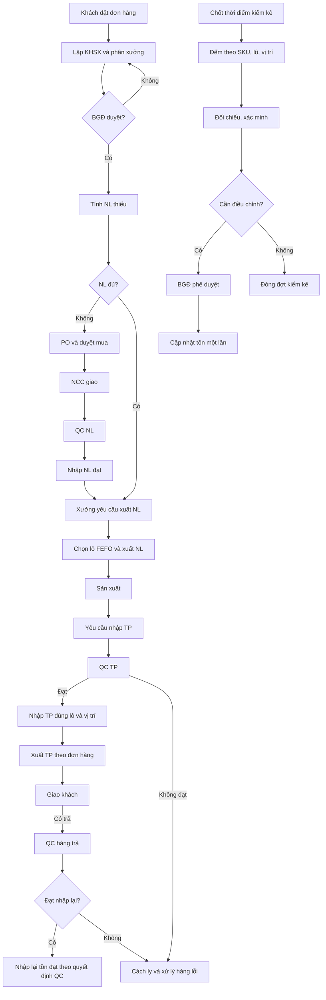
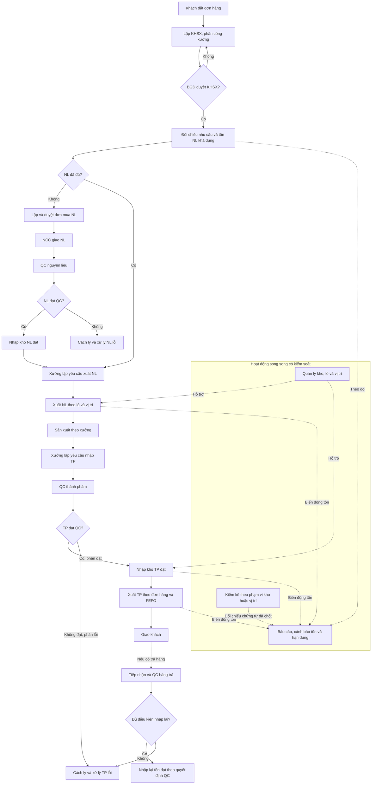
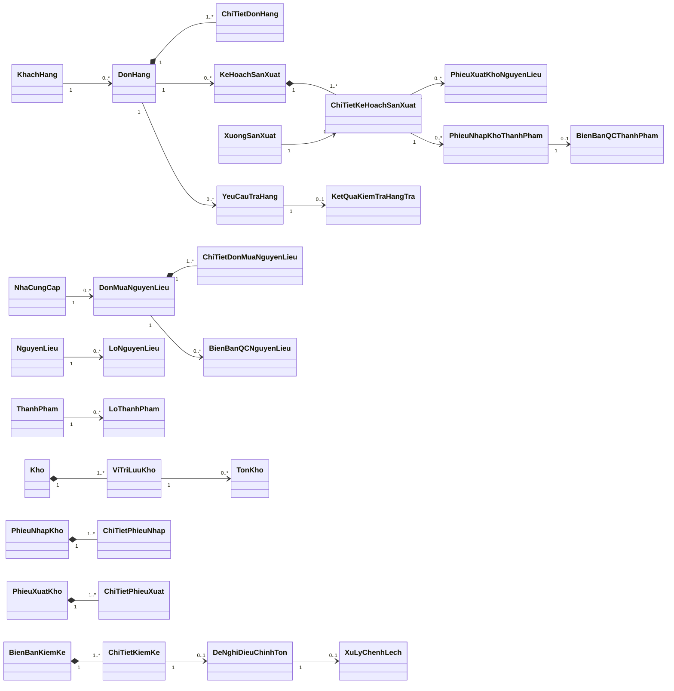

# ĐẶC TẢ YÊU CẦU PHẦN MỀM (SRS)
## HỆ THỐNG QUẢN LÝ KHO NHÀ MÁY NƯỚC NGỌT ĐÓNG CHAI, ĐÓNG LON

**Phiên bản:** 2.1 (bổ sung luồng nghiệp vụ chính và nghiệp vụ song song)  
**Ngày:** 09/10/2026  
**Trạng thái:** Bản dự thảo để nhóm và giảng viên xác nhận  
**Nguồn tham chiếu:** `srs.md` nhánh `master` của repository `HeThongQuanLiKho`; Domain Model 34 lớp do nhóm cung cấp.  
**Phạm vi sản phẩm minh họa:** nước ngọt đóng chai PET/thủy tinh và đóng lon; nguyên vật liệu gồm đồ uống nền, bao bì chai/lon, nắp, nhãn, màng co, thùng.

> **Quy tắc thay đổi:** giữ mã UC đang có để thuận lợi truy vết. UC13 và UC15 là mã cũ **ngừng dùng**, hành vi chọn kho/lô/vị trí được gộp vào UC nhập/xuất tương ứng. Không còn thực thể `LenhSanXuat`, `DieuPhoiNhapKho`, `DieuPhoiXuatKho`, `KhuVucKho` riêng. `ViTriLuuKho.khuVuc` thể hiện khu vực. Các ngưỡng số trong bản này là **đề xuất cấu hình**, cần phê duyệt trước triển khai.

# 1. Bối cảnh kinh doanh và mục tiêu
Nhà máy sản xuất nhiều loại nước ngọt đóng chai và lon, có nhiều kho và nhiều xưởng. Hệ thống quản lý từ đơn hàng, kế hoạch sản xuất có phân công xưởng, dự kiến nhu cầu nguyên liệu, mua nguyên liệu thiếu, QC nhận nguyên liệu, cấp phát nguyên liệu, QC thành phẩm, nhập kho, xuất giao khách, hàng trả, kiểm kê, xử lý chênh lệch và cảnh báo.

**Vấn đề:** cập nhật tồn thủ công gây sai lệch; khó theo dõi mã lô/hạn sử dụng; nhầm đơn vị chai–lốc–thùng; khó phân biệt hàng đạt chất lượng với hàng móp, rò rỉ, hỏng bao bì; thiếu quy trình kiểm kê đóng sổ và phê duyệt điều chỉnh.

**Mục tiêu BG01–BG10:** (BG01) nhập/xuất dựa chứng từ; (BG02) số lượng tồn nhất quán; (BG03) truy vết theo lô/kho/vị trí; (BG04) FEFO/FIFO; (BG05) lập KHSX theo đơn hàng; (BG06) QC nguyên liệu, TP, hàng trả; (BG07) kiểm kê được kiểm soát; (BG08) sức chứa/vị trí hợp lệ; (BG09) báo cáo và cảnh báo; (BG10) RBAC và nhật ký.

**Đối tượng:** Khách hàng; Bộ phận lập kế hoạch sản xuất; Bộ phận mua hàng; Ban giám đốc; Bộ phận quản lý kho; Nhân viên kho; Bộ phận QC; Xưởng sản xuất; Hội đồng kiểm kê; Quản trị hệ thống. Bộ phận mua hàng và quản trị là vai trò hỗ trợ thêm ngoài nhóm actor chính ở một số sơ đồ.

# 2. Phạm vi và ranh giới
**Trong phạm vi:** quản lý tài khoản/quyền; đơn hàng; KHSX/phân xưởng; đối chiếu NL thiếu; PO duyệt; QC; phiếu yêu cầu từ xưởng; phiếu nhập/xuất; lô NL/TP; kho và vị trí; hàng trả/hàng lỗi; kiểm kê; phê duyệt chênh lệch; cảnh báo và báo cáo. Sản xuất bên trong xưởng được theo dõi qua kết quả hoàn thành, không đi sâu điều khiển dây chuyền.

**Ngoài phạm vi:** công thức pha chế bí mật, vận hành máy chiết rót, hóa đơn thuế, thanh toán, kế toán tổng hợp, tối ưu giao vận, quản lý công nợ nhà cung cấp, IoT cân đếm tự động (có thể tích hợp sau).

**Đơn vị chuẩn:** mọi lượng tồn thành phẩm quy đổi về **đơn vị cơ sở chai hoặc lon** theo SKU; lốc/thùng/pallet là đơn vị đóng gói có hệ số quy đổi cấu hình theo từng sản phẩm. Nguyên liệu có đơn vị cơ sở riêng (kg/lít/cái...). Không trộn đơn vị sản phẩm khác nhau khi cộng số lượng.

# 3. Business Requirements (BR)
| Mã | Yêu cầu |
|---|---|
| BR01 | Đăng nhập và phân quyền theo vai trò. |
| BR02 | Đơn hàng là căn cứ lập KHSX; KHSX gồm xưởng, TP, lượng và thời gian. |
| BR03 | Khi duyệt KHSX, tính nhu cầu nguyên liệu thiếu từ nhu cầu và tồn khả dụng. |
| BR04 | PO nguyên liệu có chi tiết hàng/NCC và phải được duyệt trước nhận QC. |
| BR05 | Kho/vị trí/lô được chọn **trong** UC nhập và xuất, không có chứng từ điều phối độc lập. |
| BR06 | Chỉ nhập lượng hợp lệ đạt QC; không sửa tồn trực tiếp. |
| BR07 | Xưởng lập yêu cầu xuất NL theo chi tiết KHSX đã duyệt. |
| BR08 | Xưởng lập yêu cầu nhập TP; QC TP bắt buộc, chỉ lượng đạt nhập kho đạt. |
| BR09 | Xuất TP dựa đơn hàng, theo FEFO/FIFO và lượng khả dụng. |
| BR10 | Hàng trả được cách ly và QC trước khi quyết định nhập lại hoặc xử lý lỗi. |
| BR11 | Kiểm kê theo lô/SKU/vị trí/đơn vị cơ sở, có khóa thời điểm và duyệt điều chỉnh. |
| BR12 | Truy vết mọi biến động từ chứng từ nguồn và người thực hiện. |
| BR13 | Báo cáo nhập–xuất–tồn, hạn sử dụng, hàng lỗi và cảnh báo. |
| BR14 | Kiểm soát quy cách nước ngọt chai/lon: quy đổi đơn vị, tình trạng bao bì, số lô, NSX/HSD, hàng cận hạn. |

# 4. Business Process – giữ 13 BP
| Mã | Tên quy trình | Dòng xử lý |
|---|---|---|
| BP01 | Xác thực và phân quyền | Tài khoản → xác thực → xác định vai trò |
| BP02 | Đơn hàng và KHSX | Đơn hàng → KHSX có phân công xưởng → BGĐ duyệt |
| BP03 | Đối chiếu nhu cầu NL | KHSX duyệt → tính nhu cầu và phần thiếu |
| BP04 | Mua và QC NL | PO → phê duyệt → NCC giao → QC phân loại |
| BP05 | Nhập NL | QC đạt → chọn kho/vị trí → nhập NL |
| BP06 | Cấp NL | Xưởng yêu cầu → chọn FEFO → xuất NL |
| BP07 | Sản xuất và QC TP | Xưởng hoàn thành → yêu cầu nhập → QC TP |
| BP08 | Nhập TP | QC đạt → chọn vị trí → nhập TP |
| BP09 | Xuất TP | Đơn hàng → chọn lô → xuất và giao |
| BP10 | Hàng trả và hàng lỗi | Trả hàng → cách ly → QC → nhập lại hoặc xử lý |
| BP11 | Kiểm kê và điều chỉnh | Chốt thời điểm → đếm → đối chiếu → phê duyệt → điều chỉnh |
| BP12 | Dữ liệu kho/lô | Quản lý danh mục, vị trí, lô và sức chứa |
| BP13 | Báo cáo/cảnh báo | Tồn, chuyển động, FEFO và hạn dùng |

## 4.1. Quy trình tổng thể

```mermaid
flowchart TD
 A[Khách đặt đơn hàng] --> B[Lập KHSX và phân xưởng]
 B --> C{BGĐ duyệt?}
 C -->|Không| B
 C -->|Có| D[Tính NL thiếu]
 D --> E{NL đủ?}
 E -->|Không| F[PO và duyệt mua] --> G[NCC giao] --> H[QC NL] --> I[Nhập NL đạt]
 E -->|Có| J[Xưởng yêu cầu xuất NL]
 I --> J
 J --> K[Chọn lô FEFO và xuất NL] --> L[Sản xuất]
 L --> M[Yêu cầu nhập TP] --> N[QC TP]
 N -->|Đạt| O[Nhập TP đúng lô và vị trí] --> P[Xuất TP theo đơn hàng] --> Q[Giao khách]
 N -->|Không đạt| R[Cách ly và xử lý hàng lỗi]
 Q -->|Có trả| S[QC hàng trả] --> T{Đạt nhập lại?}
 T -->|Có| U[Nhập lại tồn đạt theo quyết định QC]
 T -->|Không| R
 X[Chốt thời điểm kiểm kê] --> Y[Đếm theo SKU, lô, vị trí] --> Z[Đối chiếu, xác minh] --> AA{Cần điều chỉnh?}
 AA -->|Có| AB[BGĐ phê duyệt] --> AC[Cập nhật tồn một lần]
 AA -->|Không| AD[Đóng đợt kiểm kê]
```

## 4.2. Luồng nghiệp vụ chính và các nghiệp vụ song song

### 4.2.1. Luồng nghiệp vụ chính (End-to-End)

**Mục tiêu:** thực hiện đơn hàng nước ngọt đóng chai/lon từ khi khách đặt hàng đến khi thành phẩm đạt chất lượng được xuất kho giao khách. Quy trình áp dụng cho nhiều kho, nhiều xưởng, quản lý theo sản phẩm (SKU), lô, vị trí và hạn sử dụng.

| Giai đoạn | BP liên quan | Actor chịu trách nhiệm | Xử lý chính và chứng từ/kết quả | Điều kiện chuyển bước |
|---|---|---|---|---|
| 1. Đặt hàng | BP02 | Khách hàng | Lập `DonHang` và `ChiTietDonHang`, xác nhận SKU chai/lon, quy cách, số lượng, ngày giao dự kiến | Đơn hàng hợp lệ |
| 2. Lập kế hoạch | BP02 | Bộ phận lập kế hoạch | Lập `KeHoachSanXuat` và `ChiTietKeHoachSanXuat`, phân công xưởng, lịch và sản lượng | KHSX được Ban giám đốc duyệt (UC03) |
| 3. Đối chiếu nguyên liệu | BP03 | Bộ phận lập kế hoạch, quản lý kho | Tính nhu cầu nguyên liệu theo sản lượng kế hoạch và đối chiếu tồn *khả dụng* theo lô/kho; xác định lượng thiếu | Đủ nguyên liệu để cấp phát hoặc hoàn tất bổ sung phần thiếu |
| 4. Mua và nhận nguyên liệu nếu thiếu | BP04–BP05 | Bộ phận mua hàng, BGĐ, QC, nhân viên kho | `DonMuaNguyenLieu` và chi tiết → duyệt → NCC giao → `BienBanQCNguyenLieu` → `PhieuNhapKho` nguyên liệu đạt QC | Chỉ nguyên liệu đạt QC, được ghi nhận nhập kho hợp lệ mới tăng tồn khả dụng |
| 5. Cấp phát nguyên liệu | BP06 | Xưởng sản xuất, nhân viên kho | Xưởng lập `PhieuXuatKhoNguyenLieu` (phiếu yêu cầu); nhân viên kho lập `PhieuXuatKho` và chi tiết, chọn lô/vị trí theo FEFO/FIFO | KHSX được duyệt, lượng xuất không vượt tồn khả dụng và có chứng từ hợp lệ |
| 6. Sản xuất | BP07 | Xưởng sản xuất | Sản xuất nước ngọt chai/lon theo kế hoạch; ghi nhận sản lượng hoàn thành và lô thành phẩm | Có thành phẩm hoàn thành để đề nghị QC |
| 7. QC thành phẩm | BP07 | Xưởng sản xuất, QC | Xưởng lập `PhieuNhapKhoThanhPham` (phiếu yêu cầu nhập); QC lập `BienBanQCThanhPham`, tách số đạt và không đạt | `soLuongDat + soLuongKhongDat = tongSoLuongKiem`; lượng không đạt chuyển xử lý/cách ly |
| 8. Nhập thành phẩm | BP08 | Nhân viên kho | Lập `PhieuNhapKho` và `ChiTietPhieuNhap` cho **lượng đạt QC**; gán lô, kho, vị trí; quy đổi chai/lon–lốc–thùng theo SKU | Hoàn tất chứng từ nhập hợp lệ mới tăng tồn thành phẩm |
| 9. Xuất thành phẩm, giao hàng | BP09 | Nhân viên kho, bộ phận giao hàng | Đối chiếu `DonHang`, chọn lô TP đạt QC và còn hạn dùng theo FEFO; lập `PhieuXuatKho` và chi tiết; bàn giao hàng | Không xuất vượt lượng khả dụng, không xuất lô cách ly/hết hạn; cập nhật tồn và trạng thái giao hàng |

**Nhánh điều kiện:** nếu nguyên liệu đã đủ thì bỏ qua bước mua; nếu QC nguyên liệu/thành phẩm không đạt thì cách ly và xử lý (BP10/UC18), không nhập vào tồn đạt; nếu sản lượng đạt chưa đủ thì thực hiện sản xuất bổ sung hoặc xử lý phần giao còn thiếu theo quy trình được phê duyệt. Nhiều lô và nhiều lần nhập/xuất có thể phục vụ cùng một kế hoạch/đơn hàng, nhưng không được ghi trùng biến động tồn.

### 4.2.2. Các nghiệp vụ song song

Các hoạt động dưới đây **có thể triển khai đồng thời** khi độc lập về chứng từ, kho/lô/vị trí và quyền thao tác; không có nghĩa được phép bỏ qua điều kiện kiểm soát của từng nghiệp vụ.

| Luồng song song | BP/UC liên quan | Thời điểm có thể diễn ra | Quy tắc phối hợp |
|---|---|---|---|
| Mua bổ sung nguyên liệu và chuẩn bị sản xuất | BP03–BP04 / UC26–UC27; BP02 / UC02–UC03 | Sau khi xác định nhu cầu thiếu, có thể đồng thời chuẩn bị xưởng, lịch và các nguyên liệu đã đủ | **Không xuất phần nguyên liệu thiếu** trước khi nguyên liệu tương ứng đạt QC và được nhập kho; không sản xuất công đoạn phụ thuộc nguyên liệu chưa được cấp |
| QC các lô nguyên liệu khác nhau và nhận hàng các NCC khác nhau | BP04–BP05 / UC29, UC21 | Nhiều chuyến giao hoặc lô độc lập | Mỗi lô có kết quả QC, phiếu nhập và dấu vết riêng; lô đang chờ QC không tính vào tồn khả dụng |
| Sản xuất tại nhiều xưởng hoặc nhiều đợt | BP06–BP08 / UC22–UC24, UC04, UC16 | Sau khi KHSX được duyệt, xưởng được phân công và đã được cấp NL phù hợp | Không cấp phát trùng cùng lượng tồn; mỗi đợt/lô TP có yêu cầu nhập và biên bản QC riêng |
| Xuất TP cho các đơn đã có hàng đạt QC và tiếp tục sản xuất đơn khác | BP07–BP09 / UC04, UC16, UC12 | Khi các chứng từ/lô phục vụ đơn hàng không xung đột | Xuất chỉ sử dụng số lượng đã nhập kho và khả dụng; phải kiểm soát đặt giữ và giao dịch đồng thời |
| Quản lý danh mục kho, lô, vị trí và theo dõi cảnh báo | BP12–BP13 / UC05, UC06, UC10, UC19, UC20, UC25, UC30 | Trong vận hành thường ngày | Việc khóa danh mục/lô phải bảo toàn lịch sử; cảnh báo, báo cáo lấy từ giao dịch đã ghi nhận |
| Tiếp nhận/QC hàng trả và vận hành đơn hàng mới | BP10 / UC14, UC17, UC18; BP02–BP09 | Khi có trả hàng từ khách | Hàng trả phải cách ly, truy xuất đơn/lô gốc; chỉ nhập lại tồn đạt sau quyết định QC hợp lệ |
| Kiểm kê kho/vùng đã khoanh và hoạt động ở vùng khác | BP11 / UC07–UC09; BP05–BP09 | Khi có đợt kiểm kê định kỳ/đột xuất | Khóa hoặc kiểm soát giao dịch **trên đúng phạm vi kiểm kê**; kho/vùng khác chỉ tiếp tục nếu không làm thay đổi tồn của phạm vi đang kiểm |

### 4.2.3. Sơ đồ luồng chính và nghiệp vụ song song

```mermaid
flowchart TD
  A[Khách đặt đơn hàng] --> B[Lập KHSX, phân công xưởng]
  B --> C{BGĐ duyệt KHSX?}
  C -->|Không| B
  C -->|Có| D[Đối chiếu nhu cầu và tồn NL khả dụng]
  D --> E{NL đã đủ?}
  E -->|Không| F[Lập và duyệt đơn mua NL]
  F --> G[NCC giao NL] --> H[QC nguyên liệu]
  H --> I{NL đạt QC?}
  I -->|Có| J[Nhập kho NL đạt]
  I -->|Không| HX[Cách ly và xử lý NL lỗi]
  E -->|Có| K[Xưởng lập yêu cầu xuất NL]
  J --> K
  K --> L[Xuất NL theo lô và vị trí] --> M[Sản xuất theo xưởng]
  M --> N[Xưởng lập yêu cầu nhập TP] --> O[QC thành phẩm]
  O --> P{TP đạt QC?}
  P -->|Có, phần đạt| Q[Nhập kho TP đạt]
  P -->|Không đạt, phần lỗi| R[Cách ly và xử lý TP lỗi]
  Q --> S[Xuất TP theo đơn hàng và FEFO] --> T[Giao khách]
  T -. Nếu có trả hàng .-> U[Tiếp nhận và QC hàng trả]
  U --> V{Đủ điều kiện nhập lại?}
  V -->|Có| W[Nhập lại tồn đạt theo quyết định QC]
  V -->|Không| R

  subgraph SS[Hoạt động song song có kiểm soát]
    X1[Quản lý kho, lô và vị trí]
    X2[Báo cáo, cảnh báo tồn và hạn dùng]
    X3[Kiểm kê theo phạm vi kho hoặc vị trí]
  end
  D -. Theo dõi .-> X2
  L -. Biến động tồn .-> X2
  Q -. Biến động tồn .-> X2
  S -. Biến động tồn .-> X2
  X1 -. Hỗ trợ .-> L
  X1 -. Hỗ trợ .-> Q
  X3 -. Đối chiếu chứng từ đã chốt .-> X2
```

Sơ đồ thể hiện luồng chính và các hoạt động hỗ trợ chạy song song về mặt nghiệp vụ; các đường nét đứt là liên hệ thông tin, **không** mặc định là sự kiện tự động thay đổi tồn kho.

### 4.2.4. Điểm đồng bộ và ràng buộc khi chạy song song

1. **Duyệt trước thực hiện:** KHSX phải được duyệt trước khi cấp phát nguyên liệu theo kế hoạch; đơn mua phải được duyệt trước khi tiếp nhận theo đơn mua.
2. **QC trước nhập tồn đạt:** kết quả QC là điều kiện bắt buộc đối với nhập nguyên liệu, thành phẩm và hàng trả vào tồn đạt. Lượng cách ly/không đạt không được đưa vào tồn khả dụng.
3. **Chứng từ trước cập nhật tồn:** tồn chỉ thay đổi khi phiếu nhập, xuất hoặc điều chỉnh đã được phê duyệt/xác nhận đúng trạng thái; một chứng từ không được ghi tồn hai lần.
4. **Tránh xuất trùng:** các giao dịch cạnh tranh cùng SKU/lô/vị trí phải kiểm tra tồn khả dụng tại thời điểm xác nhận và cập nhật theo giao dịch nguyên tử hoặc cơ chế khóa tương đương; không để tồn âm.
5. **FEFO theo lô, truy vết theo đơn vị cơ sở:** chọn lô hợp lệ có hạn dùng sớm nhất, áp dụng FIFO khi điều kiện hạn dùng tương đương hoặc không quản lý HSD; quy đổi lốc/thùng/pallet theo cấu hình SKU trước khi cộng/trừ tồn.
6. **Kiểm kê có phạm vi:** chốt thời điểm và danh sách kho/vị trí/lô; tạm ngừng hoặc kiểm soát nghiêm ngặt giao dịch tác động vào phạm vi đó. Mọi giao dịch phát sinh trong thời gian kiểm kê phải được phân định trước/sau mốc chốt, có chứng cứ để đối chiếu.
7. **Phê duyệt điều chỉnh:** đếm lệch phải xác minh nguyên nhân, lập đề nghị và được BGĐ phê duyệt trước khi ghi bút toán điều chỉnh **một lần**; không sửa trực tiếp `TonKho` bằng thao tác thủ công.
8. **Điều phối nhiều xưởng và nhiều kho:** các xưởng có thể sản xuất đồng thời nhưng kế hoạch, phiếu yêu cầu, lô và lượng nguyên liệu đã cấp phải được theo dõi riêng; chuyển hàng giữa kho phải có chứng từ nhập/xuất hoặc chuyển kho hợp lệ nếu nghiệp vụ này được triển khai.

**Liên kết truy vết:** luồng chính chủ yếu sử dụng BP02–BP09; hoạt động song song sử dụng BP10–BP13 và BP01 (kiểm soát truy cập). Quy tắc kiểm kê chi tiết được quy định tại **Mục 8**, danh mục UC tại **Mục 5** và FR tại **Mục 6**.

# 5. Danh mục Use Case và thay đổi
**Mã đang sử dụng:** UC01–UC12, UC14, UC16–UC27, UC29–UC30 (27 UC). **Mã ngừng dùng:** UC13 – Điều phối nhập kho, UC15 – Điều phối xuất kho. **UC28** không dùng do QC thành phẩm đã định danh UC04.

| UC | Tên | Actor chính |
|---|---|---|
| UC01 | Đăng nhập hệ thống | Tất cả người dùng |
| UC02 | Lập kế hoạch sản xuất | Bộ phận lập kế hoạch |
| UC03 | Duyệt KHSX | Ban giám đốc |
| UC04 | QC thành phẩm | Bộ phận QC |
| UC05 | Thống kê báo cáo và cảnh báo | Quản lý kho, Ban giám đốc |
| UC06 | Tra cứu dữ liệu kho | Quản lý kho, Nhân viên kho |
| UC07 | Lập biên bản kiểm kê | Hội đồng kiểm kê |
| UC08 | Xử lý chênh lệch kiểm kê | Quản lý kho |
| UC09 | Phê duyệt điều chỉnh tồn | Ban giám đốc |
| UC10 | Quản lý nguyên liệu | Quản lý kho |
| UC11 | Đặt đơn hàng | Khách hàng |
| UC12 | Xuất kho TP giao hàng | Nhân viên kho |
| UC14 | Kiểm tra hàng trả về | Bộ phận QC |
| UC16 | Nhập kho TP | Nhân viên kho |
| UC17 | Nhập kho hàng trả | Nhân viên kho |
| UC18 | Xử lý hàng lỗi/trả về | Quản lý kho |
| UC19 | Quản lý dữ liệu kho | Quản lý kho |
| UC20 | Quản lý lô thành phẩm | Quản lý kho |
| UC21 | Nhập kho nguyên liệu | Nhân viên kho |
| UC22 | Lập yêu cầu xuất NL | Xưởng sản xuất |
| UC23 | Xuất kho NL | Nhân viên kho |
| UC24 | Lập yêu cầu nhập TP | Xưởng sản xuất |
| UC25 | Quản lý thành phẩm | Quản lý kho |
| UC26 | Lập đơn mua NL | Bộ phận mua hàng |
| UC27 | Duyệt đơn mua NL | Ban giám đốc |
| UC29 | QC nguyên liệu | Bộ phận QC |
| UC30 | Quản lý lô nguyên liệu | Quản lý kho |

**Gộp nghiệp vụ:** UC13 → UC16/UC17/UC21; UC15 → UC12/UC23. Thao tác chọn kho, lô và vị trí vẫn bắt buộc trong luồng chính, nhưng không cần lớp `DieuPhoi...` riêng.

# 6. Functional Requirements (FR) – cụ thể, kiểm thử được
Các FR được đánh số lại theo **bản 2.0**; khi đối chiếu bản cũ phải dựa vào UC tương ứng, không mặc định FR số cũ là cùng nội dung.

| Mã | UC | Yêu cầu |
|---|---|---|
| FR001 | UC01 | Cho phép tất cả người dùng thực hiện đăng nhập hệ thống chỉ khi đã xác thực/được cấp quyền (ngoại trừ màn đăng nhập). |
| FR002 | UC01 | Đăng nhập đúng và được giới hạn chức năng theo vai trò. |
| FR003 | UC01 | Sai mật khẩu/tài khoản khóa → từ chối; không ghi trạng thái hoặc biến động tồn sai khi thất bại. |
| FR004 | UC02 | Cho phép bộ phận lập kế hoạch thực hiện lập kế hoạch sản xuất chỉ khi đã xác thực/được cấp quyền (ngoại trừ màn đăng nhập). |
| FR005 | UC02 | Chọn đơn hàng, TP, xưởng, lượng, lịch, lưu chờ duyệt. |
| FR006 | UC02 | Xưởng không đủ năng lực hoặc lượng không hợp lệ → từ chối; không ghi trạng thái hoặc biến động tồn sai khi thất bại. |
| FR007 | UC03 | Cho phép ban giám đốc thực hiện duyệt khsx chỉ khi đã xác thực/được cấp quyền (ngoại trừ màn đăng nhập). |
| FR008 | UC03 | Xem chi tiết, duyệt hoặc từ chối có lý do; tự tính NL thiếu khi duyệt. |
| FR009 | UC03 | KHSX không ở trạng thái chờ duyệt → từ chối; không ghi trạng thái hoặc biến động tồn sai khi thất bại. |
| FR010 | UC04 | Cho phép bộ phận qc thực hiện qc thành phẩm chỉ khi đã xác thực/được cấp quyền (ngoại trừ màn đăng nhập). |
| FR011 | UC04 | Mở yêu cầu nhập TP, đếm đạt/không đạt, lập biên bản. |
| FR012 | UC04 | Số đạt + không đạt ≠ tổng kiểm → không lưu; không ghi trạng thái hoặc biến động tồn sai khi thất bại. |
| FR013 | UC05 | Cho phép quản lý kho, ban giám đốc thực hiện thống kê báo cáo và cảnh báo chỉ khi đã xác thực/được cấp quyền (ngoại trừ màn đăng nhập). |
| FR014 | UC05 | Lọc báo cáo tồn, nhập/xuất, HSD, hàng lỗi, cảnh báo. |
| FR015 | UC05 | Không có dữ liệu → hiển thị rỗng, không báo lỗi; không ghi trạng thái hoặc biến động tồn sai khi thất bại. |
| FR016 | UC06 | Cho phép quản lý kho, nhân viên kho thực hiện tra cứu dữ liệu kho chỉ khi đã xác thực/được cấp quyền (ngoại trừ màn đăng nhập). |
| FR017 | UC06 | Tra cứu SKU, lô, kho, vị trí và lịch sử chứng từ. |
| FR018 | UC06 | Điều kiện sai → thông báo; không ghi trạng thái hoặc biến động tồn sai khi thất bại. |
| FR019 | UC07 | Cho phép hội đồng kiểm kê thực hiện lập biên bản kiểm kê chỉ khi đã xác thực/được cấp quyền (ngoại trừ màn đăng nhập). |
| FR020 | UC07 | Chốt phạm vi/thời điểm, đếm thực tế, lưu chi tiết và chênh lệch. |
| FR021 | UC07 | Đếm thiếu vị trí hoặc chưa đối chiếu giao dịch → chưa đóng biên bản; không ghi trạng thái hoặc biến động tồn sai khi thất bại. |
| FR022 | UC08 | Cho phép quản lý kho thực hiện xử lý chênh lệch kiểm kê chỉ khi đã xác thực/được cấp quyền (ngoại trừ màn đăng nhập). |
| FR023 | UC08 | Xác minh nguyên nhân, đếm lại, lập đề nghị điều chỉnh khi cần. |
| FR024 | UC08 | Không có bằng chứng → giữ trạng thái chờ xác minh; không ghi trạng thái hoặc biến động tồn sai khi thất bại. |
| FR025 | UC09 | Cho phép ban giám đốc thực hiện phê duyệt điều chỉnh tồn chỉ khi đã xác thực/được cấp quyền (ngoại trừ màn đăng nhập). |
| FR026 | UC09 | Duyệt/từ chối đề nghị; khi duyệt mới cập nhật tồn một lần. |
| FR027 | UC09 | Đề nghị đã duyệt/từ chối → chặn lặp; không ghi trạng thái hoặc biến động tồn sai khi thất bại. |
| FR028 | UC10 | Cho phép quản lý kho thực hiện quản lý nguyên liệu chỉ khi đã xác thực/được cấp quyền (ngoại trừ màn đăng nhập). |
| FR029 | UC10 | Thêm/sửa/khóa danh mục NL và đơn vị chuẩn. |
| FR030 | UC10 | Đã có giao dịch → không xóa cứng; không ghi trạng thái hoặc biến động tồn sai khi thất bại. |
| FR031 | UC11 | Cho phép khách hàng thực hiện đặt đơn hàng chỉ khi đã xác thực/được cấp quyền (ngoại trừ màn đăng nhập). |
| FR032 | UC11 | Chọn TP, số lượng, thông tin giao và xác nhận. |
| FR033 | UC11 | Hàng hoặc lượng không hợp lệ → từ chối; không ghi trạng thái hoặc biến động tồn sai khi thất bại. |
| FR034 | UC12 | Cho phép nhân viên kho thực hiện xuất kho tp giao hàng chỉ khi đã xác thực/được cấp quyền (ngoại trừ màn đăng nhập). |
| FR035 | UC12 | Chọn đơn hàng, kho/lô/vị trí đạt QC theo FEFO, lập xuất. |
| FR036 | UC12 | Không đủ lượng, lô hỏng/hết hạn → chặn; không ghi trạng thái hoặc biến động tồn sai khi thất bại. |
| FR037 | UC14 | Cho phép bộ phận qc thực hiện kiểm tra hàng trả về chỉ khi đã xác thực/được cấp quyền (ngoại trừ màn đăng nhập). |
| FR038 | UC14 | Đối chiếu yêu cầu/đơn gốc, QC số thực nhận và tình trạng. |
| FR039 | UC14 | Không rõ nguồn lô → cách ly chờ xác minh; không ghi trạng thái hoặc biến động tồn sai khi thất bại. |
| FR040 | UC16 | Cho phép nhân viên kho thực hiện nhập kho tp chỉ khi đã xác thực/được cấp quyền (ngoại trừ màn đăng nhập). |
| FR041 | UC16 | Chọn yêu cầu nhập đã QC đạt, lô/vị trí, lập PNK. |
| FR042 | UC16 | Lượng nhập vượt lượng đạt còn lại → chặn; không ghi trạng thái hoặc biến động tồn sai khi thất bại. |
| FR043 | UC17 | Cho phép nhân viên kho thực hiện nhập kho hàng trả chỉ khi đã xác thực/được cấp quyền (ngoại trừ màn đăng nhập). |
| FR044 | UC17 | Nhập lại chỉ lượng hàng trả được QC cho phép. |
| FR045 | UC17 | Chưa có kết luận QC hoặc không đủ sức chứa → chặn; không ghi trạng thái hoặc biến động tồn sai khi thất bại. |
| FR046 | UC18 | Cho phép quản lý kho thực hiện xử lý hàng lỗi/trả về chỉ khi đã xác thực/được cấp quyền (ngoại trừ màn đăng nhập). |
| FR047 | UC18 | Phân loại hàng cách ly, ghi phương án tái xử lý/trả/tiêu hủy có duyệt. |
| FR048 | UC18 | Không có quyền/phương án → chưa xử lý; không ghi trạng thái hoặc biến động tồn sai khi thất bại. |
| FR049 | UC19 | Cho phép quản lý kho thực hiện quản lý dữ liệu kho chỉ khi đã xác thực/được cấp quyền (ngoại trừ màn đăng nhập). |
| FR050 | UC19 | Quản lý kho, khu vực (thuộc tính vị trí), vị trí và sức chứa. |
| FR051 | UC19 | Không xóa vị trí có tồn; không ghi trạng thái hoặc biến động tồn sai khi thất bại. |
| FR052 | UC20 | Cho phép quản lý kho thực hiện quản lý lô thành phẩm chỉ khi đã xác thực/được cấp quyền (ngoại trừ màn đăng nhập). |
| FR053 | UC20 | Ghi lô, NSX, HSD, trạng thái và truy vết. |
| FR054 | UC20 | Lô đã có giao dịch không được xóa; không ghi trạng thái hoặc biến động tồn sai khi thất bại. |
| FR055 | UC21 | Cho phép nhân viên kho thực hiện nhập kho nguyên liệu chỉ khi đã xác thực/được cấp quyền (ngoại trừ màn đăng nhập). |
| FR056 | UC21 | Chọn lượng NL đạt QC, lô, kho/vị trí, lập PNK. |
| FR057 | UC21 | Lượng nhập vượt QC đạt chưa nhập → chặn; không ghi trạng thái hoặc biến động tồn sai khi thất bại. |
| FR058 | UC22 | Cho phép xưởng sản xuất thực hiện lập yêu cầu xuất nl chỉ khi đã xác thực/được cấp quyền (ngoại trừ màn đăng nhập). |
| FR059 | UC22 | Chọn chi tiết KHSX đã duyệt, NL và lượng cần cấp. |
| FR060 | UC22 | KHSX chưa duyệt hoặc yêu cầu vượt định mức → chặn/chờ duyệt ngoại lệ; không ghi trạng thái hoặc biến động tồn sai khi thất bại. |
| FR061 | UC23 | Cho phép nhân viên kho thực hiện xuất kho nl chỉ khi đã xác thực/được cấp quyền (ngoại trừ màn đăng nhập). |
| FR062 | UC23 | Chọn yêu cầu hợp lệ, lô/vị trí theo FEFO, lập PXK. |
| FR063 | UC23 | Tồn khả dụng không đủ → chặn; không ghi trạng thái hoặc biến động tồn sai khi thất bại. |
| FR064 | UC24 | Cho phép xưởng sản xuất thực hiện lập yêu cầu nhập tp chỉ khi đã xác thực/được cấp quyền (ngoại trừ màn đăng nhập). |
| FR065 | UC24 | Ghi xưởng, KHSX, TP/lô, số hoàn thành, gửi QC. |
| FR066 | UC24 | Thiếu mã lô hoặc lượng sai → chặn; không ghi trạng thái hoặc biến động tồn sai khi thất bại. |
| FR067 | UC25 | Cho phép quản lý kho thực hiện quản lý thành phẩm chỉ khi đã xác thực/được cấp quyền (ngoại trừ màn đăng nhập). |
| FR068 | UC25 | Quản lý SKU chai/lon, dung tích, đơn vị, quy cách đóng gói. |
| FR069 | UC25 | Quy cách đã phát sinh tồn → quản lý phiên bản, không sửa hồi tố; không ghi trạng thái hoặc biến động tồn sai khi thất bại. |
| FR070 | UC26 | Cho phép bộ phận mua hàng thực hiện lập đơn mua nl chỉ khi đã xác thực/được cấp quyền (ngoại trừ màn đăng nhập). |
| FR071 | UC26 | Chọn NL thiếu, NCC, chi tiết số lượng/giá, gửi BGĐ. |
| FR072 | UC26 | Thiếu chi tiết/NCC → không gửi; không ghi trạng thái hoặc biến động tồn sai khi thất bại. |
| FR073 | UC27 | Cho phép ban giám đốc thực hiện duyệt đơn mua nl chỉ khi đã xác thực/được cấp quyền (ngoại trừ màn đăng nhập). |
| FR074 | UC27 | Xem PO và duyệt/từ chối có lý do. |
| FR075 | UC27 | PO không chờ duyệt → chặn; không ghi trạng thái hoặc biến động tồn sai khi thất bại. |
| FR076 | UC29 | Cho phép bộ phận qc thực hiện qc nguyên liệu chỉ khi đã xác thực/được cấp quyền (ngoại trừ màn đăng nhập). |
| FR077 | UC29 | Đối chiếu PO và lô giao, đếm đạt/không đạt, lập biên bản. |
| FR078 | UC29 | NL không đạt → trả NCC/cách ly, không tăng tồn đạt; không ghi trạng thái hoặc biến động tồn sai khi thất bại. |
| FR079 | UC30 | Cho phép quản lý kho thực hiện quản lý lô nguyên liệu chỉ khi đã xác thực/được cấp quyền (ngoại trừ màn đăng nhập). |
| FR080 | UC30 | Quản lý mã lô, NSX, HSD, truy vết và trạng thái. |
| FR081 | UC30 | Không xóa lô có chứng từ; không ghi trạng thái hoặc biến động tồn sai khi thất bại. |
| FR082 | UC07 | Hệ thống tạo snapshot tồn hệ thống tại thời điểm chốt; mọi giao dịch sau thời điểm này phải được tách riêng để đối chiếu, không tính lẫn. |
| FR083 | UC07 | Biên bản lưu mặt hàng/SKU, mã lô, kho, vị trí, đơn vị đếm, hệ số quy đổi và số lượng quy đổi sang đơn vị cơ sở. |
| FR084 | UC08 | Chênh lệch = lượng đếm thực tế quy đổi − lượng tồn hệ thống tại thời điểm chốt, sau khi điều chỉnh giao dịch trong thời gian kiểm kê. |
| FR085 | UC09 | Điều chỉnh tồn chỉ được ghi sau phê duyệt, có mã chứng từ duy nhất, không thực hiện hai lần cho cùng đề nghị. |
| FR086 | UC12 | Không xuất SKU/lô hết hạn, hàng QC không đạt, hàng cách ly hoặc hàng đang chờ kiểm kê khóa. |
| FR087 | UC16 | Nhập thành phẩm không vượt số đạt QC còn chưa nhập; ghi nhận đồng thời phiếu, chi tiết phiếu và tồn. |
| FR088 | UC21 | Nhập NL không vượt số đạt QC còn chưa nhập; không cộng tồn phần trả NCC. |
| FR089 | UC25 | Lưu và quản lý quy cách chai/lon, dung tích và hệ số đơn vị lốc/thùng/pallet trên danh mục cấu hình. |
| FR090 | UC05 | Hỗ trợ báo cáo chênh lệch kiểm kê theo kho, vị trí, SKU, lô, nguyên nhân và tỷ lệ chênh lệch. |
| FR091 | UC20 | Quản lý trạng thái lô: đạt, cách ly, chờ QC, lỗi, hết hạn; chỉ lô đạt mới tính vào tồn khả dụng. |
| FR092 | UC14 | Hàng trả từ khách phải cách ly chờ đánh giá tính nguyên vẹn bao bì, nắp, seal, nhãn và truy xuất lô. |
| FR093 | UC07 | Hệ thống lưu người đếm, thời điểm đếm, người xác minh và phiên đếm lại với lịch sử bất biến. |

# 7. Business Rules chung
| Mã | Quy tắc bắt buộc |
|---|---|
| RULE01 | Tồn chỉ thay đổi khi chứng từ nhập, xuất, điều chỉnh tồn hợp lệ được ghi nhận thành công. |
| RULE02 | KHSX phải được BGĐ duyệt trước khi xưởng tạo yêu cầu xuất NL/nhập TP. |
| RULE03 | Nhu cầu thiếu từng NL = `max(0, nhu cầu KHSX - tồn khả dụng - lượng mua đã xác nhận còn hiệu lực nếu chính sách cho phép)`. Phần đã đặt mua chưa nhận **không** được tính là tồn thực có để cấp phát. |
| RULE04 | Tổng lượng QC đạt + không đạt = tổng kiểm; tất cả không âm; không vượt lượng nhận thực tế. |
| RULE05 | Phiếu nhập NL/TP chỉ ghi lượng đạt QC chưa nhập; số không đạt phải cách ly/trả/xử lý. |
| RULE06 | Hàng xuất theo FEFO cho lô có HSD, FIFO cho loại không quản lý hạn; ngoại lệ phải được phê duyệt và có lý do. |
| RULE07 | Không xuất lô hết hạn, bị cách ly, không đạt QC; không xuất vượt tồn khả dụng. |
| RULE08 | Mỗi vị trí có sức chứa và điều kiện bảo quản; không cho nhập vượt sức chứa. |
| RULE09 | Mỗi phiếu chỉ ghi nhận tồn đúng một lần; toàn bộ phiếu + chi tiết + tồn là một giao dịch nguyên tử. |
| RULE10 | Mọi thay đổi quan trọng lưu actor, ngày giờ, chứng từ, trạng thái trước/sau. |
| RULE11 | Hàng trả không tự tăng tồn đạt; phải qua QC và quyết định nhập lại. |
| RULE12 | Không xóa cứng lô, chứng từ hoặc vị trí đã có lịch sử giao dịch. |
| RULE13 | Mỗi vị trí kiểm kê thuộc một đợt đang mở; nếu có nhiều đợt, phải chống ghi đè cùng phạm vi/thời điểm. |
| RULE14 | Dữ liệu định lượng quy đổi về đơn vị cơ sở trước đối chiếu; định nghĩa quy cách có hiệu lực theo thời gian. |
| RULE15 | Độ chính xác DECIMAL và quy tắc làm tròn do quản trị cấu hình theo SKU, đơn vị; không làm tròn trung gian khi quy đổi. |

# 8. QUY TẮC KIỂM KÊ CHUYÊN BIỆT – NƯỚC NGỌT ĐÓNG CHAI/LON
## 8.1. Mục tiêu, phạm vi và tần suất
Kiểm kê áp dụng kho nguyên liệu, kho thành phẩm, kho hàng lỗi/trả về và tất cả vị trí chứa hàng. Đếm theo **SKU + lô + kho + vị trí + trạng thái QC**; cùng SKU khác lô/HSD **không** gộp trước đối chiếu. Có kiểm kê toàn kho định kỳ, kiểm kê luân phiên theo vị trí/SKU (cycle count) và kiểm kê đột xuất sau thất thoát hoặc bất thường. Lịch tham khảo: chu kỳ từng tháng đối với hàng luân chuyển nhanh, hàng cận hạn/hàng cách ly ưu tiên kiểm thường xuyên; kỳ thực tế do quản lý kho phê duyệt.

## 8.2. Các thông tin bắt buộc trong một lần đếm
- Mã đợt, thời điểm chốt sổ (cut-off), kho, vị trí/khu vực, mã SKU, tên sản phẩm, loại bao bì (**chai PET, chai thủy tinh, lon**), thể tích/dung tích và lô.
- NSX, HSD, trạng thái lô (đạt, chờ QC, cách ly, lỗi, hết hạn); tình trạng bao bì (nguyên vẹn, móp, rò rỉ, bể/vỡ, mất nhãn, mất niêm phong, ẩm/thùng hỏng).
- Số pallet nguyên, số thùng nguyên, số lốc nguyên, số chai/lon lẻ; hệ số quy đổi theo SKU; số đếm quy đổi về chai/lon cơ sở; người đếm và người xác nhận.
- Đối với nguyên liệu lỏng/bột và bao bì nguyên liệu: dùng đơn vị cơ sở phù hợp (lít/kg/cái), không áp quy đổi chai/lon thành phẩm.

## 8.3. Kiểm đếm và quy đổi
`SoLuongCoSo = SoPallet * ChaiLonMoiPallet + SoThung * ChaiLonMoiThung + SoLoc * ChaiLonMoiLoc + SoChaiLonLe`. Các hệ số này **không cố định** giữa sản phẩm/lô/quy cách. Ví dụ minh họa: lon 330 ml, 24 lon/thùng, 6 lon/lốc, 60 thùng/pallet; nếu kiểm 1 pallet + 2 thùng + 1 lốc + 3 lon lẻ thì lượng cơ sở = `1*1440 + 2*24 + 1*6 + 3 = 1497 lon`. Ví dụ **không** đặt chuẩn quy cách cho toàn nhà máy. Khi đếm pallet/thùng niêm phong, cần ghi nhận nguyên vẹn; bao bì rách/hở hoặc nghi ngờ phải mở và kiểm đếm vật lý.

## 8.4. Quy tắc phân loại hàng
| Mã | Trường hợp | Xử lý |
|---|---|---|
| KK01 | Chai/lon nguyên vẹn, đúng lô, còn HSD, đã QC đạt | Đếm vào tồn đạt; tính khả dụng nếu không bị giữ/chờ xuất. |
| KK02 | Lon móp/chai biến dạng, nắp không kín, rò rỉ, chai vỡ | Đếm riêng theo tình trạng, cách ly, báo QC; **không** tính tồn khả dụng. |
| KK03 | Thùng/lốc rách nhưng chai/lon bên trong nguyên vẹn | Kiểm đếm lại đơn vị cơ sở; ghi lỗi bao bì và chờ quy trình đóng gói lại/QC nếu cần. |
| KK04 | Không xác định được mã lô/NSX/HSD, tem nhãn sai | Cách ly, yêu cầu xác minh; không tự gộp vào lô gần giống. |
| KK05 | Lô đã hết HSD | Đếm lượng vật lý riêng, không cho xuất bán; chuyển quyết định xử lý. |
| KK06 | Lô sắp hết HSD | Đếm bình thường nếu đạt QC, gắn cảnh báo và ưu tiên FEFO; ngưỡng ngày do cấu hình. |
| KK07 | Hàng trả về hoặc chờ QC | Đếm ở trạng thái cách ly, không cộng tồn khả dụng; chỉ chuyển khi QC cho phép. |
| KK08 | Lô được ghi ở sai vị trí | Ghi cả vị trí thực tế và vị trí hệ thống, xác minh luân chuyển; không tự tạo tăng/giảm tổng tồn. |

## 8.5. Chốt thời điểm và giao dịch phát sinh
1. Quản lý kho lập phạm vi và thời điểm chốt sổ; phân công Hội đồng kiểm kê, người kiểm/đối chiếu độc lập.
2. Hệ thống chụp tồn ghi sổ theo SKU–lô–vị trí tại thời điểm chốt; ghi phiên bản/số thứ tự giao dịch.
3. Ưu tiên **khóa giao dịch** cho phạm vi kiểm kê trong lúc đếm. Nếu dây chuyền cần nhập/xuất liên tục, chuyển sang phương án kiểm kê cuốn chiếu: ghi nhận riêng giao dịch sau cut-off, đối chiếu về cùng một thời điểm; không dùng tồn hiện tại so trực tiếp với số đếm của thời điểm khác.
4. Ghi phiếu kiểm đếm lần 1; không cho người đếm sửa số liệu gốc sau khi đã nộp. Khi sai, tạo phiên điều chỉnh/đếm lại có nhật ký.
5. Nếu có chênh lệch hoặc hàng lỗi, kiểm đếm lần 2 độc lập trước khi đề nghị điều chỉnh.
6. Hội đồng xác nhận biên bản; Quản lý kho xác minh nguyên nhân (nhầm mã, đơn vị, chuyển vị trí, chứng từ chưa ghi, rò rỉ/vỡ, thiếu thực tế).
7. Chỉ khi BGĐ phê duyệt `DeNghiDieuChinhTon`, hệ thống mới phát sinh biến động tăng/giảm tồn; không chỉnh trực tiếp cột `TonKho.soLuongTon`.
8. Đóng kiểm kê, lưu biên bản, chứng từ điều chỉnh và báo cáo chênh lệch; mở lại giao dịch phạm vi kho.

## 8.6. Công thức đối chiếu và xử lý chênh lệch
- `TonSoSanh = TonSnapshotTaiCutoff + NhapHopLeSauCutoff - XuatHopLeSauCutoff` **chỉ khi** số thực tế được đếm sau các giao dịch ấy và hai vế quy về cùng thời điểm. Nếu đếm tại cut-off thì dùng trực tiếp snapshot.
- `ChenhLech = ThucDemQuyDoi - TonSoSanh`. Chênh lệch dương là thừa, âm là thiếu.
- `TyLeChenhLech(%) = ABS(ChenhLech) / TonSoSanh * 100` nếu tồn so sánh > 0; nếu tồn = 0 thì đánh dấu `N/A`, không chia cho 0.
- Hàng đổi vị trí trong cùng kho có thể là **chênh lệch vị trí**, không đồng nghĩa chênh lệch tổng SKU; yêu cầu tìm chứng từ di chuyển nội bộ/điều chỉnh vị trí hợp lệ.
- Hàng hỏng phát hiện khi kiểm kê vẫn là hàng vật lý, cần ghi số lượng và tình trạng, không xóa số đếm; chuyển trạng thái/cách ly và xử lý bằng chứng từ được duyệt.

## 8.7. Ngưỡng kiểm kê và cảnh báo cấu hình
| Tham số | Cấu hình tham khảo (chưa phải quy định đã duyệt) |
|---|---|
| `canHanNgay` | 30 ngày trước HSD, tùy SKU/hợp đồng |
| `nguongChenhLech` | Tùy nhóm SKU, có thể đặt ngưỡng bằng 0 đối với hàng thành phẩm |
| `soLanDemLai` | Tối thiểu 1 lần đếm lại nếu có chênh lệch |
| `tanSuatKiemKe` | Theo lịch kho và mức độ rủi ro của nhóm hàng |
| `tyLeHongBaoBi` | Báo cáo tỷ lệ lỗi, không tự động quyết định loại bỏ |

## 8.8. Phân quyền và chứng cứ kiểm kê
Hội đồng kiểm kê được nhập và xác nhận số đếm nhưng **không** được duyệt điều chỉnh tồn. Quản lý kho xác minh, lập đề nghị và có thể ghi nhận cách ly. BGĐ quyết định duyệt/từ chối. Nhân viên kho chỉ thực hiện giao dịch được mở quyền. Mọi số liệu có người nhập, thời điểm, đơn vị đo, ảnh/biên bản chứng cứ tùy yêu cầu triển khai, lý do sửa và lịch sử phiên.

## 8.9. Tiêu chí chấp nhận kiểm kê
| Mã | Kiểm tra | Kết quả kỳ vọng |
|---|---|---|
| AC-KK01 | Đếm 2 thùng 24 lon và 3 lon lẻ | Quy đổi đúng 51 lon với SKU quy cách 24 lon/thùng. |
| AC-KK02 | Cùng SKU ở hai lô khác HSD | Có 2 dòng đếm/đối chiếu, không gộp lô. |
| AC-KK03 | Phát hiện lon rò rỉ | Có dòng số lượng lỗi/cách ly; lượng khả dụng không tăng. |
| AC-KK04 | Chứng từ xuất phát sinh sau cut-off | Có ghi nhận riêng, tránh sai lệch giả. |
| AC-KK05 | Đề nghị điều chỉnh chưa được duyệt | Tồn không thay đổi. |
| AC-KK06 | Duyệt điều chỉnh hai lần | Hệ thống ghi điều chỉnh đúng một lần. |
| AC-KK07 | Sai vị trí nhưng đúng tổng tồn | Ghi sai vị trí, không tự điều chỉnh tăng/giảm tổng SKU. |
| AC-KK08 | Người không thuộc Hội đồng sửa số đếm | Bị từ chối; có nhật ký truy cập/thao tác. |
| AC-KK09 | Tồn so sánh bằng 0 và đếm thấy hàng | Ghi chênh lệch dương, tỷ lệ N/A. |
| AC-KK10 | Đếm lô hết hạn | Ghi lượng vật lý, cách ly khỏi tồn khả dụng và chặn xuất. |

# 9. Mô hình dữ liệu khái niệm – 34 lớp
**Tên lớp giữ nguyên theo Domain Model nhóm đã gửi.** Hai lớp `PhieuXuatKhoNguyenLieu` và `PhieuNhapKhoThanhPham` là **phiếu yêu cầu**, phân biệt với `PhieuXuatKho` và `PhieuNhapKho` thực tế. Danh sách sau mô tả lớp khái niệm, chưa phải DDL bảng vật lý.

| STT | Lớp | Thuộc tính (tên kiểu dữ liệu) |
|---|---|---|
| 1 | `KhachHang` | maKhachHang VARCHAR, hoTen NVARCHAR, soDienThoai VARCHAR, email VARCHAR, diaChi NVARCHAR, trangThai VARCHAR |
| 2 | `TaiKhoan` | maTaiKhoan VARCHAR, tenDangNhap VARCHAR, matKhau VARCHAR, hoTen NVARCHAR, soDienThoai VARCHAR, email VARCHAR, diaChi NVARCHAR, trangThai VARCHAR |
| 3 | `VaiTroQuyen` | maVaiTro VARCHAR, tenVaiTro NVARCHAR, moTa NVARCHAR, danhSachQuyen NVARCHAR, trangThai VARCHAR |
| 4 | `DonHang` | maDonHang VARCHAR, ngayDat DATETIME, ngayGiaoDuKien DATE, diaChiGiaoHang NVARCHAR, nguoiNhan NVARCHAR, soDienThoaiNhan VARCHAR, trangThai VARCHAR |
| 5 | `ChiTietDonHang` | maChiTietDH VARCHAR, soLuong DECIMAL, donViTinh NVARCHAR, donGia DECIMAL, thanhTien DECIMAL, ghiChu NVARCHAR |
| 6 | `KeHoachSanXuat` | maKHSX VARCHAR, ngayLap DATETIME, ngayBatDau DATE, ngayKetThuc DATE, ngayDuyet DATETIME, ketQuaDuyet VARCHAR, lyDoTuChoi NVARCHAR, trangThai VARCHAR |
| 7 | `ChiTietKeHoachSanXuat` | maCTKHSX VARCHAR, soLuongSanXuat DECIMAL, ngayBatDau DATE, ngayKetThuc DATE, ghiChu NVARCHAR |
| 8 | `XuongSanXuat` | maXuong VARCHAR, tenXuong NVARCHAR, viTri NVARCHAR, nangLucSanXuat DECIMAL, trangThai VARCHAR |
| 9 | `DonMuaNguyenLieu` | maDonMua VARCHAR, ngayLap DATETIME, tongSoLuong DECIMAL, tongTien DECIMAL, ngayDuyet DATETIME, ketQuaDuyet VARCHAR, lyDoTuChoi NVARCHAR, trangThai VARCHAR |
| 10 | `ChiTietDonMuaNguyenLieu` | maCTDonMua VARCHAR, soLuong DECIMAL, donViTinh NVARCHAR, donGia DECIMAL, thanhTien DECIMAL, ghiChu NVARCHAR |
| 11 | `NhaCungCap` | maNCC VARCHAR, tenNCC NVARCHAR, diaChi NVARCHAR, soDienThoai VARCHAR, email VARCHAR, trangThai VARCHAR |
| 12 | `NguyenLieu` | maNguyenLieu VARCHAR, tenNguyenLieu NVARCHAR, donViTinh NVARCHAR, quyCachDongGoi NVARCHAR, dieuKienBaoQuan NVARCHAR, trangThai VARCHAR |
| 13 | `LoNguyenLieu` | maLoNL VARCHAR, ngayNhap DATE, ngaySanXuat DATE, hanSuDung DATE, soLuongBanDau DECIMAL, soLuongConLai DECIMAL, trangThai VARCHAR |
| 14 | `ThanhPham` | maThanhPham VARCHAR, tenThanhPham NVARCHAR, donViTinh NVARCHAR, quyCachDongGoi NVARCHAR, hanSuDungMacDinh INT, trangThai VARCHAR |
| 15 | `LoThanhPham` | maLoTP VARCHAR, ngaySanXuat DATE, hanSuDung DATE, soLuongBanDau DECIMAL, soLuongConLai DECIMAL, trangThai VARCHAR |
| 16 | `Kho` | maKho VARCHAR, tenKho NVARCHAR, loaiKho VARCHAR, viTri NVARCHAR, sucChua DECIMAL, trangThai VARCHAR |
| 17 | `ViTriLuuKho` | maViTri VARCHAR, tenViTri NVARCHAR, khuVuc NVARCHAR, sucChua DECIMAL, sucChuaConLai DECIMAL, quyTacSapXep NVARCHAR, trangThai VARCHAR |
| 18 | `TonKho` | maTonKho VARCHAR, soLuongTon DECIMAL, soLuongKhaDung DECIMAL, ngayCapNhat DATETIME |
| 19 | `PhieuNhapKho` | maPhieuNhap VARCHAR, ngayNhap DATETIME, loaiNhap VARCHAR, tongSoLuong DECIMAL, lyDoNhap NVARCHAR, trangThai VARCHAR |
| 20 | `ChiTietPhieuNhap` | maCTPhieuNhap VARCHAR, soLuongNhap DECIMAL, donViTinh NVARCHAR, ghiChu NVARCHAR |
| 21 | `PhieuXuatKho` | maPhieuXuat VARCHAR, ngayXuat DATETIME, loaiXuat VARCHAR, tongSoLuong DECIMAL, lyDoXuat NVARCHAR, trangThai VARCHAR |
| 22 | `ChiTietPhieuXuat` | maCTPhieuXuat VARCHAR, soLuongXuat DECIMAL, donViTinh NVARCHAR, ghiChu NVARCHAR |
| 23 | `PhieuXuatKhoNguyenLieu` | maPhieuYCXK VARCHAR, ngayLap DATETIME, tongSoLuongYeuCau DECIMAL, lyDo NVARCHAR, ghiChu NVARCHAR, trangThai VARCHAR |
| 24 | `PhieuNhapKhoThanhPham` | maPhieuYCNK VARCHAR, ngayLap DATETIME, soLuongHoanThanh DECIMAL, ghiChu NVARCHAR, trangThai VARCHAR |
| 25 | `BienBanQCNguyenLieu` | maBienBanQCNL VARCHAR, ngayKiemTra DATETIME, tongSoLuongKiem DECIMAL, soLuongDat DECIMAL, soLuongKhongDat DECIMAL, ketQua VARCHAR, lyDoKhongDat NVARCHAR, ghiChu NVARCHAR |
| 26 | `BienBanQCThanhPham` | maBienBanQCTP VARCHAR, ngayKiemTra DATETIME, tongSoLuongKiem DECIMAL, soLuongDat DECIMAL, soLuongKhongDat DECIMAL, ketQua VARCHAR, lyDoKhongDat NVARCHAR, ghiChu NVARCHAR |
| 27 | `YeuCauTraHang` | maYeuCauTra VARCHAR, ngayYeuCau DATETIME, soLuongYeuCauTra DECIMAL, lyDoTra NVARCHAR, ghiChu NVARCHAR, trangThai VARCHAR |
| 28 | `KetQuaKiemTraHangTra` | maKetQuaKiemTra VARCHAR, ngayKiemTra DATETIME, soLuongThucTe DECIMAL, soLuongDat DECIMAL, soLuongKhongDat DECIMAL, tinhTrangHang NVARCHAR, ketQua VARCHAR, ghiChu NVARCHAR |
| 29 | `XuLyHangLoiTraVe` | maXuLyHang VARCHAR, ngayXuLy DATETIME, soLuongXuLy DECIMAL, tinhTrangHang NVARCHAR, phuongAnXuLy NVARCHAR, ketQuaXuLy NVARCHAR, ghiChu NVARCHAR, trangThai VARCHAR |
| 30 | `BienBanKiemKe` | maBienBanKiemKe VARCHAR, ngayKiemKe DATETIME, noiDung NVARCHAR, ghiChu NVARCHAR, trangThai VARCHAR |
| 31 | `ChiTietKiemKe` | maCTKiemKe VARCHAR, soLuongHeThong DECIMAL, soLuongThucTe DECIMAL, chenhLech DECIMAL, ghiChu NVARCHAR |
| 32 | `XuLyChenhLech` | maXuLy VARCHAR, ngayXuLy DATETIME, nguyenNhan NVARCHAR, phuongAnXuLy NVARCHAR, ketQuaXuLy NVARCHAR, trangThai VARCHAR |
| 33 | `DeNghiDieuChinhTon` | maDeNghi VARCHAR, ngayLap DATETIME, soLuongDieuChinh DECIMAL, lyDo NVARCHAR, ngayDuyet DATETIME, ketQuaDuyet VARCHAR, ghiChu NVARCHAR, trangThai VARCHAR |
| 34 | `CanhBaoKho` | maCanhBao VARCHAR, loaiCanhBao VARCHAR, noiDung NVARCHAR, mucDo VARCHAR, ngayPhatSinh DATETIME, trangThai VARCHAR |

## 9.1. Quan hệ cốt lõi

```mermaid
classDiagram
direction LR
KhachHang "1" --> "0..*" DonHang
DonHang "1" *-- "1..*" ChiTietDonHang
DonHang "1" --> "0..*" KeHoachSanXuat
KeHoachSanXuat "1" *-- "1..*" ChiTietKeHoachSanXuat
XuongSanXuat "1" --> "0..*" ChiTietKeHoachSanXuat
DonMuaNguyenLieu "1" *-- "1..*" ChiTietDonMuaNguyenLieu
NhaCungCap "1" --> "0..*" DonMuaNguyenLieu
NguyenLieu "1" --> "0..*" LoNguyenLieu
ThanhPham "1" --> "0..*" LoThanhPham
Kho "1" *-- "1..*" ViTriLuuKho
ViTriLuuKho "1" --> "0..*" TonKho
PhieuNhapKho "1" *-- "1..*" ChiTietPhieuNhap
PhieuXuatKho "1" *-- "1..*" ChiTietPhieuXuat
ChiTietKeHoachSanXuat "1" --> "0..*" PhieuXuatKhoNguyenLieu
ChiTietKeHoachSanXuat "1" --> "0..*" PhieuNhapKhoThanhPham
PhieuNhapKhoThanhPham "1" --> "0..1" BienBanQCThanhPham
DonMuaNguyenLieu "1" --> "0..*" BienBanQCNguyenLieu
BienBanKiemKe "1" *-- "1..*" ChiTietKiemKe
ChiTietKiemKe "1" --> "0..1" DeNghiDieuChinhTon
DeNghiDieuChinhTon "1" --> "0..1" XuLyChenhLech
DonHang "1" --> "0..*" YeuCauTraHang
YeuCauTraHang "1" --> "0..1" KetQuaKiemTraHangTra
```

**Ràng buộc dữ liệu phải triển khai:** các chi tiết phiếu và tồn kho phải tham chiếu tới **đúng một** loại lô NL hoặc TP; không cho hai khóa lô cùng có giá trị hoặc cùng rỗng. Phiếu QC và phiếu nhập/xuất liên kết qua chứng từ nguồn. Các khóa ngoại, bảng trung gian đối với quy cách đóng gói, snapshot kiểm kê và lịch sử thao tác cần bổ sung trong mô hình logic/ERD để không phá danh sách 34 lớp Domain Model.

**Đặc biệt về kiểm kê:** `BienBanKiemKe`, `ChiTietKiemKe`, `DeNghiDieuChinhTon`, `XuLyChenhLech` đã tồn tại, nhưng thuộc tính 34 lớp **chưa đủ** để chứa cut-off, lần đếm, đơn vị quy đổi, người đếm, trạng thái QC. Cần bổ sung ở thiết kế logic các bảng/thuộc tính `DotKiemKe`, `LanDemKiemKe`, `ChiTietDemTheoLo`, `QuyCachDongGoi`, `LichSuBienDongTon` (đề xuất, không giả định đã có trong Domain Model).

# 10. Yêu cầu phi chức năng (NFR)
| Mã | Yêu cầu và cách kiểm chứng |
|---|---|
| NFR01 | Trang tra cứu đáp ứng mục tiêu p95 ≤ 3 giây ở 50 người dùng đồng thời với dữ liệu demo (ngưỡng đề xuất). |
| NFR02 | Xác nhận nhập/xuất/điều chỉnh p95 ≤ 5 giây trong môi trường kiểm thử xác định. |
| NFR03 | Ghi phiếu, chi tiết và tồn trong transaction; rollback toàn bộ nếu một thao tác lỗi. |
| NFR04 | Chống gửi lặp bằng trạng thái phiếu và mã yêu cầu idempotency. |
| NFR05 | Mật khẩu lưu bằng thuật toán băm mật khẩu an toàn; không ghi mật khẩu rõ trong log. |
| NFR06 | Phân quyền được kiểm ở backend, không chỉ ẩn nút trên UI. |
| NFR07 | Nhật ký lưu người, thời điểm, hành động, trước/sau, chứng từ và mã tương quan. |
| NFR08 | Không cho số lượng âm, mã trùng, lô thiếu NSX/HSD khi bắt buộc; khóa ngoại hợp lệ. |
| NFR09 | Sao lưu hằng ngày và thử phục hồi định kỳ; mục tiêu RPO 24 giờ/RTO 4 giờ (đề xuất). |
| NFR10 | Giao diện hiển thị tiếng Việt, rõ trạng thái QC và đơn vị chai/lon/thùng. |
| NFR11 | Quy tắc FEFO, ngưỡng cảnh báo, hệ số quy đổi, lịch kiểm kê phải cấu hình được. |
| NFR12 | Không làm sai tồn dưới thao tác xuất/nhập đồng thời; kiểm thử tranh chấp cùng lô. |
| NFR13 | Không để báo cáo lấy lô cách ly như hàng khả dụng. |
| NFR14 | Dữ liệu đếm kiểm kê đã nộp là bất biến; chỉnh thông qua phiên đếm bổ sung. |
| NFR15 | Hệ thống phải giải thích được nguồn của số tồn và mọi điều chỉnh bằng chuỗi chứng từ. |

# 11. Đặc tả Use Case (bản chuẩn hóa)

## UC01 – Đăng nhập hệ thống
| Thành phần | Đặc tả |
|---|---|
| Actor chính | Tất cả người dùng |
| Tiền điều kiện | Có tài khoản/đúng quyền; dữ liệu nguồn hợp lệ và ở trạng thái cho phép (riêng UC01 không yêu cầu đăng nhập trước). |
| Luồng chính | Đăng nhập đúng và được giới hạn chức năng theo vai trò. |
| Hậu điều kiện | Có kết quả/chứng từ hoặc dữ liệu trạng thái phù hợp; nếu gây biến động tồn thì cập nhật nhất quán với chứng từ. |
| Ngoại lệ | Sai mật khẩu/tài khoản khóa → từ chối. |
| Nguyên tắc | Không lặp xử lý, giữ dấu vết actor/ngày giờ; số lượng và quan hệ nguồn phải hợp lệ. |

## UC02 – Lập kế hoạch sản xuất
| Thành phần | Đặc tả |
|---|---|
| Actor chính | Bộ phận lập kế hoạch |
| Tiền điều kiện | Có tài khoản/đúng quyền; dữ liệu nguồn hợp lệ và ở trạng thái cho phép (riêng UC01 không yêu cầu đăng nhập trước). |
| Luồng chính | Chọn đơn hàng, TP, xưởng, lượng, lịch, lưu chờ duyệt. |
| Hậu điều kiện | Có kết quả/chứng từ hoặc dữ liệu trạng thái phù hợp; nếu gây biến động tồn thì cập nhật nhất quán với chứng từ. |
| Ngoại lệ | Xưởng không đủ năng lực hoặc lượng không hợp lệ → từ chối. |
| Nguyên tắc | Không lặp xử lý, giữ dấu vết actor/ngày giờ; số lượng và quan hệ nguồn phải hợp lệ. |

## UC03 – Duyệt KHSX
| Thành phần | Đặc tả |
|---|---|
| Actor chính | Ban giám đốc |
| Tiền điều kiện | Có tài khoản/đúng quyền; dữ liệu nguồn hợp lệ và ở trạng thái cho phép (riêng UC01 không yêu cầu đăng nhập trước). |
| Luồng chính | Xem chi tiết, duyệt hoặc từ chối có lý do; tự tính NL thiếu khi duyệt. |
| Hậu điều kiện | Có kết quả/chứng từ hoặc dữ liệu trạng thái phù hợp; nếu gây biến động tồn thì cập nhật nhất quán với chứng từ. |
| Ngoại lệ | KHSX không ở trạng thái chờ duyệt → từ chối. |
| Nguyên tắc | Không lặp xử lý, giữ dấu vết actor/ngày giờ; số lượng và quan hệ nguồn phải hợp lệ. |

## UC04 – QC thành phẩm
| Thành phần | Đặc tả |
|---|---|
| Actor chính | Bộ phận QC |
| Tiền điều kiện | Có tài khoản/đúng quyền; dữ liệu nguồn hợp lệ và ở trạng thái cho phép (riêng UC01 không yêu cầu đăng nhập trước). |
| Luồng chính | Mở yêu cầu nhập TP, đếm đạt/không đạt, lập biên bản. |
| Hậu điều kiện | Có kết quả/chứng từ hoặc dữ liệu trạng thái phù hợp; nếu gây biến động tồn thì cập nhật nhất quán với chứng từ. |
| Ngoại lệ | Số đạt + không đạt ≠ tổng kiểm → không lưu. |
| Nguyên tắc | Không lặp xử lý, giữ dấu vết actor/ngày giờ; số lượng và quan hệ nguồn phải hợp lệ. |

## UC05 – Thống kê báo cáo và cảnh báo
| Thành phần | Đặc tả |
|---|---|
| Actor chính | Quản lý kho, Ban giám đốc |
| Tiền điều kiện | Có tài khoản/đúng quyền; dữ liệu nguồn hợp lệ và ở trạng thái cho phép (riêng UC01 không yêu cầu đăng nhập trước). |
| Luồng chính | Lọc báo cáo tồn, nhập/xuất, HSD, hàng lỗi, cảnh báo. |
| Hậu điều kiện | Có kết quả/chứng từ hoặc dữ liệu trạng thái phù hợp; nếu gây biến động tồn thì cập nhật nhất quán với chứng từ. |
| Ngoại lệ | Không có dữ liệu → hiển thị rỗng, không báo lỗi. |
| Nguyên tắc | Không lặp xử lý, giữ dấu vết actor/ngày giờ; số lượng và quan hệ nguồn phải hợp lệ. |

## UC06 – Tra cứu dữ liệu kho
| Thành phần | Đặc tả |
|---|---|
| Actor chính | Quản lý kho, Nhân viên kho |
| Tiền điều kiện | Có tài khoản/đúng quyền; dữ liệu nguồn hợp lệ và ở trạng thái cho phép (riêng UC01 không yêu cầu đăng nhập trước). |
| Luồng chính | Tra cứu SKU, lô, kho, vị trí và lịch sử chứng từ. |
| Hậu điều kiện | Có kết quả/chứng từ hoặc dữ liệu trạng thái phù hợp; nếu gây biến động tồn thì cập nhật nhất quán với chứng từ. |
| Ngoại lệ | Điều kiện sai → thông báo. |
| Nguyên tắc | Không lặp xử lý, giữ dấu vết actor/ngày giờ; số lượng và quan hệ nguồn phải hợp lệ. |

## UC07 – Lập biên bản kiểm kê
| Thành phần | Đặc tả |
|---|---|
| Actor chính | Hội đồng kiểm kê |
| Tiền điều kiện | Có tài khoản/đúng quyền; dữ liệu nguồn hợp lệ và ở trạng thái cho phép (riêng UC01 không yêu cầu đăng nhập trước). |
| Luồng chính | Chốt phạm vi/thời điểm, đếm thực tế, lưu chi tiết và chênh lệch. |
| Hậu điều kiện | Có kết quả/chứng từ hoặc dữ liệu trạng thái phù hợp; nếu gây biến động tồn thì cập nhật nhất quán với chứng từ. |
| Ngoại lệ | Đếm thiếu vị trí hoặc chưa đối chiếu giao dịch → chưa đóng biên bản. |
| Nguyên tắc | Không lặp xử lý, giữ dấu vết actor/ngày giờ; số lượng và quan hệ nguồn phải hợp lệ. |

## UC08 – Xử lý chênh lệch kiểm kê
| Thành phần | Đặc tả |
|---|---|
| Actor chính | Quản lý kho |
| Tiền điều kiện | Có tài khoản/đúng quyền; dữ liệu nguồn hợp lệ và ở trạng thái cho phép (riêng UC01 không yêu cầu đăng nhập trước). |
| Luồng chính | Xác minh nguyên nhân, đếm lại, lập đề nghị điều chỉnh khi cần. |
| Hậu điều kiện | Có kết quả/chứng từ hoặc dữ liệu trạng thái phù hợp; nếu gây biến động tồn thì cập nhật nhất quán với chứng từ. |
| Ngoại lệ | Không có bằng chứng → giữ trạng thái chờ xác minh. |
| Nguyên tắc | Không lặp xử lý, giữ dấu vết actor/ngày giờ; số lượng và quan hệ nguồn phải hợp lệ. |

## UC09 – Phê duyệt điều chỉnh tồn
| Thành phần | Đặc tả |
|---|---|
| Actor chính | Ban giám đốc |
| Tiền điều kiện | Có tài khoản/đúng quyền; dữ liệu nguồn hợp lệ và ở trạng thái cho phép (riêng UC01 không yêu cầu đăng nhập trước). |
| Luồng chính | Duyệt/từ chối đề nghị; khi duyệt mới cập nhật tồn một lần. |
| Hậu điều kiện | Có kết quả/chứng từ hoặc dữ liệu trạng thái phù hợp; nếu gây biến động tồn thì cập nhật nhất quán với chứng từ. |
| Ngoại lệ | Đề nghị đã duyệt/từ chối → chặn lặp. |
| Nguyên tắc | Không lặp xử lý, giữ dấu vết actor/ngày giờ; số lượng và quan hệ nguồn phải hợp lệ. |

## UC10 – Quản lý nguyên liệu
| Thành phần | Đặc tả |
|---|---|
| Actor chính | Quản lý kho |
| Tiền điều kiện | Có tài khoản/đúng quyền; dữ liệu nguồn hợp lệ và ở trạng thái cho phép (riêng UC01 không yêu cầu đăng nhập trước). |
| Luồng chính | Thêm/sửa/khóa danh mục NL và đơn vị chuẩn. |
| Hậu điều kiện | Có kết quả/chứng từ hoặc dữ liệu trạng thái phù hợp; nếu gây biến động tồn thì cập nhật nhất quán với chứng từ. |
| Ngoại lệ | Đã có giao dịch → không xóa cứng. |
| Nguyên tắc | Không lặp xử lý, giữ dấu vết actor/ngày giờ; số lượng và quan hệ nguồn phải hợp lệ. |

## UC11 – Đặt đơn hàng
| Thành phần | Đặc tả |
|---|---|
| Actor chính | Khách hàng |
| Tiền điều kiện | Có tài khoản/đúng quyền; dữ liệu nguồn hợp lệ và ở trạng thái cho phép (riêng UC01 không yêu cầu đăng nhập trước). |
| Luồng chính | Chọn TP, số lượng, thông tin giao và xác nhận. |
| Hậu điều kiện | Có kết quả/chứng từ hoặc dữ liệu trạng thái phù hợp; nếu gây biến động tồn thì cập nhật nhất quán với chứng từ. |
| Ngoại lệ | Hàng hoặc lượng không hợp lệ → từ chối. |
| Nguyên tắc | Không lặp xử lý, giữ dấu vết actor/ngày giờ; số lượng và quan hệ nguồn phải hợp lệ. |

## UC12 – Xuất kho TP giao hàng
| Thành phần | Đặc tả |
|---|---|
| Actor chính | Nhân viên kho |
| Tiền điều kiện | Có tài khoản/đúng quyền; dữ liệu nguồn hợp lệ và ở trạng thái cho phép (riêng UC01 không yêu cầu đăng nhập trước). |
| Luồng chính | Chọn đơn hàng, kho/lô/vị trí đạt QC theo FEFO, lập xuất. |
| Hậu điều kiện | Có kết quả/chứng từ hoặc dữ liệu trạng thái phù hợp; nếu gây biến động tồn thì cập nhật nhất quán với chứng từ. |
| Ngoại lệ | Không đủ lượng, lô hỏng/hết hạn → chặn. |
| Nguyên tắc | Không lặp xử lý, giữ dấu vết actor/ngày giờ; số lượng và quan hệ nguồn phải hợp lệ. |

## UC14 – Kiểm tra hàng trả về
| Thành phần | Đặc tả |
|---|---|
| Actor chính | Bộ phận QC |
| Tiền điều kiện | Có tài khoản/đúng quyền; dữ liệu nguồn hợp lệ và ở trạng thái cho phép (riêng UC01 không yêu cầu đăng nhập trước). |
| Luồng chính | Đối chiếu yêu cầu/đơn gốc, QC số thực nhận và tình trạng. |
| Hậu điều kiện | Có kết quả/chứng từ hoặc dữ liệu trạng thái phù hợp; nếu gây biến động tồn thì cập nhật nhất quán với chứng từ. |
| Ngoại lệ | Không rõ nguồn lô → cách ly chờ xác minh. |
| Nguyên tắc | Không lặp xử lý, giữ dấu vết actor/ngày giờ; số lượng và quan hệ nguồn phải hợp lệ. |

## UC16 – Nhập kho TP
| Thành phần | Đặc tả |
|---|---|
| Actor chính | Nhân viên kho |
| Tiền điều kiện | Có tài khoản/đúng quyền; dữ liệu nguồn hợp lệ và ở trạng thái cho phép (riêng UC01 không yêu cầu đăng nhập trước). |
| Luồng chính | Chọn yêu cầu nhập đã QC đạt, lô/vị trí, lập PNK. |
| Hậu điều kiện | Có kết quả/chứng từ hoặc dữ liệu trạng thái phù hợp; nếu gây biến động tồn thì cập nhật nhất quán với chứng từ. |
| Ngoại lệ | Lượng nhập vượt lượng đạt còn lại → chặn. |
| Nguyên tắc | Không lặp xử lý, giữ dấu vết actor/ngày giờ; số lượng và quan hệ nguồn phải hợp lệ. |

## UC17 – Nhập kho hàng trả
| Thành phần | Đặc tả |
|---|---|
| Actor chính | Nhân viên kho |
| Tiền điều kiện | Có tài khoản/đúng quyền; dữ liệu nguồn hợp lệ và ở trạng thái cho phép (riêng UC01 không yêu cầu đăng nhập trước). |
| Luồng chính | Nhập lại chỉ lượng hàng trả được QC cho phép. |
| Hậu điều kiện | Có kết quả/chứng từ hoặc dữ liệu trạng thái phù hợp; nếu gây biến động tồn thì cập nhật nhất quán với chứng từ. |
| Ngoại lệ | Chưa có kết luận QC hoặc không đủ sức chứa → chặn. |
| Nguyên tắc | Không lặp xử lý, giữ dấu vết actor/ngày giờ; số lượng và quan hệ nguồn phải hợp lệ. |

## UC18 – Xử lý hàng lỗi/trả về
| Thành phần | Đặc tả |
|---|---|
| Actor chính | Quản lý kho |
| Tiền điều kiện | Có tài khoản/đúng quyền; dữ liệu nguồn hợp lệ và ở trạng thái cho phép (riêng UC01 không yêu cầu đăng nhập trước). |
| Luồng chính | Phân loại hàng cách ly, ghi phương án tái xử lý/trả/tiêu hủy có duyệt. |
| Hậu điều kiện | Có kết quả/chứng từ hoặc dữ liệu trạng thái phù hợp; nếu gây biến động tồn thì cập nhật nhất quán với chứng từ. |
| Ngoại lệ | Không có quyền/phương án → chưa xử lý. |
| Nguyên tắc | Không lặp xử lý, giữ dấu vết actor/ngày giờ; số lượng và quan hệ nguồn phải hợp lệ. |

## UC19 – Quản lý dữ liệu kho
| Thành phần | Đặc tả |
|---|---|
| Actor chính | Quản lý kho |
| Tiền điều kiện | Có tài khoản/đúng quyền; dữ liệu nguồn hợp lệ và ở trạng thái cho phép (riêng UC01 không yêu cầu đăng nhập trước). |
| Luồng chính | Quản lý kho, khu vực (thuộc tính vị trí), vị trí và sức chứa. |
| Hậu điều kiện | Có kết quả/chứng từ hoặc dữ liệu trạng thái phù hợp; nếu gây biến động tồn thì cập nhật nhất quán với chứng từ. |
| Ngoại lệ | Không xóa vị trí có tồn. |
| Nguyên tắc | Không lặp xử lý, giữ dấu vết actor/ngày giờ; số lượng và quan hệ nguồn phải hợp lệ. |

## UC20 – Quản lý lô thành phẩm
| Thành phần | Đặc tả |
|---|---|
| Actor chính | Quản lý kho |
| Tiền điều kiện | Có tài khoản/đúng quyền; dữ liệu nguồn hợp lệ và ở trạng thái cho phép (riêng UC01 không yêu cầu đăng nhập trước). |
| Luồng chính | Ghi lô, NSX, HSD, trạng thái và truy vết. |
| Hậu điều kiện | Có kết quả/chứng từ hoặc dữ liệu trạng thái phù hợp; nếu gây biến động tồn thì cập nhật nhất quán với chứng từ. |
| Ngoại lệ | Lô đã có giao dịch không được xóa. |
| Nguyên tắc | Không lặp xử lý, giữ dấu vết actor/ngày giờ; số lượng và quan hệ nguồn phải hợp lệ. |

## UC21 – Nhập kho nguyên liệu
| Thành phần | Đặc tả |
|---|---|
| Actor chính | Nhân viên kho |
| Tiền điều kiện | Có tài khoản/đúng quyền; dữ liệu nguồn hợp lệ và ở trạng thái cho phép (riêng UC01 không yêu cầu đăng nhập trước). |
| Luồng chính | Chọn lượng NL đạt QC, lô, kho/vị trí, lập PNK. |
| Hậu điều kiện | Có kết quả/chứng từ hoặc dữ liệu trạng thái phù hợp; nếu gây biến động tồn thì cập nhật nhất quán với chứng từ. |
| Ngoại lệ | Lượng nhập vượt QC đạt chưa nhập → chặn. |
| Nguyên tắc | Không lặp xử lý, giữ dấu vết actor/ngày giờ; số lượng và quan hệ nguồn phải hợp lệ. |

## UC22 – Lập yêu cầu xuất NL
| Thành phần | Đặc tả |
|---|---|
| Actor chính | Xưởng sản xuất |
| Tiền điều kiện | Có tài khoản/đúng quyền; dữ liệu nguồn hợp lệ và ở trạng thái cho phép (riêng UC01 không yêu cầu đăng nhập trước). |
| Luồng chính | Chọn chi tiết KHSX đã duyệt, NL và lượng cần cấp. |
| Hậu điều kiện | Có kết quả/chứng từ hoặc dữ liệu trạng thái phù hợp; nếu gây biến động tồn thì cập nhật nhất quán với chứng từ. |
| Ngoại lệ | KHSX chưa duyệt hoặc yêu cầu vượt định mức → chặn/chờ duyệt ngoại lệ. |
| Nguyên tắc | Không lặp xử lý, giữ dấu vết actor/ngày giờ; số lượng và quan hệ nguồn phải hợp lệ. |

## UC23 – Xuất kho NL
| Thành phần | Đặc tả |
|---|---|
| Actor chính | Nhân viên kho |
| Tiền điều kiện | Có tài khoản/đúng quyền; dữ liệu nguồn hợp lệ và ở trạng thái cho phép (riêng UC01 không yêu cầu đăng nhập trước). |
| Luồng chính | Chọn yêu cầu hợp lệ, lô/vị trí theo FEFO, lập PXK. |
| Hậu điều kiện | Có kết quả/chứng từ hoặc dữ liệu trạng thái phù hợp; nếu gây biến động tồn thì cập nhật nhất quán với chứng từ. |
| Ngoại lệ | Tồn khả dụng không đủ → chặn. |
| Nguyên tắc | Không lặp xử lý, giữ dấu vết actor/ngày giờ; số lượng và quan hệ nguồn phải hợp lệ. |

## UC24 – Lập yêu cầu nhập TP
| Thành phần | Đặc tả |
|---|---|
| Actor chính | Xưởng sản xuất |
| Tiền điều kiện | Có tài khoản/đúng quyền; dữ liệu nguồn hợp lệ và ở trạng thái cho phép (riêng UC01 không yêu cầu đăng nhập trước). |
| Luồng chính | Ghi xưởng, KHSX, TP/lô, số hoàn thành, gửi QC. |
| Hậu điều kiện | Có kết quả/chứng từ hoặc dữ liệu trạng thái phù hợp; nếu gây biến động tồn thì cập nhật nhất quán với chứng từ. |
| Ngoại lệ | Thiếu mã lô hoặc lượng sai → chặn. |
| Nguyên tắc | Không lặp xử lý, giữ dấu vết actor/ngày giờ; số lượng và quan hệ nguồn phải hợp lệ. |

## UC25 – Quản lý thành phẩm
| Thành phần | Đặc tả |
|---|---|
| Actor chính | Quản lý kho |
| Tiền điều kiện | Có tài khoản/đúng quyền; dữ liệu nguồn hợp lệ và ở trạng thái cho phép (riêng UC01 không yêu cầu đăng nhập trước). |
| Luồng chính | Quản lý SKU chai/lon, dung tích, đơn vị, quy cách đóng gói. |
| Hậu điều kiện | Có kết quả/chứng từ hoặc dữ liệu trạng thái phù hợp; nếu gây biến động tồn thì cập nhật nhất quán với chứng từ. |
| Ngoại lệ | Quy cách đã phát sinh tồn → quản lý phiên bản, không sửa hồi tố. |
| Nguyên tắc | Không lặp xử lý, giữ dấu vết actor/ngày giờ; số lượng và quan hệ nguồn phải hợp lệ. |

## UC26 – Lập đơn mua NL
| Thành phần | Đặc tả |
|---|---|
| Actor chính | Bộ phận mua hàng |
| Tiền điều kiện | Có tài khoản/đúng quyền; dữ liệu nguồn hợp lệ và ở trạng thái cho phép (riêng UC01 không yêu cầu đăng nhập trước). |
| Luồng chính | Chọn NL thiếu, NCC, chi tiết số lượng/giá, gửi BGĐ. |
| Hậu điều kiện | Có kết quả/chứng từ hoặc dữ liệu trạng thái phù hợp; nếu gây biến động tồn thì cập nhật nhất quán với chứng từ. |
| Ngoại lệ | Thiếu chi tiết/NCC → không gửi. |
| Nguyên tắc | Không lặp xử lý, giữ dấu vết actor/ngày giờ; số lượng và quan hệ nguồn phải hợp lệ. |

## UC27 – Duyệt đơn mua NL
| Thành phần | Đặc tả |
|---|---|
| Actor chính | Ban giám đốc |
| Tiền điều kiện | Có tài khoản/đúng quyền; dữ liệu nguồn hợp lệ và ở trạng thái cho phép (riêng UC01 không yêu cầu đăng nhập trước). |
| Luồng chính | Xem PO và duyệt/từ chối có lý do. |
| Hậu điều kiện | Có kết quả/chứng từ hoặc dữ liệu trạng thái phù hợp; nếu gây biến động tồn thì cập nhật nhất quán với chứng từ. |
| Ngoại lệ | PO không chờ duyệt → chặn. |
| Nguyên tắc | Không lặp xử lý, giữ dấu vết actor/ngày giờ; số lượng và quan hệ nguồn phải hợp lệ. |

## UC29 – QC nguyên liệu
| Thành phần | Đặc tả |
|---|---|
| Actor chính | Bộ phận QC |
| Tiền điều kiện | Có tài khoản/đúng quyền; dữ liệu nguồn hợp lệ và ở trạng thái cho phép (riêng UC01 không yêu cầu đăng nhập trước). |
| Luồng chính | Đối chiếu PO và lô giao, đếm đạt/không đạt, lập biên bản. |
| Hậu điều kiện | Có kết quả/chứng từ hoặc dữ liệu trạng thái phù hợp; nếu gây biến động tồn thì cập nhật nhất quán với chứng từ. |
| Ngoại lệ | NL không đạt → trả NCC/cách ly, không tăng tồn đạt. |
| Nguyên tắc | Không lặp xử lý, giữ dấu vết actor/ngày giờ; số lượng và quan hệ nguồn phải hợp lệ. |

## UC30 – Quản lý lô nguyên liệu
| Thành phần | Đặc tả |
|---|---|
| Actor chính | Quản lý kho |
| Tiền điều kiện | Có tài khoản/đúng quyền; dữ liệu nguồn hợp lệ và ở trạng thái cho phép (riêng UC01 không yêu cầu đăng nhập trước). |
| Luồng chính | Quản lý mã lô, NSX, HSD, truy vết và trạng thái. |
| Hậu điều kiện | Có kết quả/chứng từ hoặc dữ liệu trạng thái phù hợp; nếu gây biến động tồn thì cập nhật nhất quán với chứng từ. |
| Ngoại lệ | Không xóa lô có chứng từ. |
| Nguyên tắc | Không lặp xử lý, giữ dấu vết actor/ngày giờ; số lượng và quan hệ nguồn phải hợp lệ. |

# 12. Tiêu chí chấp nhận (AC) và kiểm thử
Để tránh AC chung chung, mỗi UC có tối thiểu 3 test tương ứng: luồng chính, quyền/trạng thái sai, số liệu sai/ghi thất bại. Riêng kiểm kê dùng thêm AC-KK01–AC-KK10 tại mục 8.9.

| AC | UC | Nội dung kiểm chứng |
|---|---|---|
| AC-01-01 | UC01 | Dữ liệu đầu vào hợp lệ: đăng nhập đúng và được giới hạn chức năng theo vai trò; tạo đúng kết quả/chứng từ. |
| AC-01-02 | UC01 | Không có quyền/không đúng trạng thái: từ chối và không ghi dữ liệu. |
| AC-01-03 | UC01 | Sai mật khẩu/tài khoản khóa → từ chối; không ghi nhận kết quả sai. |
| AC-02-01 | UC02 | Dữ liệu đầu vào hợp lệ: chọn đơn hàng, tp, xưởng, lượng, lịch, lưu chờ duyệt; tạo đúng kết quả/chứng từ. |
| AC-02-02 | UC02 | Không có quyền/không đúng trạng thái: từ chối và không ghi dữ liệu. |
| AC-02-03 | UC02 | Xưởng không đủ năng lực hoặc lượng không hợp lệ → từ chối; không ghi nhận kết quả sai. |
| AC-03-01 | UC03 | Dữ liệu đầu vào hợp lệ: xem chi tiết, duyệt hoặc từ chối có lý do; tự tính nl thiếu khi duyệt; tạo đúng kết quả/chứng từ. |
| AC-03-02 | UC03 | Không có quyền/không đúng trạng thái: từ chối và không ghi dữ liệu. |
| AC-03-03 | UC03 | KHSX không ở trạng thái chờ duyệt → từ chối; không ghi nhận kết quả sai. |
| AC-04-01 | UC04 | Dữ liệu đầu vào hợp lệ: mở yêu cầu nhập tp, đếm đạt/không đạt, lập biên bản; tạo đúng kết quả/chứng từ. |
| AC-04-02 | UC04 | Không có quyền/không đúng trạng thái: từ chối và không ghi dữ liệu. |
| AC-04-03 | UC04 | Số đạt + không đạt ≠ tổng kiểm → không lưu; không ghi nhận kết quả sai. |
| AC-05-01 | UC05 | Dữ liệu đầu vào hợp lệ: lọc báo cáo tồn, nhập/xuất, hsd, hàng lỗi, cảnh báo; tạo đúng kết quả/chứng từ. |
| AC-05-02 | UC05 | Không có quyền/không đúng trạng thái: từ chối và không ghi dữ liệu. |
| AC-05-03 | UC05 | Không có dữ liệu → hiển thị rỗng, không báo lỗi; không ghi nhận kết quả sai. |
| AC-06-01 | UC06 | Dữ liệu đầu vào hợp lệ: tra cứu sku, lô, kho, vị trí và lịch sử chứng từ; tạo đúng kết quả/chứng từ. |
| AC-06-02 | UC06 | Không có quyền/không đúng trạng thái: từ chối và không ghi dữ liệu. |
| AC-06-03 | UC06 | Điều kiện sai → thông báo; không ghi nhận kết quả sai. |
| AC-07-01 | UC07 | Dữ liệu đầu vào hợp lệ: chốt phạm vi/thời điểm, đếm thực tế, lưu chi tiết và chênh lệch; tạo đúng kết quả/chứng từ. |
| AC-07-02 | UC07 | Không có quyền/không đúng trạng thái: từ chối và không ghi dữ liệu. |
| AC-07-03 | UC07 | Đếm thiếu vị trí hoặc chưa đối chiếu giao dịch → chưa đóng biên bản; không ghi nhận kết quả sai. |
| AC-08-01 | UC08 | Dữ liệu đầu vào hợp lệ: xác minh nguyên nhân, đếm lại, lập đề nghị điều chỉnh khi cần; tạo đúng kết quả/chứng từ. |
| AC-08-02 | UC08 | Không có quyền/không đúng trạng thái: từ chối và không ghi dữ liệu. |
| AC-08-03 | UC08 | Không có bằng chứng → giữ trạng thái chờ xác minh; không ghi nhận kết quả sai. |
| AC-09-01 | UC09 | Dữ liệu đầu vào hợp lệ: duyệt/từ chối đề nghị; khi duyệt mới cập nhật tồn một lần; tạo đúng kết quả/chứng từ. |
| AC-09-02 | UC09 | Không có quyền/không đúng trạng thái: từ chối và không ghi dữ liệu. |
| AC-09-03 | UC09 | Đề nghị đã duyệt/từ chối → chặn lặp; không ghi nhận kết quả sai. |
| AC-10-01 | UC10 | Dữ liệu đầu vào hợp lệ: thêm/sửa/khóa danh mục nl và đơn vị chuẩn; tạo đúng kết quả/chứng từ. |
| AC-10-02 | UC10 | Không có quyền/không đúng trạng thái: từ chối và không ghi dữ liệu. |
| AC-10-03 | UC10 | Đã có giao dịch → không xóa cứng; không ghi nhận kết quả sai. |
| AC-11-01 | UC11 | Dữ liệu đầu vào hợp lệ: chọn tp, số lượng, thông tin giao và xác nhận; tạo đúng kết quả/chứng từ. |
| AC-11-02 | UC11 | Không có quyền/không đúng trạng thái: từ chối và không ghi dữ liệu. |
| AC-11-03 | UC11 | Hàng hoặc lượng không hợp lệ → từ chối; không ghi nhận kết quả sai. |
| AC-12-01 | UC12 | Dữ liệu đầu vào hợp lệ: chọn đơn hàng, kho/lô/vị trí đạt qc theo fefo, lập xuất; tạo đúng kết quả/chứng từ. |
| AC-12-02 | UC12 | Không có quyền/không đúng trạng thái: từ chối và không ghi dữ liệu. |
| AC-12-03 | UC12 | Không đủ lượng, lô hỏng/hết hạn → chặn; không ghi nhận kết quả sai. |
| AC-14-01 | UC14 | Dữ liệu đầu vào hợp lệ: đối chiếu yêu cầu/đơn gốc, qc số thực nhận và tình trạng; tạo đúng kết quả/chứng từ. |
| AC-14-02 | UC14 | Không có quyền/không đúng trạng thái: từ chối và không ghi dữ liệu. |
| AC-14-03 | UC14 | Không rõ nguồn lô → cách ly chờ xác minh; không ghi nhận kết quả sai. |
| AC-16-01 | UC16 | Dữ liệu đầu vào hợp lệ: chọn yêu cầu nhập đã qc đạt, lô/vị trí, lập pnk; tạo đúng kết quả/chứng từ. |
| AC-16-02 | UC16 | Không có quyền/không đúng trạng thái: từ chối và không ghi dữ liệu. |
| AC-16-03 | UC16 | Lượng nhập vượt lượng đạt còn lại → chặn; không ghi nhận kết quả sai. |
| AC-17-01 | UC17 | Dữ liệu đầu vào hợp lệ: nhập lại chỉ lượng hàng trả được qc cho phép; tạo đúng kết quả/chứng từ. |
| AC-17-02 | UC17 | Không có quyền/không đúng trạng thái: từ chối và không ghi dữ liệu. |
| AC-17-03 | UC17 | Chưa có kết luận QC hoặc không đủ sức chứa → chặn; không ghi nhận kết quả sai. |
| AC-18-01 | UC18 | Dữ liệu đầu vào hợp lệ: phân loại hàng cách ly, ghi phương án tái xử lý/trả/tiêu hủy có duyệt; tạo đúng kết quả/chứng từ. |
| AC-18-02 | UC18 | Không có quyền/không đúng trạng thái: từ chối và không ghi dữ liệu. |
| AC-18-03 | UC18 | Không có quyền/phương án → chưa xử lý; không ghi nhận kết quả sai. |
| AC-19-01 | UC19 | Dữ liệu đầu vào hợp lệ: quản lý kho, khu vực (thuộc tính vị trí), vị trí và sức chứa; tạo đúng kết quả/chứng từ. |
| AC-19-02 | UC19 | Không có quyền/không đúng trạng thái: từ chối và không ghi dữ liệu. |
| AC-19-03 | UC19 | Không xóa vị trí có tồn; không ghi nhận kết quả sai. |
| AC-20-01 | UC20 | Dữ liệu đầu vào hợp lệ: ghi lô, nsx, hsd, trạng thái và truy vết; tạo đúng kết quả/chứng từ. |
| AC-20-02 | UC20 | Không có quyền/không đúng trạng thái: từ chối và không ghi dữ liệu. |
| AC-20-03 | UC20 | Lô đã có giao dịch không được xóa; không ghi nhận kết quả sai. |
| AC-21-01 | UC21 | Dữ liệu đầu vào hợp lệ: chọn lượng nl đạt qc, lô, kho/vị trí, lập pnk; tạo đúng kết quả/chứng từ. |
| AC-21-02 | UC21 | Không có quyền/không đúng trạng thái: từ chối và không ghi dữ liệu. |
| AC-21-03 | UC21 | Lượng nhập vượt QC đạt chưa nhập → chặn; không ghi nhận kết quả sai. |
| AC-22-01 | UC22 | Dữ liệu đầu vào hợp lệ: chọn chi tiết khsx đã duyệt, nl và lượng cần cấp; tạo đúng kết quả/chứng từ. |
| AC-22-02 | UC22 | Không có quyền/không đúng trạng thái: từ chối và không ghi dữ liệu. |
| AC-22-03 | UC22 | KHSX chưa duyệt hoặc yêu cầu vượt định mức → chặn/chờ duyệt ngoại lệ; không ghi nhận kết quả sai. |
| AC-23-01 | UC23 | Dữ liệu đầu vào hợp lệ: chọn yêu cầu hợp lệ, lô/vị trí theo fefo, lập pxk; tạo đúng kết quả/chứng từ. |
| AC-23-02 | UC23 | Không có quyền/không đúng trạng thái: từ chối và không ghi dữ liệu. |
| AC-23-03 | UC23 | Tồn khả dụng không đủ → chặn; không ghi nhận kết quả sai. |
| AC-24-01 | UC24 | Dữ liệu đầu vào hợp lệ: ghi xưởng, khsx, tp/lô, số hoàn thành, gửi qc; tạo đúng kết quả/chứng từ. |
| AC-24-02 | UC24 | Không có quyền/không đúng trạng thái: từ chối và không ghi dữ liệu. |
| AC-24-03 | UC24 | Thiếu mã lô hoặc lượng sai → chặn; không ghi nhận kết quả sai. |
| AC-25-01 | UC25 | Dữ liệu đầu vào hợp lệ: quản lý sku chai/lon, dung tích, đơn vị, quy cách đóng gói; tạo đúng kết quả/chứng từ. |
| AC-25-02 | UC25 | Không có quyền/không đúng trạng thái: từ chối và không ghi dữ liệu. |
| AC-25-03 | UC25 | Quy cách đã phát sinh tồn → quản lý phiên bản, không sửa hồi tố; không ghi nhận kết quả sai. |
| AC-26-01 | UC26 | Dữ liệu đầu vào hợp lệ: chọn nl thiếu, ncc, chi tiết số lượng/giá, gửi bgđ; tạo đúng kết quả/chứng từ. |
| AC-26-02 | UC26 | Không có quyền/không đúng trạng thái: từ chối và không ghi dữ liệu. |
| AC-26-03 | UC26 | Thiếu chi tiết/NCC → không gửi; không ghi nhận kết quả sai. |
| AC-27-01 | UC27 | Dữ liệu đầu vào hợp lệ: xem po và duyệt/từ chối có lý do; tạo đúng kết quả/chứng từ. |
| AC-27-02 | UC27 | Không có quyền/không đúng trạng thái: từ chối và không ghi dữ liệu. |
| AC-27-03 | UC27 | PO không chờ duyệt → chặn; không ghi nhận kết quả sai. |
| AC-29-01 | UC29 | Dữ liệu đầu vào hợp lệ: đối chiếu po và lô giao, đếm đạt/không đạt, lập biên bản; tạo đúng kết quả/chứng từ. |
| AC-29-02 | UC29 | Không có quyền/không đúng trạng thái: từ chối và không ghi dữ liệu. |
| AC-29-03 | UC29 | NL không đạt → trả NCC/cách ly, không tăng tồn đạt; không ghi nhận kết quả sai. |
| AC-30-01 | UC30 | Dữ liệu đầu vào hợp lệ: quản lý mã lô, nsx, hsd, truy vết và trạng thái; tạo đúng kết quả/chứng từ. |
| AC-30-02 | UC30 | Không có quyền/không đúng trạng thái: từ chối và không ghi dữ liệu. |
| AC-30-03 | UC30 | Không xóa lô có chứng từ; không ghi nhận kết quả sai. |

# 13. Ma trận truy vết BR → BP → UC → FR
| BR | BP liên quan | UC liên quan | FR tương ứng |
|---|---|---|---|
| BR01 | BP01 | UC01 | FR001, FR002, FR003 |
| BR02 | BP02 | UC02, UC03, UC11 | FR004, FR005, FR006, FR007, FR008, FR009, FR031, FR032, FR033 |
| BR03 | BP03 | UC03, UC26 | FR007, FR008, FR009, FR070, FR071, FR072 |
| BR04 | BP04 | UC26, UC27, UC29 | FR070, FR071, FR072, FR073, FR074, FR075, FR076, FR077, FR078 |
| BR05 | BP05/BP06/BP08/BP09 | UC12, UC16, UC17, UC21, UC23 | FR034, FR035, FR036, FR040, FR041, FR042, FR043, FR044, FR045, FR055, FR056, FR057, FR061, FR062, FR063, FR086, FR087, FR088 |
| BR06 | BP05/BP08 | UC16, UC17, UC21 | FR040, FR041, FR042, FR043, FR044, FR045, FR055, FR056, FR057, FR087, FR088 |
| BR07 | BP06 | UC22, UC23 | FR058, FR059, FR060, FR061, FR062, FR063 |
| BR08 | BP07/BP08 | UC04, UC24, UC16 | FR010, FR011, FR012, FR040, FR041, FR042, FR064, FR065, FR066, FR087 |
| BR09 | BP09 | UC12 | FR034, FR035, FR036, FR086 |
| BR10 | BP10 | UC14, UC17, UC18 | FR037, FR038, FR039, FR043, FR044, FR045, FR046, FR047, FR048, FR092 |
| BR11 | BP11 | UC07, UC08, UC09 | FR019, FR020, FR021, FR022, FR023, FR024, FR025, FR026, FR027, FR082, FR083, FR084, FR085, FR093 |
| BR12 | BP12 | UC06, UC10, UC19, UC20, UC25, UC30 | FR016, FR017, FR018, FR028, FR029, FR030, FR049, FR050, FR051, FR052, FR053, FR054, FR067, FR068, FR069, FR079, FR080, FR081, FR089, FR091 |
| BR13 | BP13 | UC05 | FR013, FR014, FR015, FR090 |
| BR14 | BP07/BP10/BP11/BP12 | UC04, UC07, UC14, UC20, UC25 | FR010, FR011, FR012, FR019, FR020, FR021, FR037, FR038, FR039, FR052, FR053, FR054, FR067, FR068, FR069, FR082, FR083, FR089, FR091, FR092, FR093 |

# 14. Phân quyền nghiệp vụ
| Actor | Các UC chính |
|---|---|
| Khách hàng | UC11 |
| Bộ phận lập kế hoạch | UC02 |
| Bộ phận mua hàng | UC26 |
| Ban giám đốc | UC03, UC05, UC09, UC27 |
| Quản lý kho | UC05, UC06, UC08, UC10, UC18, UC19, UC20, UC25, UC30 |
| Nhân viên kho | UC06, UC12, UC16, UC17, UC21, UC23 |
| Bộ phận QC | UC04, UC14, UC29 |
| Xưởng sản xuất | UC22, UC24 |
| Hội đồng kiểm kê | UC07 |

Vai trò khác có thể xem báo cáo hoặc duyệt chứng từ nếu có cấp quyền; mọi điều chỉnh đều được kiểm RBAC ở máy chủ.

# 15. Giả định, vấn đề mở và tiêu chí hoàn thành
**Giả định cần xác nhận:** (A1) mỗi SKU có quy cách đóng gói và đơn vị chuẩn được quản lý theo phiên bản; (A2) nhiều lô có thể cùng vị trí; (A3) hạn sử dụng áp dụng cho hàng TP và nguyên liệu có hạn; (A4) nhà máy có kho riêng cho hàng lỗi/trả về; (A5) QC xác định chính sách nhập lại hàng trả, không mặc định tái bán hàng đã giao.

**Điểm cần nhóm/giảng viên duyệt:** (O1) UC13/15 thực sự gộp hay cần giữ giao diện riêng; (O2) bộ tiêu chuẩn QC và xử lý hàng trả; (O3) chính sách chốt thời điểm kiểm kê và tần suất; (O4) hệ số quy đổi từng SKU; (O5) các ngưỡng cảnh báo, hiệu năng; (O6) bổ sung bảng logic phục vụ snapshot/phiên đếm mà không thay đổi 34 lớp khái niệm; (O7) phương án xử lý hàng lỗi (trả NCC/tái xử lý/tiêu hủy) và quyền duyệt.

**Definition of Done SRS:** 13 BP đủ và thống nhất; 27 UC hiện hành có điều kiện/ngoại lệ; 34 lớp khái niệm được liệt kê; không còn tham chiếu các lớp loại bỏ như đối tượng dữ liệu chính; quy tắc kiểm kê theo chai/lon/đơn vị, lô/HSD/cut-off/QC/duyệt được kiểm thử; FR–UC–BR có truy vết; không sửa tồn trực tiếp.

**Tham chiếu:** SRS gốc: https://github.com/nguyentrong-280205/HeThongQuanLiKho/blob/master/srs.md. Bản mới là tài liệu hiệu chỉnh **đề xuất** theo yêu cầu, không phải thay đổi trực tiếp trên GitHub.

